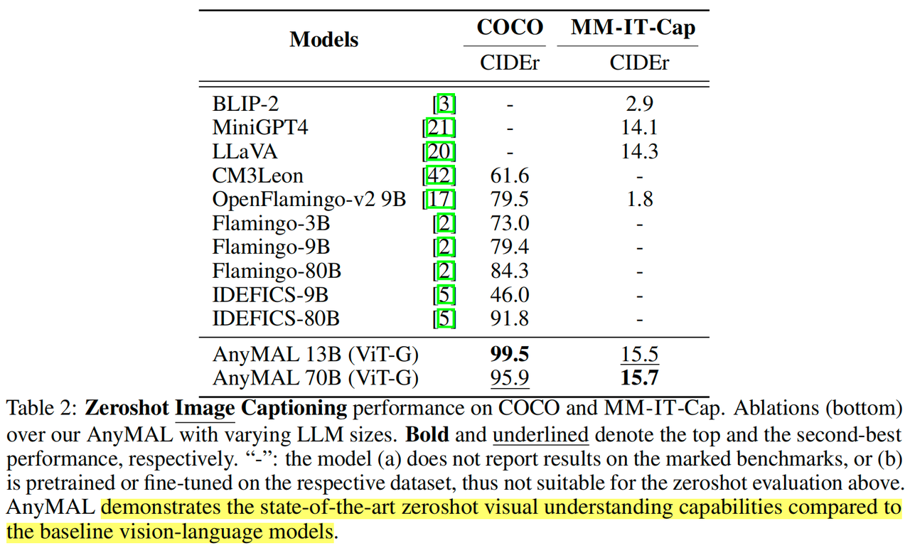
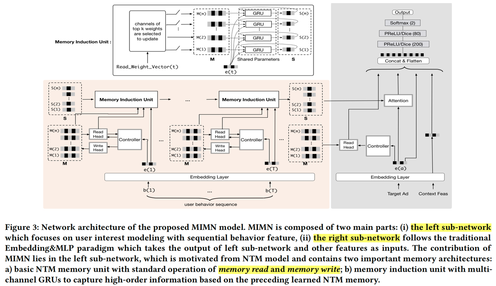
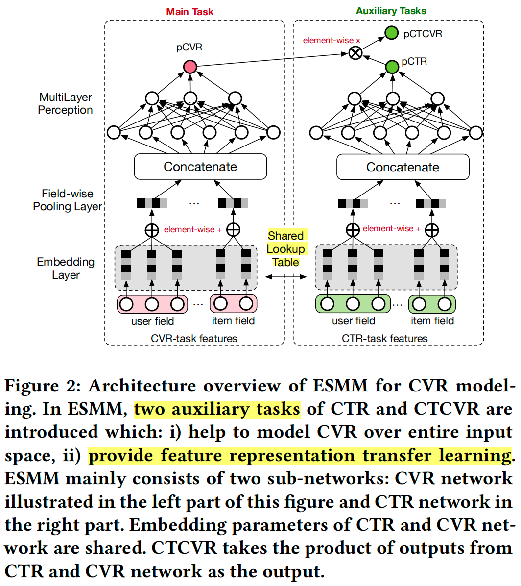
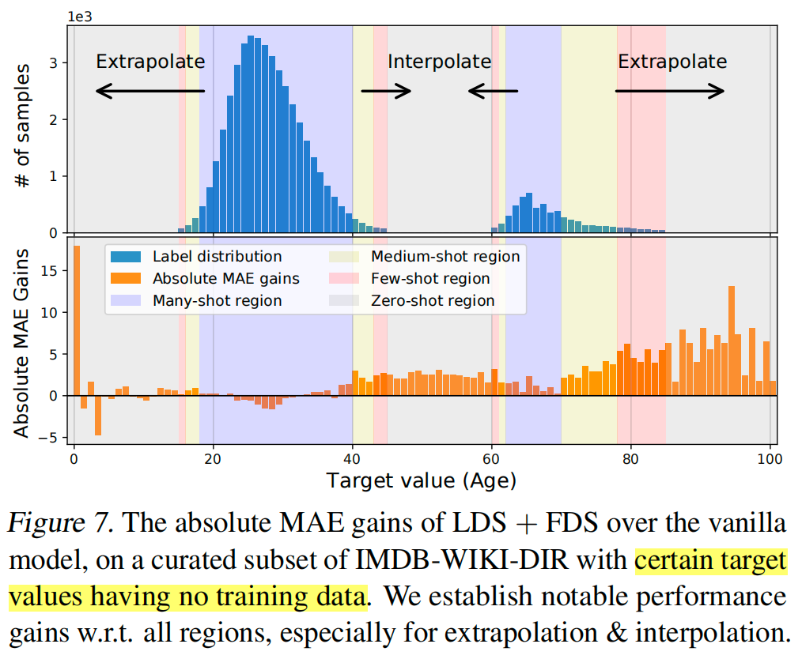

# papers-weekly

每周论文学习记录

# pending list

> paper1 = video 2

领域主线：

1. 大模型（NLP, CV, 多模态等)
2. GNN系列
3. Anomaly Detection 系列
4. 搜广推（+智能运营)
5. ABtest

具体文章：

- [ ] Opening the black box of Deep Neural Networks via Information
- [ ] Learning phrase representations using rnn encoder-decoder for statistical machine translation2014年，提出了GRU
- [ ] 使用Xenon-Generation Finetune LLama文档阅读
- [ ] 写综述：GNN 论文总结
- [ ] Deeper insights into graph convolutional networks for semi-supervised learning
- [ ] 不同的位置编码方式，1D(Bert的), 2D etc
- [ ] 通用内容

  - [ ] GAP global average pooling
  - [ ] Grad-cam: Visual explanations from deep networks via gradient-based localization  视觉DNN的可解释性
  - [ ] DL三大特征抽取器（CNN,RNN,Transformer）总结TBD
  - [ ] viking, milvus等向量检索相关技术，检索和矢量搜索工具（如 LangChain、LlamaIndex 和 Pinecone）
- [ ] 大模型近年来的主要文章（目标：7月底写一篇综述）

  - [ ] Big Transfer (BiT): General Visual Representation Learning （CNN中做的比较大的)
  - [ ] CLIP 得分，衡量文本、图像的对齐程度
  - [ ] Tokens-to-Token ViT: Training Vision Transformers from Scratch on ImageNet
  - [ ] image GPT 的工作
  - [ ] 多模态预训练工作（by李沐)
  - [ ] MAE loss，BiT MAE重建图像
  - [ ] DALLE/DALLE2 效果体验

# 2023.12

ALIGN

Imagen

LLM 系列：

Zero-Shot Text-to-Image Generation

## 2023.12.29

《Emu2: Generative Multimodal Models are In-Context Learners》

2023.12 的一篇文章，BAAI和清华、北大合作，要点：

1. Human 可以比较容易的基于in context examples处理多模态tasks，当前多模态model在努力imitate，本文展示了task-agnostic ICL 能力（few-shot），并且Generalize to unseen multimodal tasks，可以被effective scaling-up极大的加强
2. 模型，比较经典的 visual encoder + generative multimodal model + visual decoder，通过几个基础预训练模型来初始化，然后通过大体量的多模数据集进行continue training。pretrained后的模型，还可以做instruction finetuning
3. 实验结果，以37B的尺寸，在VQA和LMM benchmarks上，以及图像生成数据集上，都取得非常好的结果，甚至超过了 Flamingo 80B和 DALLE3

总体上，以一个非常简洁的模型架构，通过pretrain数据的scaling up，取得很好的结果，模型的思想与[5007]也比较像，只是当时还没有这么大这么好的pretrained foundation model

## 2023.12.28

《vLLM: Efficient Memory Management for Large Language Model Serving with *PagedAttention*》

2023.10 UC Berkeley 和 Stanford 的一篇文章，关于提高LLM推理性能，要点：

1. LLMs 的高吞吐量要求batching处理足够多的请求，但是key-value cache memory for each request很巨大，容易由于fragmentation和redundant duplication造成显著浪费，本文提出PagedAttention，受虚拟内存和paging技术启发的一种attention 算法，operates on KV cache stored in 非连续内存上
2. 模型，以13B模型为例，inference期间的内存占用主要分为三部分：model params 固定占用26GB，attention KV cache，大约30%显存，还有其他activations等占用一小部分。其中KV这部分因为内存碎片等原因有比较多浪费。本文的block-based PagedAttention可以很好的解决这个问题
3. 实验结果，vLLM 提高popular LLMs by 2-4 倍吞吐，在同等水平的latency下，性能有比较明显的提升。

总体上，本文通过深入到LLM inference时的memory使用机制，借鉴OS vitural memory思路，提出了block-based PagedAttention，显著优化了LLM推理时的内存约束，大幅提高了吞吐。

## 2023.12.24

《API-Bank: A Comprehensive Benchmark for Tool-Augmented LLMs》

2023.10 的一篇文章，研究LLM 的tool使用能力，要点：

1. LLM 可以通过使用tool来强化自己的能力，本文提出了三个问题，LLM使用tools能力的有效性评估，如何强化LLM使用tools的能力，有哪些障碍需要被解决。构建了API-Bank这个专门设计的数据集（相当于一个 instruction finetuning 数据集），设计了一个multi-agent 标注数据的流程
2. 模型，基于Alpaca-7B 和API-Bank数据集FT，显示了比较强的API使用能力
3. 实验结果，当前的LLMs具备一定的使用tool的能力，但是diverse并且high-quality的数据集，对于提升模型能力大有帮助

总体上，本文构建了一个tool-augmented LLM的数据集API-Bank，并对不同类型模型的不同level tool使用能力做了研究，同时也证明了数据集的有效性。Multi-agent标注数据的流程很有借鉴意义，协同agent完成复杂任务。

## 2023.12.23

《PandaGPT: One Model To Instruction-Follow Them All》

2023.5 腾讯AI lab 的一篇文章，关于多模态model的，要点：

1. 当前的多模态对齐工作，局限于text和其他模态之间的对齐，PandaGPT，第一个 general-purpose 的model，可以处理来自6种模态的instruction-following input，并且这些能力只通过trained on aligned image-text pairs获得
2. 模型，imagebind + Vicuna，为了对齐 ImageBind 和 Vicuna 的feature space，在 160k 数据上FT，并且为了减少计算量，只FT少部分参数

总体上，本文基于Imagebind和Vicuna的工作，不同之处在于PandaGPT模型做了instructions的微调，因此适应多种模态的prompt task，文中也有比较多Demo，但是缺少公共评测集结果。

《Vipergpt: Visual inference via python execution for reasoning》

2023.3 的一篇工作，也属于Agent的范畴，不同之处在于用python代码来衔接，要点：

1. 背景：回答 visual queries 非常复杂，需要visual processing and reasoning，E2E方法之前主导这类task，但是缺少解释性和泛化性；modular programs提供了一种替代，本文提出ViperGPT框架，应用code gen 模型，引入V-L models到流程中来
2. 本文的方法，通过生成代码（Codex）来衔接各个model，对复杂流程进行 modular，用代码来控制逻辑；一种平行的方法是生成 text instructions（哪种思路更好呢？没找到效果对比的数据）；另外all-in-one的model也是一个方案，类似Google Gemini这种
3. 模型：Our prompt consists of an application programming interface (API), detailed in the following section, which we provide to the LLM as part of its input context.

总体上，本文提出了一个很好的框架，通过生成代码来衔接各个基础模型，完成复杂的visual input 任务，评估了多个数据集，如RefCOCO，GQA，OK-VQA，NExT-QA 等，取得了SOTA的效果

《WebGPT: Browser-assisted question-answering with human feedback》

2022.6 OpenAI的一篇工作，让GPT3联网，要点：

1. 本文 FT GPT-3 to answer long-form questions(LFQA) using a text-based web browsing environment, which allows the model to search and navigate the web. 相比于RAG来说，本文把 R 这个部分替换为了bing搜索引擎，理论上效果应该会更好。
2. 数据，用到了几份数据，ELI5 和 TruthfulQA；并通过人工演示搜集了一批 demonstrations 数据，以及comparisons score数据
3. 模型，基于GPT3 model family，用到了BC, RM, RL, rejection sampling 等训练方法。从实验结果来看，最好的model outperform humans on ELI5，但是对于 out-of-distribution questions仍然表现不好。（可能是FT有偏了）

总体上，本文通过让GPT拿到bing search数据，来处理LFQA task，经过FT后，在这些问题上取得了 outperform human的结果，但是这种FT方法对于out of distribution的问题仍然表现不好。属于2年前的工作了，现在的模型能力，agent 方案，更丰富的FT技术等，应该能表现的更好。

## 2023.12.22

《Visual ChatGPT: Talking, Drawing and Editing with Visual Foundation Models》

2023.3 微软的一篇文章，关于agent构建的，要点：

1. ChatGPT 提供一个统一的language interface with  *remarkable conversational competency and reasoning capabilities，本文提出 Visual ChatGPT system，集成不同的VFMs，支持ChatGPT式的使用体验，另一种解决方案是，是否有必要train一个**多模态**的model？
2. *模型，核心部分是一个 prompt manager，显式的告诉ChatGPT每个VFM的能力，以及其input-output format，并且把visual info转换成language，同时管理历史信息

总体上，通过prompt manager来管理VFMs，使用自然语言与 ChatGPT 交互，来推动整个任务执行流程前进，毕竟还是有一些局限，ChatGTP对于图像、视频等的信息感知是有偏差的，但整体还是一个比较有意思的工作。

## 2023.12.21

《ChatGPT’s One-year Anniversary: Are Open-Source Large Language Models Catching up?》

2023.11 的一篇回顾总结文章，要点：

1. ChatGPT推出1周年之际，本文对open source, close source大模型做了全面评估，总体上还是闭源模型的效果更好，但是开源模型的差距已经越来越小
2. 本文总结了6个维度的很多个benchmarks，对大语言模型做了系统评估。多个模型在效果上可以达到接近甚至超过GPT-3.5-turbo的水平，但是距离GPT-4普遍还有比较大的差距。考虑到模型规模以及投入水平，开源模型的追赶还是可期的。

## 2023.12.20

《NExT-GPT: Any-to-Any Multimodal LLM》

2023.9 NUS的一篇工作，研究 any-to-any LLM，要点：

1. 背景：本文目标是开发 any-to-any MM-LLMs，能够接受any modality作为input，也能output any modality（之前的工作缺失的），提出 NExT-GPT model，只微调1%的参数
2. 数据：三类数据集 Text + X -> Text，Text -> Text + X，以及modality-switching instruction tuning dataset
3. 模型：总体上是 imagebind + linear projection + LLM + Transformer projection + diffusion model
4. 实验结果：从实验结果看，在几类任务上都取得比较好的效果，对于大一统模型来说是不错的

总体上，本文提出了一个 end-to-end general-purpose any-to-any multimodal LLM (MM-LLM) model，并取得比较好的效果。

## 2023.12.19

《HuggingGPT: Solving AI Tasks with ChatGPT and its Friends in Hugging Face》

2023.12 的一篇文章，研究LLM agent，要点：

1. 背景：解决 AI tasks with different domains ahd modalities 是迈向AGI的关键一步，把LLM作为controller来manage 现有的AI models解决复杂AI tasks，让LLM可以解决超越text的问题，当前有两类方法：Unified multimodal language models；The integration of using tools or models in LLMs，HuggingGPT 属于这种方法，可以持续吸收task-specific experts的能力。
2. 模型：本文提出 HuggingGPT 这个agent框架，一种新的AI solution，使用language作为interface来连接各个AI models。solution 包含4个阶段：task planning，model selection，task execution，response generation
3. 实验结果：几种不能类型的任务都能解决的比较好，并且充分证明了LLM基础能力的重要性。

总体上，本文属于agent应用的novel尝试，跟Reflexion/React等文章要解决的问题类似，不过当前agent领域是不是缺少一些权威的benchmarks？不太好做横向对比。

《DHEN: A Deep and Hierarchical Ensemble Network for Large-Scale Click-Through Rate Prediction》

2022.3 Meta 的一篇关于CTR建模特征交叉的文章，要点：

1. 背景：对于CTR建模来说，特征交叉很重要，更好的特征交叉会提升效果，然而不同的design对于不同dataset有不同效果，表明可能它们分别capture了non-overlapping的info。
2. 模型，本文提出DHEN，包括 a collection of heterogeneous interaction modules and ensemble components，学习到一个基于异构modules之上的不同级别的层次交叉，总体也是一个 deep stacking structure，类似ResNet，Transformer等
3. 评估结果，同等计算量下，DHEN scaling up 的效果比MoE要好，不同interaction module交叉的效果不一样，总体上堆叠交叉取得正向收益

总体上，本文核心idea是不同interaction module（DCN,linear,CNN,self-attention,AdvancedDLRM等）的 stack 深度交叉，证明了不同交叉模块堆叠交叉后，取得良好效果。

《GLaM: Efficient scaling of language models with mixture-of-experts》

2022.8 Google 的一篇文章，研究大语言模型+MoE的效果，要点：

1. 本文推出了GLaM(**G**eneralist **La**nguage **M**odel)系列模型，使用 sparsely activated mixture-of-experts architecture，单位token的训练能耗只相当于GPT-3的 1/3，但是却取得更好的 zero, one, few-shot perf
2. 模型，系列模型按总参数量看，最小的模型 130M，最大的模型1.2T。效果最好的1.2T模型，在训练和推理时，会激活2/64 experts，带来稀疏化的效果
3. 实验结果，在NLU和NLG任务上，GLaM模型都表现出更好的训练性能，以及更好的效果，另外一面是由于网络更大，占用的devices会更多。模型稀疏化是继续scale up的一个重要研究方向。

## 2023.12.18

《**Toolformer: Language Models Can Teach Themselves to ****Use**** Tools**》

2023.2 FAIR 的一篇文章，研究让LMs使用工具，要点：

1. 本文研究如何让LMs学会使用工具，Toolformer 模型
2. 数据，基于 CCNet 数据集的一部分，用few-shot prompt LM的方法进行样本生成，再从中过滤出FT数据集，并确保API call 发生在对模型最有用的地方
3. 模型，基于GPT-J做FT，a batch size of 128 and a learning rate of 10^-5，warmup for first 10%
4. 实验结果，对于多个任务都有显著作用，QA，数学推理，翻译等；同时scaling laws的研究表明，对于比较小的模型，API calls 不是很有用，大模型才能学会怎么使用；即便对于大的模型，有和没有API calls 的性能gap仍然很大。

总体上，很有创新性的一篇文章，遗憾之处在于规模仍然太小，基础模型小，并且tool的类别也不多。

《React: Synergizing reasoning and acting in language models》

2023.3 的Google一篇文章，研究把LLM的Reasoning和Acting结合起来，要点：

1. Reasoning 和 Acting 之前被当做separate topic来对待，本文Combine reasoning and acting,  in language models for general task solving，其中Reasoning, 帮助模型得出、跟踪和更新 action plan；Actions, interface with and gather additional information from external sources such as knowledge bases or environments
2. 模型：有两种方案，prompt 和 finetune，ReAct*→ *CoT-SC 当ReAct在given steps内无法正确返回时，退回到CoT的模式
3. 实验结果：在QA等任务上效果不错，同时scale研究表明，在小模型时，基于prompt来combine reasoning 和 acting 的效果并不好，FT 能取得更好的效果。大模型时，prompt 的效果好一些，

总体上，本文研究把大模型的 Reasoning 和 Acting 能力结合起来，解决general task，从结果来看还不错。跟[5124]的区别在于，[5124]是一个迭代的方法，verbal RL，本文是推理+Act

《*WizardLM* : Empowering Large Language Models to Follow Complex Instructions》

2023.6 Microsoft 和 北京大学的一篇工作，基于 LLaMA FT了一个模型，要点：

1. 背景：之前的 instruction FT 有2个主要问题：samples in NLP dataset share a few common instructions，严重限制了他们的 diversity；instructions only ask for one task，而人类instructions通常有多种 task demands
2. 数据：本文基于 Alpaca/Vicuna 的instruction dataset，使用 **OpenAI ChatGPT API** 执行 4 epochs of evolution（in-depth, in-breadth），最终得到250k instructions
3. 模型：LLM FT with instruction tuning 取得了很大的成功，本文提出Evol-Instruct，用LLM替代人力生成 large amounts of instruction data，具有varying levels of complexity，然后FT LLaMA，得到 WizardLM 模型
4. 实验结果：在 17/29 个 skills上，WizardLM 达到了ChatGPT 90%的效果，虽然有些方面还落后，但是已经说明使用 AI-evolved instructions FT 来enhance LLM是一个好的方向

总体上，本文设计 AI-evolved instructions dataset，用来FT LLaMA模型后，取得了不错的效果。

## 2023.12.17

《**Reflexion: Language Agents with Verbal Reinforcement Learning**》

2023.10 Northeastern University, MIT, Princeton University 等的一篇文章，研究 Reflexion agent 的，要点：

1. LLM 越来越多与环境进行交互，但是LLM利用传统RL从行动和错误中学习确是一件高成本的事情，需要额外samples和计算cost，本文提出了一个优化框架，称作 Verbal reinforcement learning，利用自然语言来做 policy optimization，教会model从过去的行动和错误中学习
2. 模型：*self-reflection *to build a persisting memory of self-reflective experiences which allows an agent to identify its own errors and self-suggest lessons to learn from its mistakes over time
3. 实验结果：Reflexion 方法在多个任务中都取得非常好的效果，例如 sequential decision-making, coding, language reasoning 等，尤其在 HE 数据集上取得了 91% pass@1 的效果，outperform了GPT4

《TinyStories: How Small Can Language Models Be and Still Speak Coherent English?》

2023.4 Microsoft Research 的一篇文章，研究 SLMs，要点：

1. 本文聚焦SLMs的问题，研究语言模型最小的要求，以获得 generate text that is consistent, diverse, and meaningful 的能力
2. 本文研究了 10 million params 级别模型, much simple arch(only one transformer block)，仍然可以输出 fluent and consistent stories，同时保持多样性和语法正确，并展示了推理能力。提出一种新的评估范式，让GPT4进行评分
3. 有一些关于模型 width/depth 的发现，width is more important for capturing factual knowledge, whereas depth is more important for contextual tracking.（推理？）

   通过synthesize精致的高质量数据集来构建模型，是一个可行的思路。

《Generative Agents: Interactive Simulacra of Human Behavior》

2023.8 Stanford 和 Google Research 一篇很有意思的文章，要点：

1. 非常有意思的一篇文章，本文聚焦创建一个小的，交互式的社会，基于25个llm driven agents
2. 模型，Architecture 包含三个主要模块：Memory stream, memory retrieval model；Reflection, draw conclusions；Planning，把 conclusions 翻译成high-level inference
3. 实验结果，从实验结果以及消融实验来看，这个 sandbox 环境产生了一些有意义的交互和结果，未来随着llm本身的性能优化，以及整体方案提升产生更好的结果。

《Textbooks Are All You Need II: **phi-1.5 **technical report》

2023.9 的一篇文章，仍然研究小语言模型，要点：

1. 本文继续关注small language model，关注 natural language 问题，仍然是一个1.3B的model，取得了可以与 5x 大小模型相匹配的性能
2. 数据，在phi-1.0的基础上更拓展了2份数据，一个是generated nlp dataset，一个是web dataset，作者推测**创建一个 synthetic 数据集在不远的将来是一项重要技能，以及AI研究的核心topic之一**
3. 实验结果，在Common sense reasoning、自然语言理解、Reasoning任务上都取得了跟5x模型大小相当的性能。

总体上，再次证明了高质量数据的重要性，作者大胆猜测或许可能通过1B左右参数取得 ChatGPT 的能力

## 2023.12.16

《phi-1: Textbooks Are All You Need》

2023.6 微软的一篇研究代码小模型的工作，要点：

1. 本文作者基于高质量数据集train 了一个1.3B的code模型，outperform了StarCoder/CodeT5+等一众模型
2. 数据，作者认为当前的训练数据存在一些问题，比如样本不够严谨，文档混乱等，会影响模型训练效果，作者构建了3个数据集：6B filtered code-language dataset, a synthetic textbook dataset, a synthetic exercises dataset，前2者组成 CodeTextBook，后1个是CodeExercises（python only）
3. 模型，decoder-only model，先在CodeTextBook上pretrain，再在CodeExercises上FT
4. 实验结果，在HumanEval上大幅领先于之前的StarCoder等模型，并且做了一系列实验，证明收益来自于更高质的数据，而不是数据泄露

## 2023.12.15

《FiD-KD: Distilling knowledge from reader to retriever for question answering》

2022.8 更新的一篇文章，在FiD基础上，运用distillation思想，蒸馏reader的知识到retriever中，要点：

1. retrieve-then-generate的任务，比较难通过训练 retriever，难点在于获取 pairs of query and support documents 包含跟query相关的信息，被 knowledge distillation 启发，通过reader中的attention score来监督训练retriever，以返回更相关的结果
2. 模型，retriever + reader（FiD），用reader model的synthetic label去train retriever model，attention activations是一个好的相关性代理
3. 实验结果，迭代式训练可以获得更好的结果，拿到了 SOTA 的结果（比之前的DPR，RAG都要好）

## 2023.12.14

《(GenRead)Generate rather than retrieve: Large language models are strong context generators》

2023.1 微软的一篇工作，RAG的变种，要点：

1. 针对 knowledge-intensive tasks，当前主流的方案采用 *retrieve-then-read *的模型pipeline，本文提出 generate-then-read的框架，outperform 了当前SOTA模型DPR-FiD，没有retrieve任何外部doc
2. 模型，用 large model generate（GPT3.5），后接GPT3.5 or SFT 的FiD模型
3. 实验结果，GENREAD 取得 71.6/54.4 EM分数在TriviaQA和WebQ上, significantly 优于  *DPR**-FiD；另外*本文的方法可以和 dense retrievers 结合起来使用，也可以和任何 reader 结合起来使用。

总体上本文的方法基于 generate-then-read 框架是一股清流，不借助任何doc实现起来更简单，但问题也很突出，数据无法更新。不过 generate + retriever 倒是可以考虑。

## 2023.12.12

《Mistral 7B》

2023一篇模型工作，要点：

1. 本文研究如何用小模型来获取不错的性能，Mistral 7B outperforms the best open 13B model (Llama 2) across all evaluated benchmarks，并在多个任务上 surpass 了 LLaMA1 34B model
2. 模型，Transformer arch，重点变化是引入了GQA和SWA，在模型效果和推理速度上都获得提升

《HEIM: Holistic Evaluation of Text-to-Image Models》

2023.11 斯坦福的一篇文章，Percy的作品，要点：

1. 像HELM一样，建立了一组benchmarks 评估text->image的12个维度
2. 26个model，60+数据集

## 2023.12.10

《**Searching for MobileNetV3**》

2019.11 Google一篇关于Mobile端NN模型的文章，要点：

1. 在 Mobile NN 领域，研究optimal trade-off between accuracy and efficiency 是一个活跃的领域，方法包括减少网络参数、reducing operations，network search，Quantization和knowledge distillation等
2. MoblenetV3 模型，use platform-aware NAS to search for the global network structures by optimizing each network block, and NetAdapt for network search
3. 从实验结果来看，在分类、分割等任务上行，比V2性能取得明显提升。整体性能劣化不太多

## 2023.12.7

《Gemini: A Family of Highly Capable Multimodal Models》

2023.12.6 Google 发布的多模态大模型，总体上：

以多种模态 Text, image, video, audio 作为输入，输出 text, image

在单模态的评估集上，基本都超过了之前的SOTA

## 2023.12.6

《*WizardCoder* : Empowering Code Large Language Models with Evol-Instruct》

2023.6 微软的一篇工作，基于StarCoder指令微调模型，要点：

1. 基于 StarCoder 15.5B模型，做instruction finetuning，具体方法是采用了WizardLM中的Evol-instruct方法
2. the *Evol-Instruct *method, which involves evolving existing instruction data to generate more complex and diverse datasets.
3. To construct the training dataset, we initialized it with the 20K instruction-following dataset called
   Code Alpaca. We iteratively employ the Evol-Instruct technique on this dataset consisting of 20,000
   samples to produce evolved data.
4. 评估结果看，结果大幅超过了之前的SOTA工作

《Fid: Leveraging passage retrieval with generative models for open domain question answering》

2021.2 FAIR的一篇研究retrieval & generative model的工作，要点：

1. 生成式模型，对OpenQA问题已经证明了其竞争力，本文研究这些模型如何从retrieving text passages中受益
2. 本文的方法，retriever + multiple encoder + decoder，模型只在decoder中做evidence fusion，因此叫：fusion-in-decoder，这种方法也允许在decoder中更好的aggregate evidence from multiple passages
3. 实验结果，从实验结果看，在三个QA数据集上取得SOTA结果，同时伴随retrieved passages，性能是scalable的

## 2023.12.5

《EMDR: End-to-End Training of Multi-Document Reader and Retriever for Open-Domain Question Answering》

2021.11 Google 的一篇工作，open-domain QA领域的新SOTA，要点：

1. 本文的工作是在 open-domain question answering system 上提出了一个E2E的训练框架，叫做EMDR^2，取得了当时的SOTA效果。在这之前的优化方案，一个是two-stage training，另一个是condition on 单个retrieve doc。
2. 模型，本文方法，将retrieved docs作为latent variables, combine them. 通过EM算法来迭代优化，将模型的反馈作为pseudo labels去同时优化retriever和reader。（没有像DPR那样supervised的训练retriever，结果反而更好）
3. 实验结果，在三个主要的open-domain QA数据集上取得SOTA结果，方法优于FiD和DPR

总体上，一个 End-to-End 训练 multi-document Retriever 和 Reader 的模型框架，取得SOTA结果。

《DPR: Dense Passage Retrieval for Open-Domain Question Answering》

2020.9 Meta AI 的一篇工作，如题研究 dense retriever，要点：

1. Open-domain QA，retriever 传统上使用TF-IDF、BM25等，后来有提出inverse cloze task (ICT) objective，但是计算开销大。本文解决一个问题，只使用 pairs of questions and passages train 一个dense embedding model，不引入额外预训练工作
2. Final solution: the embedding is optimized for maximizing inner products of the question and relevant passage vectors, with an objective comparing all pairs of questions and passages in a batch
3. 实验结果，只通过少量高质量数据训练一个高质量的dense retriever是有可能的，1000条样本outperform BM25；不同训练方式的差异，in-batch negative examples 比较有用，BM25 negatives也有用

总体上，本文证明了 dense retrieval 可以outperform以及replace sparse retrieval component in 传统QA。

## 2023.12.4

《RETRO: Improving Language Models by Retrieving from Trillions of Tokens》

2022.2 DeepMind 的一篇文章，关于RAG，要点：

1. 增加模型的params有2个好处：增加额外的计算；增加模型对于training data的记忆，相比于增加模型 params，本文直接让模型access a large database，将模型的可用数据相比训练时扩大了一个数量级
2. 实验结果，随着模型增大，retrieval model 的gain持续增长；随着retrieval database增大，retrieval model 的gain持续增长；
3. RETRO 的收益来源：explicit neighbour copying and general knowledge extraction

## 2023.12.3

《Atlas: Few-shot Learning with Retrieval Augmented Language Models》

2022.11 Meta一片研究RAG的文章，要点：

1. Few-shot 是LM的一项重要emergent能力，然而RA 模型尚未展现出令人信服的few-shot learning能力。本文研究 few-shot learning 是否一定要求model存储大量信息在params中，是否记忆能力可以和泛化能力解耦开
2. 本文给出的model Atlas, design and train retrieval-augmented language models，聚焦下游 few-shot learning能力，模型采用 Contriever + T5 架构，jointly pretrain/finetune，并且为提高性能对loss和tasks做了针对性设计
3. 实验结果，Jointly pretrain，对于few shot性能提升有显著帮助；当FT样本有限的时候，在jointly FT时query-side FT和rerank 方法比较有效；FT model Atlas 在QA数据集上取得了SOTA结果。

总体上，本文研究RAG model的few-shot learning能力，主要研究方向是 jointly pretrain/finetune retriever 和 language model，结果证明有明显收益。

《A Survey on In-context Learning》

2023.6 关于ICL的一篇综述文章，要点：

1. 关于ICL的一篇综述文章，参考价值还不错
2. ICL 定义，is a paradiam 允许LM 只通过a few examples的展示学习新tasks，Key idea is learn from analogy/类比，learn the pattern hidden in the demonstration and accordingly make the right prediction
3. ICL 能力的影响因素：pretrain, prompting template, in-context examples selection, order of examples etc.；提升ICL能力的一些方法，warmup（Supervised/self-supervised），Demonstrations，Scoring functions
4. ICL 的更多使用场景：数据标注，data engineering；Model Augmentating，保持LM arch不变，prepend retrieved docs to the input；Knowledge updating

总体上，本文对LLMs的ICL能力做了比较系统的综述，包括定义、能力来源研究、能力提升方向、使用场景等，有一定参考价值。

## 2023.12.2

《Contriever: Unsupervised Dense Information Retrieval with Contrastive Learning》

2022.8 Meta AI的一篇工作，要点：

1. IR 领域 dense retrievers 发展迅速，取得了SOTA的结果，outperform BM25 传统方法。但是对于新的领域，dense retrievers 发展并不顺利，本文提出用对比学习训练unsupervised dense retrievers，并且在11/15 of BEIR上outperform BM25，并且具有很好的跨语言能力。
2. 模型，使用BERT base arch，对比学习loss，positive/negative pairs构造方面用了一些技巧
3. 实验结果，使用对比学习，在没有annotated样本的情况下，dense retriever Contriever 总体优于BM25；在 MS MARCO 数据集上finetune后，效果很好，因此提出基于 retrieved results 做 re-rank，在BEIR基准上取得SOTA结果；并且具有不错的多语言效果。

总体上，本文研究NN在召回问题上的应用，在没有 supervision 的情况下用对比学习训练一个 dense retriever，Contriever 优于BM25，召回结果经过rerank处理后打成新SOTA

《An explanation of in-context learning as implicit bayesian inference》

2022.7 的一篇文章，研究ICL的理论解释，要点：

1. 本文研究LLM in context learning 能力的理论解释，LM infer the latent concept across multiple sentences；在inference阶段，当LM在不同的例子间，也推断shared prompt concept时，ICL就发生了。即：implicit Bayesian inference
2. 实验结论，在ICL场景下，Example 长一些是更有用的，accuracy提高；随着examples数量的提升，accuracy也会提高；更大的模型，可以提升 In-Context learning 能力，尽管当 pretraining loss 可能保持相同，larger models can improve in-context learning beyond improving pretraining perplexity；examples 的顺序会对性能有显著影响。

总体上，属于研究ICL理论性比较强的一篇文章，结论也相对比较solid。后续提供insights for pretraining and prompting LLM

《REPLUG: Retrieval-Augmented Black-Box Language Models》

2023.5 研究RAG的一篇文章，要点：

1. 本文研究，把LM当做一个黑盒，用tuneable retrieval model 来加强它。RePLUG & LSR，LM可以被用来supervise retrieval model，进而帮助LM更好的pred
2. 模型，对比了各种可以访问的模型，GPT系列，OPT等；train retrieval model时，把LM的打分当做一个supervise signal。 Retrieve 10 docs per input，然后调用10次推理，在ensemble
3. 实验结果，可以减少 LM 的perplexity；retrieval提升了模型的问题解决能力；该方法适用于各种模型；取得的收益不仅来自于ensemble，也来自retrieved relevant docs。当retrieved doc中包含有rare entities时，会更加有用。

总体上，本文研究把LM当做黑盒，结合retrieval model引入retrieved doc，大幅提高了language modeling以及下游tasks的效果。

《Rethinking the Role of Demonstrations: What Makes In-Context Learning Work?》

2022.10 Meta的一篇文章，价值比较高，要点：

1. 本文研究相比于zero-shot而言，在few-shot learning时，到底demonstrations中的哪一部分对于LM比较有用，有一些非常有意思的发现。
2. 实验结果，结果显示LM确实利用了demonstrations的某些方面，让结果更好，不过few shot 中Ground truth 展示，在 ICL 中实际上是不那么重要的，因此在classification and multi-choice tasks中，随机替换few shot labels，并不hurt perf，因为模型已经具备了这部分知识；那么demonstration中的哪个部分对perf有影响？the label space and the distribution of the input text are both key to ICL；以及specifying the overall format（input-label pair） is also crucial
3. 延伸思考1，模型在test时并不真的「learn」，因此imput-label对应关系没有那么重要。也就是“demonstrations are for *task location *and the intrinsic ability to perform the task is obtained at pretraining time”
4. 延伸思考2，Demonstrations 和 instructions 的作用可能是类似的，都是做 task location，它们只是激活模型已经学到的能力，而并不引入新的知识。
5. 延伸思考3，本文也启发研究，如何让模型在pretrain时学到wider的task semantics，以增强zero-shot/few-shot的能力；同时也启发 Zero-shot 有显著提升空间，用unlabelled input + random labels

总体上，本文研究few shot中demonstrations的哪个部分对LM的推理性能比较重要，有若干有价值的发现，是一篇非常好的文章。

《VRepair: Neural Transfer Learning for Repairing Security Vulnerabilities in C Code》

2022年的一篇工作，要点：

1. Vulnerability repair 结合DL进行研究的一个问题是数据集太小，而Bug fixing 跟它是类似的问题，本文利用迁移学习思想来研究
2. 方法，先在 big bug fix corpus 数据集上训练，然后在 small vulnerability fix dataset 上 finetune。模型选用了一个典型的en-de Transformer架构
3. 实验结果，相比在小数据集上直接训练vulnerability model，本文提出的bug fix pretrain + vul finetune效果更好。未来基于github 的各种commit，可能可以训练code change model，去做comment generation or other tasks

总体上，对于非DL科班的人来说，是一个好的尝试，文章罗列了很多科普概念，但是没有什么太多新意。

《KATE: What Makes Good In-Context Examples for GPT-3?》

2021.1 微软的一篇文章，研究怎么更好的选择few-shot examples，要点：

1. ICL，generalize to unseen tasks without fintuing，是大模型很重要的能力，同时Few-shot 性能严重依赖 in-context examples 的选择，本文聚焦如何更好的选择
2. 本文提出方法Retrieve 语义相似的examples，in-context examples 跟test example在emb space上更相近会带来更好的效果。a retrieval model 被引入。总体上叫做KATE方法。
3. 模型，retrieval model(emb based) -> few shot examples + GPT-3
4. 实验结果，情感分析任务上，本文的方法比random和KNN都明显更好，在类似task的数据集（sst-2）上FT，可以提升性能；消融实验发现，In-context examples，多一些会更好（在20个左右达到性能高点），Retrieval 候选的training sets集合大小，越大越好，examples 顺序的影响，相似度 reverse更好，可能由于这种排列顺序，相似的example离test更近

总体上，本文对于如何选择few-shot examples做了有价值的研究，基于语义相似度对比random有明显收益，同时在task-specific数据集上FT的emb 模型效果会更好。

《EPR: Learning To Retrieve Prompts for In-Context Learning》

2022.5 的一篇关于few shot ICL的文章，质量一般，要点：

1. 背景：In context learning, LM 可以看到 test instance 和 few training examples as its input and directly decodes the output without any update to its parameters, output 严重依赖 selected training examples。本文提出EPR，一种学习retrieve好的prompt以增强ICL的方法
2. 方法：本文的方法比较简单，用scoring LM对training examples进行打分，然后用对比学习训练supervised retriever（training an efficient dense retriever，EPR），最后推理的模型是：supervised retriever + LM
3. 实验结果，可以看到，当scoring LM与generator LM的训练数据类似时，效果会更好。同时dense retriever 显著优于BM25。（这个结论与[5097]并不冲突，[5097]讲的是 retrieve doc来做ICL，起到补充信息的作用；而本文是retrieve examples，起到few-shot的作用）

总体上，这个方法idea比较简单，并且似乎有数据泄露的嫌疑？

## 2023.12.1

《In-Context Retrieval-Augmented Language Models》

2023.8 AI21 Labs的一篇研究RAG的的文章，要点：

1. RAG 显示了提升生成模型性能的能力，现存的RAG方法focus on modify the model arch，本文提出的方法不需要做 model arch 的修改，使用 off-the-shelf retriever and generator
2. 实验结果，In-context RAG led to LM's Perf gains，等同于扩大LM's params 2~3倍；Sparse retriever 明显优于 dense retriever，并且成本更低；Query length 对于性能会有一定影响，sparse retriever l=32, dense retriever l=64；在更大的模型上，RAG效果更好

总体上，本文提出了一种应用RAG的简单方案，并且得出一些有指导价值的结论

《Retrieval-Augmented Generation for Knowledge-Intensive NLP Tasks》

2021年Meta最初关于RAG的文章，要点：

1. 本文提出一个混合的generation model，同时使用 parametric 和 non-parametric memory，也就是针对 knowledge-intensive tasks 做general-purpose RAG finetuning
2. 模型，retrieval（BERT based） + generation（BART based），train 的时候，只train query encoder和BART generator
3. 实验结果，RAG 在open-domain QA上取得SOTA结果，RAG更factual和specific

总体上，本文工作开启了一个新方向，关于 parametric 和 non-parametric memory 如何交互，有利于减少generation model的幻觉，在diversity，factural，specific上都表现更好。本文在对问题进行抽象、数学化表达方面做的比较好。

# 2023.11

## 2023.11.29

《Learn to Explain: Multimodal Reasoning via Thought Chains for Science Question Answering》

2022.10 的一篇工作，基于多模态数据集研究CoT问题，要点：

1. 人类回答问题会综合多模态信息运用CoT来得到答案，本文推出 ScienceQA 这个多模态benchmark，研究多模态CoT问题，CoT 不仅能帮助few-shot learning，还可以帮助fine-tuning
2. 实验结果，CoT可以在多种模型范式下取得收益，Few-shot GPT-3 +1.2%, finetuned UnifiedQA +3.99%；通过QCMLE->A来研究GPT3模型能力的上界，展示了先生成解释，再生成答案的能力上限很高；另外，当EL位于A之前时，可以看到GPT3(CoT)的性能会大幅下降，很可能是因为要先生成比较长的L和E的话，predict会提前停止或者用完了maximum tokens
3. 其他有意思的洞见，指令微调，instruction 提供了一些关于task的信息，比如 explanation 等；基于 CoT 可以借助更少的数据学习，UnifiedQA with CoT obtains the same results as UnifiedQA without CoT with only 40% of the training data

总体上，本文研究基于多模态benchmark ScienceQA的CoT问题，发现CoT对于few-shot和finetuned model都会有收益，同时GPT-3的模型能力上界比较高；基于CoT技术来FT模型，只需要更少的样本达到同等性能。

《Chain of thought prompting elicits reasoning in large language models》

2022.11 Google 一篇研究CoT的工作，要点：

1. 本文研究如何基于 few-shot prompt 来提高language model的reasoning能力，本文只用一个 off-the-shelf model，不需要对模型参数做任何调整
2. 模型，使用了几个常见的系列模型，baseline为standard Few-shot prompting，策略组为Few-shot prompting with CoT
3. 实验结果，在数学、符号和常识推理问题上，CoT few-shot prompting都展现出了相比standard更强的reasoning 能力，并且越大的模型表现越好，这是一个emergent 能力；在prompt时，reason after answer并没有什么用，跟标准版本的prompt差不多

总体上，CoT 展示出了能够拓展 language model 适应范围的能力，但是我们并不知道 NN 是否真的在 reasoning，这是一个 open question

《Multimodal Chain-of-Thought Reasoning in Language Models》

2023.2 AWS和上交的一篇研究CoT的工作，要点：

1. 本文的主要内容是提出了一个 Multimodal-CoT 的框架，使用text和vision特征作为输入，用two-stage CoT来提高推理效果
2. 模型，T5/Flan-T5，用了DETR的vision encoder，基于 ScienceQA分割数据集用于Supervised training
3. 实验结果，two stage CoT相比one stage，推理效果更好，同时引入了vision特征后效果更好

总体上，本文对 CoT和 multimodal CoT做了比较有意思的研究，有一些有价值的洞见和结论。

## 2023.11.28

《VulRepair: A T5-Based Automated Software Vulnerability Repair》

2022年的工作，关于code repair，要点：

1. AI-based 方法帮助 find, detect, localize vulnerabilities 是很有价值的一件事情，本文提出VulRepair模型，一个T5-based model
2. 数据集，在一个更大的数据集上pretrain，CSN；之后在CVE Fixes 和 Big-Vul上FT
3. 模型，Code Representation + T5 model + linear layer

总体上，基于T5模型做了一个code repair model，这篇文章的写作是非常好的，细节比较清晰。

## 2023.11.27

《On Learning Meaningful Code Changes via Neural Machine Translation》

2019.6 的一篇工作，关于 code change NMT model 的，要点：

1. 本文主要研究通过NMT方法来学习code change是否可行，code change包括bug fix，refactoring 等等
2. 数据，基于三个库的数据，挖掘生成 PRs作为训练验证集
3. 模型，基于RNN 的encoder-decoder结构

总体上，是一个比较有新意的seq2seq paradiam用来解决代码转换问题的工作，效果也还可以。

《NatGen: Generative pre-training by “Naturalizing” source code》

2022.7 哥伦比亚大学一篇很不错的code pretrain model文章，内容要点：

1. 预训练代码模型在self-supervised fashion下有不同的pretraining objectives，本文提出了一个新的预训练目标：“Naturalizing” of source code, 探索 code’s bimodal, dual-channel (formal & natural channels) nature。生成等价，但是更natural的代码
2. 数据，基于CodeSearchNet + 1M functions each for C and C#数据集，通过6个改写规则de-naturalize代码
3. 模型，模型生成代码的能力，主要依赖于模型被优化的pretrain objectives；受启发于文字工作者，消化不好的text，rewrite良好的text；基于encoder-decoder架构结合上述de-naturalize数据的seq2seq的预训练模型，能够更好的理解代码。
4. 实验结果，当 few shot 样本量很少时，NatGen 模型显著优于CodeT5，NatGen 模型的zero shot 和few shot性能更好，原因：通过naturalization 任务学到的coding 知识更general 和transferable；对于代码生成任务而言，pretrain 应该显式的教会模型写代码，这样FT所需数据量就更少

总体上，是一篇很好的文章，内容简洁易懂，效果也不错，在代码生成、代码翻译、代码修改三个FT任务上都取得了SOTA的效果，优于CodeT5。

## 2023.11.26

《BART: Denoising sequence-to-sequence pre-training for natural language generation, translation, and comprehension》

2019.10 的一篇工作，尝试统一NL生成、理解、翻译等任务，内容要点：

1. 本文提出了BART模型，一个 seq2seq 的pretrain model，适用于NL生成、翻译、理解等任务
2. 模型，一个典型的Encoder-Decoder架构，训练分为2阶段，一阶段对text做任意的noising变换，包括变长、调换顺序、mask等；二阶段做seq-seq pretrain。BART = BERT + GPT，并且在训练技巧上做了升级
3. 实验结果，从实验结果看，当在text generation任务上tune时非常有效，对于理解任务也work的很好。

总体上，属于早期基于transformer统一各种任务类型的尝试，有新意也有一定效果。

《PLBART: Unified pre-training for program understanding and generation》

2021.4 的一篇工作，关于一个general的代码理解和生成模型，内容要点：

1. 本文的目标是开发一个general model form PLUG(Program and Language Understanding and Generation) applications
2. 数据，a large-collection of Java and Python functions and natural language descriptions from Github and StackOverflow，code + text 混合数据
3. 模型，采用Encoder-decoder 架构，总共1.4亿参数，训练目标为：Token masking, token deletion, token infilling

总体上，从实验结果看，在理解和生成任务上表现还不错。比较早期的模型，相对较小

《SPT-Code: Sequence-to-Sequence Pre-Training for Learning Source Code Representations》

2022.5 南京大学等的一篇工作，内容要点：

1. 当前很多code模型基于encoder-only架构，这并不理想，本文基于 encoder-decoder 架构，设计了三种pretrain tasks：knowledge of source code, the corresponding  **code structure** , as well as a natural language description
2. 数据，依赖 bilingual 的code-text数据集，限制了pretrain code model的发展，也要使用 self-supervised方法，本文基于 CodeSearchNet数据集，设计了三种预训练任务，Masked Sequence to Sequence (MASS), the code sequence；Code-AST prediction, its AST；Method Name Generation (MNG), the associated natural language description
3. 模型，T5 的encoder-decoder结构，262M参数
4. 实验结果，FT之后，在代码理解和生成任务上结果都还不错，但是实验并不全面，没有测试general的数据集

总体上，除了预训练目标之外，没有太多新意，结果说明也不够全面。

《StarCoder: may the source be with you》

2023.5 HF 的一篇代码模型文章，内容要点：

1. 本文推出 StarCoder 和 StarCoderBase 2个模型，15.5B parameter models with 8K context length，StarCoderBase在1T Code数据上训练，在35B python tokens上FT得到StarCoder。2个模型基于decoder-only架构
2. 数据，the Stack 数据集，1T tokens
3. 实验结果，StarCoderBase outperform了所有 multiple language opensource model，并且outperform了CodeX。2个模型在自然语言推理上的表现不太好，对比大语言模型相差较多，但是比其他代码模型要好。

总体上，是code generation的新SOTA

《APPS: Measuring Coding Challenge Competence With APPS》

2021.11 的一个code generation评估基准工作，内容要点：

1. APPS，是一个评估code generation from natural language specifications的benchmark。准确严谨的评估代码生成并不容易
2. 数据集，构建了三个level的数据集，一共10000个问题，使用test cases通过率和strict accuracy等指标
3. 实验结果，从实验结果看GPT3-175B并不是一个好的程序生成模型，有比较多语法错误，BLEU也不是一个好的用来衡量程序生成性能的指标；

总体上来看，APPS 是一个相对严谨、难的code generation benchmark

《Unixcoder: Unified cross-modal pre-training for code representation》

2022.3 微软的一篇工作，内容要点：

1. 对于代码模型，En-De 架构在生成任务上是 sub-optimal 的，尤其对于要求decoder-only的代码补全类任务。unidirectional framework is sub-optimal for understanding tasks. 本文提出 UniXCoder，一个 **unified cross-modal pre-trained model**
2. 模型，En-De 架构，设计了三种不同的预训练任务 MLM, CLM, DN，并且引入跨模态的comment和AST数据来加强模型的表征学习
3. 实验结果，在理解和生成上都取得不错结果，达到当前的SOTA

总体上，基于 En-De 架构，一个统一的多任务、跨模态预训练模型，文章写的不错，容易理解。

## 2023.11.25

《AlphaCode: Competition-level code generation with alphacode》

2022.2 DeepMind一片采用 Encoder-Decoder架构的code model工作，内容要点：

1. AlphaCode 模型基于Encoder-Decoder 架构，采用 a shallow encoder and a deep decoder significantly improves the efficiency of training without hurting problem solve rate
2. 模型，pretrain on open-source code + finetuned on CodeContests data

3，实验结果，在10个Contests任务上，能达到平均 54.3%的水平；在Apps数据集上，AlphaCode 5@1000，能达到接近 Codex 12B 的水平（还有一些差距）

总体上，是En-De架构一篇不错的工作，效果上还在追赶 CodeX

《CodeGeeX: A Pre-Trained Model for Code Generation with Multilingual Evaluations on HumanEval-X》

2023.3 清华、智谱和华为的一篇工作，SOTA的开源Code模型，内容要点：

1. 本文提出了一个13B的模型 CodeGeeX，code generation 任务。训练了850B tokens 23 programming language 的数据
2. 模型，基于decoder-only架构，39层 decoder，总参数量13B
3. 实验结果，在HumanEval-X 基准上超过 CodeGen-Multi-16B取得了SOTA结果；在 code translation任务上也是全面好于CodeGen-Multi-16B；为83%用户带来效率提升

总体上，是一篇优秀的工作和论文，关于模型细节和训练，讲的比较细，做了比较多工程优化。

《GraphCodeBERT: Pre-training code representations with data flow》

2021.9 MSRA的一篇工作，关于Code预训练模型，内容要点：

1. 现有方法忽略了 code structure (semantic structure)，本文第一次尝试引入semantic structure of code，通过显式构建data flow的方式。相关工作：NN with Code Structure
2. 数据，基于source code通过AST等方式构造出 variable relation关系，作为Data Flow(code stucture）信息
3. 模型，采用了BERT的 encoder-only 架构，输入为 text+code+data flow，输出部分有三个目标：MLM，edge prediction，variable alignment。同时引入了graph-guided masked attention机制
4. 实验结果，在 code search, clone detection, code translation, and code refinement 多个任务上都有很不错的结果，GraphCodeBERT这种建模方式，很适合做理解类任务。

《CodeBERT: A Pre-Trained Model for Programming and Natural Languages》

2020年微软的一篇工作，属于Code model的早期工作，内容要点：

1. 第一个NL-PL pretrained model for 多编程语言，适用于code search and code-to-text generation tasks
2. 数据，训练数据覆盖了bimodal的NL-PL pairs，以及unimodal的code数据
3. 模型，采用了BERT的 encoder-only 架构
4. 实验结果，在text-code retrieval 和 code-to-text 生成任务上，效果好于之前的模型，主要是纯NLP的预训练模型。实验还是偏理解，以及简单的生成。

## 2023.11.24

《InCoder: A generative model for code infilling and synthesis》

2022.4 Meta的一篇文章，关于 causal mask 训练方式，内容要点：

1. 背景：left-to-right的代码生成方式，在被持续稳定的优化；本文提出一个unified model for program synthesis（L2R） and editing（mask and infill）。
2. 数据：159GB code data from github 以及 57GB from StackOverflow
3. 模型：6.7B Transformer，本文采用 causal mask objective 的训练方式，使其既能适应left-to-right任务，也能适应 infilling 任务
4. 实验结果：在 infilling、代码生成等任务上，CM 方式建模都好于L-R，并且单行和多行效果都持平codex

总之，本文证实了 causal mask objective 的训练方式能同时应对代码 generation 和 infilling 任务。

## 2023.11.23

《CodeT: Code generation with generated tests》

2022.11 微软的一篇工作，内容要点：

1. 背景，代码生成模型会针对一个问题生成多个 solution，如何选择是一个问题，本文提出了一个方法CodeT，使用同一个LLM模型，同时生成solution和test cases，然后选择通过率最高的solution
2. 实验结果，本文的方法可以显著提升各种LLM模型的代码生成质量，不足之处是会引入一些计算开销。

总体上是个很新颖的简单思路，取得很不错的效果。

《CodeT5+: Open Code Large Language Models for Code Understanding and Generation》

2023.5 Salesforce 另外一篇代码大模型的工作，内容要点：

1. 背景，现有的LLM code模型存在2个局限，一是限定的网络结构，二是限定的训练目标。导致不能广泛适用于各种下游code任务。本文采用了En-De架构，用混合目标pretrain，同时结合指令微调技术，获得了很好的性能。
2. 数据，在CSN数据集上扩充形成了一个多语言数据集，51.5B tokens，比CSN大50X；指令微调时使用了GPT生成的20k微调数据
3. 模型，采用了T5模型架构，shallow encoder and deep decoder arch，多不同的任务激活网络的不同部分。在训练时分为2阶段，一阶段 pretrain model with massive code data；二阶段 pretrain the model with a smaller set of code-text data。指令微调
4. 实验结果，在内容理解和内容生成类数据集上，都表现出良好的效果。

总体上，本文基于T5模型的En-De架构，设计了一个结合多训练目标的基座模型，能适用于不同下游场景。

## 2023.11.22

《Codegen: An open large language model for code with multi-turn program synthesis》

2023.2 Salesforce的一篇工作，内容要点：

1. 本文主要做了两件事，一个是在大规模code&text数据集上训练了一组语言/代码模型，另外给出了一个MTPB的代码生成多轮评估框架，可以量化模型的多轮代码生成能力
2. 模型，causal language model，参数从350M到16.1B。基于自然语言desc的conditional代码生成能力emergence，可能源自于模型size，训练目标，以及训练数据本身。之所以叫emergence，因为模型并不是在 comment-code pairs 上面训练的，就像其他无监督语言模型一样。
3. 评估结果，CodeGen-Mono 2.7B outperforms Codex 2.5B，同时作者发现用户意图如果能被模型更好的理解，代码生成也更可能成功，模型的代码能力和语言能力成正比。

总体上是，一个很好的开源基座代码模型。

## 2023.11.21

《PolyCoder: A systematic evaluation of large language models of code》

2022.5 卡内基梅隆的一篇工作，关于代码模型，内容要点：

1. 本文对 code models 做了一个系统性评估，在本文发表时，没有 open source language model 仅在多编程语种的code数据集上训练，本文填补了这个空白，开源了 PolyCoder model
2. 数据，本文数据集对比Codex 和 CodeParrot 覆盖更少的 python code，同时cover多种不同的编程语言
3. 模型，本文聚焦于一种模型范式 causal language model，采用GPT-2的模型结构
4. 评估结果，一些有价值结论：在训练数据中包含自然语言，可以帮助模型学习；PolyCoder(2.7B) 用了更少的 python token 但是效果与 GPT-Neo(2.7B)差不多，说明其他编程语言有transfer的增益效果；也不是在所有编程语言上，blend 自然语言和代码都会更好，在部分编程语言上，可能只好一点点

## 2023.11.20

《Code Llama: Open Foundation Models for Code》

2023年Meta的工作，内容要点：

1. Code LLaMA, based on LLaMA 2，达成了开源模型的SOTA，支持大input contexts，zero-shot instructions
2. 实验结果，Code LLAMA-Instruct 显著提高了在truthfullness, toxicity等benchmarks上的表现

## 2023.11.19

《SAM: Segment Anything Model》

2023年Meta的一篇分割基础模型的工作，内容要点：

1. 本文的出发点是想建立一个 cv 基础模型，可以通过prompt用于任意 segment 任务，具有优秀的Zero shot generalization能力
2. 数据，数据集部分做了很复杂的迭代搜集工作，最终形成了SA-1B 这样一个包含11M图片，以及1+B masks的高质量数据集，比任意现有seg数据集都大400倍以上
3. 模型结构，image encoder(ViT) + prompt emcoder(position emb, CLIP, convs) + mask decoder(Tfm decoder + linear classifier) 结构
4. 实验结果，在多个分割类任务上取得很好的效果。

总体上，本文通过构建一个超大的高质量分割数据集，以及一个精心设计的pretrain task，预训练了SAM模型，具有优秀的zero shot 泛化性能，堪称分割领域的GPT时刻。

《DINOv2: Learning Robust Visual Features without Supervision》

2023.4 Meta AI的一篇研究图像预训练模型的工作，内容要点：

1. 背景，研究 all purpose features if pretrained on a large quantity of curated data，并验证 quality of DINOv2 on various computer vision benchmarks at both image and pixel levels。
2. 数据，通过 emb/dedup/retrieval 三阶段的data pipeline，本文构建了一个A small but diverse corpus of 142M images，LVD-142M。只使用图片信息，并没有用到任何text
3. 模型结构，模型复用了 ViT-L/g 等，做了一些改进，比如 FlashAttention/FSDP 等
4. 实验结果，有比较多有价值的结论，基于LVD-142M训练的ViT-g，其性能总体好于基于 ImageNet-22K supervised ViT-g；图像分辨率的影响，可以看到**在 high resolution 上训一小段时间**可以获得接近于全部 high resolution 训练的效果；ViT-L/14 distilled from ViT-g/14，表现优于ViT-L/14 trained from Scratch

总体上，本文给出了一个预训练良好的 image encoder，可以产出与(weakly)supervised model效果接近/更好的高质量特征，而不需要任何finetune工作，甚至优于 CLIP/MAE等SOTA方法。之后作者会继续scale，达到LLM instruction emergence的效果

《DINO: Emerging Properties in Self-Supervised Vision Transformers》

2021年Meta的工作，研究Vision预训练，内容要点：

1. 在本文中，我们通过研究发现 SSL ViT features 包含关于语义分割的隐式信息，同时使用 Small patches with ViTs能提升 resulting features的质量
2. 相关工作有，Self-supervised learning，语言模型用words in a sentence to create pretext tasks，相比于一个句子一个label的监督学习，能提供更丰富的信息；Self-training and knowledge distillation，self training 目标是通过将一小批标注样本propagate给一大批未标注样本的方式来提高features质量，kd，训练一个小的网络模仿更大模型的输出来压缩模型
3. 模型，本文模型结构，teacher是在training过程中动态build的，而不是提前训练好，Student 和 teacher 模型同结构，使用CE损失，teacher 的梯度不回传，而是根据student network的ema来更新；self-supervised pretraining 范式
4. 实验结果，DINO 与 其他 SSL 方法的对比，以及与 supervised 方法的对比，可以看到 DINO + ViT-B/8 的性能已经与 supervised 方法很接近了，同时 ViT-B/8 效果好于 ViT-B/16，当缩小patch size时，perf 可以在不增加额外参数的情况下被显著提升，同时会降低吞吐；另外，kNN分类中呈现出的特征质量，有潜力应用于 image retrieval; 同时特征中的 scene layout 也可以让image seg受益，DINO 的 Self-supervised pretraining，迁移效果比 supervised pretraining 要好（Table 6）

总体上，本文研究基于 ViT 模型结构的 SSL，应用 self distillation 思路，结果发现相比于 supervised learning，DINO 能学到更好的特征表示，对比其他SSL方法 DINO 也更加好；ViT 架构下小的patch效果更好，吞吐变差

## 2023.11.17

《Florence-2: Advancing a Unified Representation for a Variety of Vision Tasks》

2023.11 微软的一篇工作，内容要点：

1. 本文的出发点，是建立一个视觉基础模型，可以生成univied, prompt-based representation for 各种vision tasks。阻碍vision foundation model开发的主要障碍，一个是缺少全面的 visual 标注；另一个是缺失一个统一的预训练framework，能融合计算机视觉中的 spatial hierarchy and semantic granularity
2. 数据，通过 data engine 流程，结合其他模型，构建了一个包含 126M images，500M text annotations，1.3B text-region annotations，3.6B text phrase-region annotations的数据集 FLD-5B。在构建数据时，包含了 image/region/fine-grained levels 等不同级别，具有丰富的语义和图像信息
3. 模型，相比 Flamingo，构建了一个更小的模型，参数量只有2/7亿，但是pretrain数据集要大得多，应该是比较耗费资源的
4. 实验结果，在 zero shot 场景以及 caption/VQA 等FT任务上，都表现出很好的性能。

总体上，对比 Florence 1的工作，本文在训练范式上摆脱了对比学习框架，用更大更丰富的文本图像数据集充分pretrain一个简洁的模型框架，seq2seq结构，效果非常好。 训练数据量比 Flamingo 大很多，效果也更好。

## 2023.11.14

《Florence: A New Foundation Model for Computer Vision》

2021.11 微软的一篇文章，尝试构建视觉基础模型，内容要点：

1. We use the name of *Florence *as the origin of the trail for exploring ***vision foundation *** **models** , as well as the birthplace of Renaissance
2. 数据，使用了 9亿 image-text pair 数据作为预训练集
3. 模型，是个典型的对比学习框架，language部分用了12层的transformer，image部分用了Swin Transformer（CNN based），总参数量8.9亿，因为数据量比较庞大，在512张A100-40G上训了10天
4. 实验结果，在多个数据集上取得优秀的效果。

总体上，是一篇很不错的 vision foundation 模型的工作，以现在视角来看，也很标准。

《Fake Alignment: Are LLMs Really Aligned Well?》

2023.11 的一篇水作，内容要点：

1. Fake alignment 定义：模型只是记住了在面对开放式安全问题时怎么回答，但是面对选择问题时却判断的不好
2. 本文提出了一个Fake Alignment Evaluation Framework (FAEF)，用来评估模型的伪对齐问题。

## 2023.11.13

《Large-scale contrastive language-audio pretraining with feature fusion and keyword-to-caption augmentation》

2023.4 蒙特利尔大学一篇language-audio pretrain的文章，内容要点：

1. 本文主要是关于language audio对比学习的，用到了large scale data、feature fusion以及keyword-to-caption augmentation
2. 数据，本文release了一个audio caption数据集LAION-Audio-630K，是当前最大的
3. 模型结构，类似CLIP，比较典型的对比学习结构，不同之处在于2点，一个是Audio的feature fusion结构，另一个是Text侧接入了data augmentation环节
4. 实验结果，在 text-to-audio retrieval以及audio classification任务上都有不错的效果。

《BLIP2: Bootstrapping Language-Image Pre-training with Frozen Image Encoders and Large Language Models》

2023.6 的一篇 V-L 工作，内容要点：

1. VLP pretrain 的成本比较高，因为e2e并且规模大，本文提出BLIP2，主打generic和efficient。对于 VLP 任务来说，cross-modal alignment 很关键，冻结 unimodal 的权重会增加难度，本文propose Querying Transformer (Q-Former) pre-trained with a new two-stage pre-training strategy
2. 模型结构，总体上除了 text/vison encoder 这部分之外，就是 Q Former 结构的引入，2阶段预训练：Representation learning stage, enforces the Q-Former to learn visual representation most relevant to the text。三个目标：ITC+ITG+ITM，这一步减少了后续LLM模型的V-L对齐负担；generative learning stage, trains the Q-Former such that its output visual representation can be interpreted by the LLM，LLM 的选型 decode-only or En-De，对应的loss不同
3. 实验结果，在 VQA, image captioning, image-text retrieval 等多个任务上表现出良好的性能，并且对比 BLIP, Flamingo 等工作，BLIP2的训练量要更小。

总体上，属于利用pretrained vision/text encoder，加入新结构适配到 V-L generic任务上的优秀工作。

模型结构：

实验结果：

《Llama-adapter: Efficient fine-tuning of language models with zero-init attention》

2023.6 的一篇工作，内容要点：

1. 背景：LLaMA-Adapter 是一个轻量级FT框架，在LLaMA-7B之上引入1.2M参数，8 A100卡finetune 1hour。
2. 模型结构，在预训练模型的 Transformer high layers 中插入 adaption prompts，FT 时冻结LLaMA的原始参数，只train adaption prompts。为了avoid noise at early traing stage，使用zero-initialized attention mechanism with zero gating
3. 实验结果，从结果来看LLaMA-Adapter用了更少的参数和计算量，outperform了Alpaca和Alpaca-LoRA模型；多模态场景下，也有很不错的效果表现；消融实验显示 adaption 插入的layer越多越好

总体上，本文工作验证了指令微调收益，以及多模态场景下的适应能力。

模型原理：

指令响应实验结果：

《The Lottery Ticket Hypothesis for Pre-trained BERT Networks》

2020年一篇关于模型 pruning 的文章，内容要点：

1. 本文基于BERT研究LTH问题，对BERT模型进行 sparsity/pruning/compressing 处理，减少模型大小同时尽可能保持性能。之前的pruning on BERT 关注create small subnetworks on a specific downstream task，本文目标是small subnetworks universallytrainable on a range of downstream tasks
2. 模型压缩的几种做法：**pruning** (in which parts of a model are removed), **quantization**
   (in which parameters are represented with fewer bits), **parameter-sharing** (in which the same parameters are used in multiple parts of a model), **distilliation** (in which a smaller student model is trained to mimic a larger teacher model)
3. pruning 有结构化的与非结构化的，结构化比如从网络结构（attention heads、MLP layers等）角度去做，本文是非结构化方法
4. 实验结果，For a range of downstream tasks, we indeed find matching subnetworks at 40% to 90% sparsity，同时保持性能不下降的太厉害。

实验结果：

## 2023.11.12

《Openflamingo: An open-source framework for training large autoregressive vision-language models》

2023.8 复现Flamingo的一篇工作，内容要点：

1. 本文的目标是实现opensource Flamingo（但是不支持video inputs），Flamingo（[5036]）具有很强的in-context learning能力（up to 32）
2. 通行的VL model format是 (image, text)->text，有点受限。更灵活的做法是 interleaved sequence of images and text to textual outputs, enabling fewshot, in-context learning or multi-round multimodal chatbot interactions
3. 模型结构，同 Flamingo，在语言模型选型上选择了MPT和RedPajama（不算好），训练时using 64 GPUs distributed across 8 nodes on Stabilty AI’s cluster
4. 实验结果，表现是不错的，在7个V-L任务上能达到Flamingo 80%~89%的性能；`<image>` 和 <|endofchunk|> 的trainable对于性能也有提升；另外不同类型任务的性能 evolving 不一样

总体上，作为Flamingo的一个开源实现，效果不错，同时资源使用也不多，具有比较强的参考意义。

模型信息：

实验结果：

《U-net: Convolutional networks for biomedical image segmentation》

2015年的一篇优秀工作，关于image segmentation的，内容要点：

1. 一个共识是训练DNN网络需要数千annotated training samples，本文提出了一个网络和训练侧基于data augmentation更有效的利用标记样本。包括随机变形，以及drop-out layer 的隐式数据增强
2. 模型结构，一个U型网络，总体上是一个 Encoder-Decoder 的架构：Encoder 部分是卷积 + max pooling(down sampling)，Decoder 部分是 up sampling + 卷积 + skip-connection，核心 idea 是增加了一些层，将 pooling operators 替换为 upsampling operators。两部分信息综合提供前景+背景信息，一个是CNN的特征提取，另一个是upsampled output。
3. 实验结果，取得了非常好的performance on very different segmentation applications. 受益于数据增强技术，只需要很少的 labelled 样本，training time: 10 hours on a NVidia Titan GPU (6 GB)

总体上，是一个非常精巧的设计，将前景和背景信息综合起来，提供一个信息丰富的feature map，用于最后的pixel-wise的softmax层进行边界判断。

模型结构：

实验结果：

《Intrinsic Dimensionality Explains the Effectiveness of Language Model Fine-Tuning》

2020.12 Meta的一篇文章，旨在研究 pretrain + finetune 能work的内在机制，内容要点：

1. Abstract: 现实中在一个亿级别参数模型上tune task，只用到几百上千条样本。背后的机制还没有被很好的理解。pretrained model 有一个非常低的 intrinsic dimension，可以被用来finetune。
2. Intrinsic dim 可以告诉我们需要多少参数来closely的近似finetuning时的优化问题，那么损失函数的intrinsic dim衡量了达到saticfactory solution的最小参数量。本文提出的方法是，searching over various d，选择能达到90% full training metric的最小的d。
3. 一些关键实验研究结论
   1. Large scale training of MLM 学习到足够通用和分散的语言表示，可以促进下游任务学习高度压缩的任务表示。Model params 数量strongly inversely correlates with Intrinsic dim, ID可能是serveral orders of magnitudes less than total params，也就是模型的参数量越大，我们需要越少的 intrinsic dim 去表示一个下游task，pretrain 隐式的最小化了intrinsic dim（**of later tuning for ****diff** ** NLP tasks** ）。
   2. Pretrained model BERT 在capacity方面是redundant的，可以被显著的稀疏化而不会带来太多效果衰退（待进一步阅读）
   3. Pretrain 拟合的效果越好（steps增加），finetune下游任务时intrinsic dim 越小。越容易解决的任务，显示出越低的内在表示。LM的Pretrain 提供了一个compression framework 以最小化NLP tasks的avg desc length
   4. 泛化性依赖于 intrinsic dimension 的量级，而不是pretrained model 的params count

不同模型的intrinsic dim：

intrinsic dim 和pretrain的关系：

intrinsic dim和model size的关系：

《Finetuned language models are zero-shot learners》

2022年ICLR的一篇文章，研究指令微调对模型泛化性的影响，内容要点：

1. 本文关于一种简单有效的提升language model zero-shot能力的方法，137B微调后的模型FLAN，在20/25个datasets上surpass zero-shot GPT3 175B，甚至在一些dataset上outperform few-shot GPT3 by a large margin
2. 数据，60 NLP datasets，每个dataset准备10个不同的templates，increase diversity
3. 模型，base model 是LaMDA-PT, 137B decoder-only，在搜集的数据集上进行指令微调
4. 实验结果1，指令微调的收益只对足够大的model size（>10B）有效，对于小模型甚至有害，因为模型的capacity不够；task clusters的数量对于提升unseen泛化能力很重要；
5. 实验结果2，指令的重要性：如果没有指令只有FT，效果并不好，伪指令的效果也不好，自然语言指令效果最好；Few-shot inference： **few-shot 推理提升了所有任务的性能** ，尤其是对于output比较长/复杂的任务，examples帮助模型更好的理解输出格式。同时few-shot降低了prompt engineering带来的方差；Instruction tuning 可以跟其他优化方法共同使用，例如 prompt tuning

总体上，这篇文章围绕指令微调做了细致工作，并且做了很好的消融实验帮助提升认知。

数据：

Unseen泛化性：

model size的影响：

《T5/Google: Exploring the Limits of Transfer Learning with a Unified Text-to-Text Transformer》

2020年Google的一篇雄文，内容要点：

1. 本文研究一个 unified approach to transfer learning 让我们可以treat每一个text任务作为 "text-to-text" 问题
2. 数据，使用了C4数据集，unlabelled
3. 模型，本文详细分析了几种不同类型的语言模型结构，En-De, Decoder-AR, prefix LM 等，结合attention masked分析各自的作用机制
4. 实验结果，从实验结果来看，T5-11B模型在多个任务上都取得了SOTA的结果

总体上，T5 可以称作是一篇雄文，对于 NLP pretrain + finetune 范式的进展做了阶段性总结，对很多基本问题进行了细致剖析，属于必读的文章。

模型架构：

语言模型结构：

实验结果：

## 2023.11.11

《T0: Multitask Prompted Training Enables Zero-Shot Task Generalization》

2022.3 的一篇文章，关于多任务学习与zero shot泛化性关联的研究，内容要点：

1. 大语言模型展示出了很强的多样化任务zero-shot泛化性，有一种假设是由于在pretrain阶段伴随language modeling的隐式multitask learning，那么显示的mm是否可以增强zero-shot 泛化性呢，本文主要针对这个问题做了研究，关注2个点，多任务 prompt training 是否增强unseen泛化性；多样化prompts是否增强prompt word鲁棒性
2. 数据，文章搜集了多样化的数据集，每类task包含多个datasets，也即 a large multitask mixture with multiple prompts
3. 模型，基于T5模型做 prompt finetuning
4. 实验结果，本文的方法在 unseen 泛化性上有显著收益，多个任务上效果甚至超过了GPT-3 175B；prompt 鲁棒性方面，即便 only 1 prompt per dataset，也有显著效果提升，并且train on more prompts per dataset可以取得更好、更稳定的unseen 泛化性，但是在更多的 dataset（对应不同类型prompts）上训练，看起来并不会持续的让模型对 prompt wording 更鲁棒。

总体上，本文如标题所说展示了multitask prompt finetuning 可以显著增强模型的unseen zero-shot 泛化性；但是增加prompt多样性，看起来并没有增加 prompt wording 的鲁棒性。

数据集：

unseen 泛化性：

《Self-instruct: Aligning language model with self generated instructions》

2023.5 的一篇文章，顾名思义，让预训练模型通过自己生成的instructions对齐的工作，内容要点：

1. 本文非常详细的介绍了 instruction 集的生成过程。Self-instruct，提供了一种免标注的方法用来对齐 pretrained language models 和 instructions，主要目的是让LM对齐人类意图。
2. 数据，人工编写 instructions 数据，costly并且缺乏多样性。本来使用一小批（175个）人工撰写的tasks开始，先生成instructions，再生成output。最后过滤掉低质和重复的instructions，加入到 task pool 中。共生成了52K instructions，以及82K inputs/outputs。注意 instruction 和 instance input 在多数情况下没有一个严格的boundaray
3. 模型，指令数据准备好之后，通过标准的 supervised way train model，为了让模型robust，使用多种templates encode instance
4. 实验结果，使用了[5025]中的数据集 SUPER-NATURALINSTRUCTIONS/SuperNI 来做评估。评估结果显示Self-instruct GPT3 outperform GPT3 by a large margin(+33.1%)，并且距离instructGPT只有5% gap；另外展示了Instructions 数量的影响，以及引入从 instructGPT 蒸馏出来的高质量instructions后的显著正向影响。

总体上，本文展示了一种低成本指令对齐的方法，让pretrained大模型可以很好的对齐人类指令，为揭开InstructGPT等优秀闭源模型背后的原理起到积极作用。

Instruction 生成：

实验结果1：

实验结果2：

《Instruction tuning with GPT-4》

2023.4 一篇用GPT-4来辅助instruct tuning的文章，内容要点：

1. 本文展示了使用GPT-4作为teacher for self-instruct tuning的有效性，其基本思想与[5026]很接近
2. 数据，基于52K instruction-following数据，用GPT4进行了扩展，以及翻译成中文
3. 模型，选择LLaMA-7B作为基座模型，train 了2个版本，LLaMA-GPT4和LLaMA-GPT4-CN，并基于GPT-4对不同模型结果的的rating训练了Reward model
4. 实验结果，在eval的benchmarks上LLaMA-GPT4对比LLaMA-GPT3.5，helpfulness上升了，诚实性和无害性下降；LLaMA-GPT4对比GPT4，三项指标接近；LLaMA-GPT4 和 GPT4 倾向于输出更长的结果，对于更有创造力的任务表现更好。

总体上，本文展示了用GPT-4生成指令数据以及用作评估的有效性，为指令微调工作提效。

实验结果1：

实验结果2：

《Tk-INSTRUCT: Generalization via Declarative Instructions on 1600+ NLP Tasks》

2022.10 一篇关于NLP模型指令微调下泛化能力研究的一篇文章，内容要点：

1. NLP 模型如何基于 task 指令微调更好的泛化到 unseen tasks上，本文对此做了研究。本文 construct a meta-dataset (dataset of datasets): SUPER-NATURALINSTRUCTIONS，并且训练了一个模型can perform a new task given the instruction, outperforming InstructGPT (which uses 16*× *more parameters).
2. 数据集，构建了一个包含1600+tasks的数据集，单个task包含最多数千个instances，instruction 模版包含多个元素，Definition，pos examples，neg examples 等等
3. 模型训练，在构建好指令数据集之后，基于T5基座模型通过meta-tune的方式做监督训练，并在 unseen tasks上测试其泛化能力，评估指标：ROUGE-L 以及 human eval
4. 实验结果，Tk-Instruct 模型展现出了良好的unseek tasks泛化能力，比175B的InstructGPT更好，但是并不知道 InstructGPT 的数据集情况；相比直接基于相应tasks的supervised finetune（1k instances/task）能力上界，单纯的泛化方式能力提升还有差距。
5. factors 影响，模型泛化能力与instruct tasks 的数量呈现对数线性关系；同时增加特定任务下的训练数据数量不会有太大帮助，每个任务包含64个是比较合理设置，并且不同任务数据要均衡；模型规模跟泛化能力是正相关的。

总体上，Instruction tuning，可以显著增强语言模型的in-context learning能力，即便面对未见过的任务，即cross-task generalization。Scale up training tasks多样性和model size，对于未知任务的泛化能力都很重要。

Instruction 模版：

Diverse tasks：

task 泛化效果：

不同factors的影响：

## 2023.11.10

《LLaVA: Visual Instruction Tuning》

2023.4 的一篇文章，关于多模态指令微调，内容要点：

1. LLM 基于机器生成的指令数据做微调已经取得了成功，本文是关于视觉指令微调。本文的方法是，基于 language-only GPT-4 生成多模态 language-image 指令微调数据集（based on image-text pairs），train LLaVA model，a Large 多模态模型/LMM，connect CLIP & LLaMA，finetune end to end
2. 模型结构，LLaVA 连接vision encoder（CLIP VIT-L/14）和LLM（LLaMA），为了通用目的的vision和language理解。LLM 展现出了语言可以起更广的作用，一个更通用interface，服务于一般目的，不同任务指令可以被隐式表达在语言中。
3. 模型训练，LLaVA的训练分为2个阶段，Pre-training for Feature Alignment， 保持 visual encoder 和LLM weights frozen，train projection W；Fine-tuning End-to-End. 只保持 visual encoder 冻结。本文的FT探索了两个场景，multimodal chatbot 和 scienceQA
4. 实验结果：multimodal chatbot 达到了GPT-4 85.1%分位；scienceQA 场景LLaVA模型取得了接近 SOTA 的结果，与GPT-4联合使用可超越SOTA

总体上，本文展示了构建multimodal模型，以及对其进行指令微调的方法，并基于此实验了2个应用场景，都取得不错的效果。

模型结构：

## 2023.11.9

《Qlora: Efficient finetuning of quantized llms》

2023.5 的一篇文章，将高效模型FT的，内容要点：

1. 本文提出QLoRA，一种有效的FT方法，可以减少memory用量，能在48G GPU上FT 65B model，同时保留 full 16-bit FT 的精度；同时，最好的模型Guanaco-65B（基于LLaMA FT)，在Vicuna benchmark上达到99.3%的chatgpt性能
2. 模型原理，2个关键的部分，一个是将模型量化为4-bit精度，用了NF data type（ information theoretically optimal for normally distributed weights），以及double quantization方法减少内存用量；另一个是用了paged optimizer应对memory spikes
3. 实验结果，QLoRA对比full FT和LoRA可以极大的减少FT memory用量，同时保持性能不下降；GPT-4 eval 很便宜，可以作为人工eval的一种合理替代
4. 在Finetune/pretrain时，数据质量远比dataset size要重要；对于一个特定任务来说，合适的数据集比dataset size更重要

模型原理：

FT 效果对比：

## 2023.11.8

《LoRA: Low-Rank Adaptation of Large Language Models》

2021年Microsoft的一篇工作，低秩FT大模型，内容要点：

1. pretrain 大模型用于具体领域时，FT是一个强诉求，之前的方法：添加adapter layer会引入inference latency。然而虽然模型参数众多，但其实模型主要依赖低秩维度的内容(`low intrinsic dimension`)，类比一下，似乎adaption好使的本质也依赖于此，所以提出了Low-Rank Adaptation (LoRA)
2. LoRA的思想也很简单，在原始PLM旁边增加一个旁路，做一个降维再升维的操作，来模拟所谓的 intrinsic rank。这种思想有点类似于 **残差连接** ，同时使用这个旁路的更新来模拟full finetuning的过程。并且，full finetuning可以被看做是LoRA的特例（当r等于k时）
3. 模型结构，一个平行的简单网络，A+B，r 可以是1 or 2，当 full rank（d）甚至高达12288。LoRA是 Full Fine-tuning 的一种generalization，当提高r时，最终相当于 FT 原始模型
4. 模型训练，训练的时候固定PLM的参数，只训练降维矩阵A与升维矩阵B。而模型的输入输出维度不变，输出时将BA与PLM的参数叠加。用随机高斯分布初始化A，用0矩阵初始化B，保证训练的开始此旁路矩阵依然是0矩阵。
5. 实验结果，相比full FT以及其他方法，LoRA大幅降低了trainable params，同时性能也有优势。总体上，降低FT的参数量10000x，以及GPU memory requirement 3x

实验结果：

## 2023.11.7

《DISTIL-WHISPER: ROBUST KNOWLEDGE DISTILLATION VIA LARGE-SCALE PSEUDO LABELLING》

2023.11 hugging face的一篇工作，蒸馏whisper，内容要点：

1. 当Pre-trained speech recognition变得更大时，low-latency or resource-constrained 等约束成为了挑战，这篇工作，用pseudo-labelling 技术knowledge distill Whisper模型到Distil-Whisper，仅适用51%参数比原模型快5.8倍，同时WER性能相差1%以内
2. 模型结构，4个部分做KD，模型结构方面，复制了whisper的encoder部分，decoder部分保留1st和32nd层，总体参数规模小了49%，在distill train时，用了相比原whisper模型更小的数据集，KL和PL损失加权。其中PL损失又叫pseudo label损失，来自于原whisper模型生成内容
3. 实验结果，short form和long form结果都比较好，其中long form的结果 distill 模型相比 whisper 原模型效果还更好一些，是由于减少了幻觉和重复内容。

总体而言，通过蒸馏大幅减少模型参数，同时性能基本得以保持。

数据：

模型结构：

实验结果：

《MetaLM: Language models are general-purpose interfaces》

2022.6 的一篇文章，将语言模型作为各种模态、各种task类型的general interface，内容要点：

1. model architecture 已经统一，但是针对不同任务/模态仍然在开发不同的模型，本文提出了MetaLM，作为通用interface to fundation models across tasks and modalities
2. MetaLM的模型结构，包括一个 causal decoder as universal task layer, 以及数个 pretrained non-causal encoders mounted to it。pretrain MetaLM用一个新的objective: semi-causal language modeling，jointly pretrain the interface and the modular encoders。模型的规模比较小，只有1.3B量级
3. 对于LM各种变种做了一定归类，比如单向生成架构，prefix LM with en-de 架构，类Bert双向encoder等
4. 实验结果，language-only and vision-language tasks

模型架构：

几种LM类型：

language model:

vision-language model:

## 2023.11.6

《Flan: Scaling Instruction-Finetuned Language Models》

2022.12 Google的一篇工作，讲大模型指令微调，内容要点：

1. Flan = Finetuning language models，指的是 Instruction finetuning，指令微调，本文主要研究指令微调在 model size，task numbers 等方面的scale，同时研究了CoT数据微调的效果
2. 模型训练，batch size/lr/steps等超参因model而异；相比于pre-train的计算量，FT用了0.2%~1.6%不等
3. model size方面，从80M参数，到540B参数，都大幅受益于指令微调；微调的数据task范围越广越好，泛化性越强；在CoT+non-CoT数据上FT，相比于只在某一个类型数据上FT，效果会更好；CoT prompting 起作用有2个条件：模型足够大、任务本身需要推理
4. 本文证明了Flan 微调数据集+方法的普适性以及显著收益

Finetuning tasks

data format：

各模型的Flan结果：

## 2023.11.5

《AnyMAL: An Efficient and Scalable Any-Modality Augmented Language Model》

2023.9 Meta的一篇工作，介绍基于LLM的multimodal工作，内容要点：

1. V-L 或跨模态models，由于跨模态对齐数据源的相对稀缺，最近工作shifted towards基于一个语言模型基座，re-purposing several task-specific vision-language datasets。本文工作允许diverse模态混合输入，用搜集到的多模态指令微调数据做FT process，扩充LLM基座到70B规模。
2. pre-train 阶段，主要是为了modality alignment with paired multimodal data，使用了CLIP/CLAP等工作中的模态encoder，训练一个projection layer与LLM对齐textual space；通过quantization技术做到可以在单块80G卡上以batch size=4来train
3. fine-tune 阶段，通过人工标注和Synthetic的方式搜集了60K+150K数据集 MM-IT，用QLoRA技术来FT
4. 实验结果，在captioning tasks for various modalities, multimodal reasoning and instruction-following 两类评估任务上，对比baseline models都表现出明显的提升；此外还做了超参消融实验，发现 increase batch size 以及 number of visual tokens 提升比较小，但是 increase resampling layers number 可以显著reduce loss

总体来说，本文做法很精巧，在emb层pretrain对齐，充分利用LLM模型的powerful reasoning能力，将modality-specific信号通过pre-trained aligner module映射到textual space，加上针对具体任务的FT，取得了较好的效果。

模型原理：

实验结果1：

《MIMN: Practice on Long Sequential User Behavior Modeling for Click-Through Rate Prediction》

2019.5 Alibaba 的一篇文章，复习一下，内容要点：

1. 围绕用户兴趣进行模型框架设计是一个有价值的问题，long sequence 造成system latency和storage cost方面的问题。总体上，用户兴趣建模有2个方向，pooling-based（简单、损失精度）和sequential based（复杂、提高精度）
2. 本文提出一种方案，通过异步UIC模块将用户 long-term interest 编码到fixed-size内存中，解决用户长行为序列存储/计算问题，序列长度可以做到1000，也解决了latency的问题
3. 系统方案重点是2个部分，异步UIC (User Interest Center) module，maintains the latest interest representation for each user；MIMN模型，参照了NTM的思想，以增量方式工作，将用户历史兴趣压缩在fixed-size的向量中。
4. 从实验结果看，对比DIN/DIEN等，都有性能提升。不足之处是behavior sequence的长度太短，fixed size 会影响emb表达能力，同时也不是端到端的模型。

系统结构：

实验结果：

## 2023.11.4

《DIEN: Deep interest evolution network for click-through rate prediction》

2018年，Alibaba 发表在AAAI的一篇文章，内容要点：

1. 用户兴趣是变化的，比如一段时间关注books，一段时间关注clothes，当前DL CTR model focus on interaction between features from diff fields, and pay less attention to user interest representation，本文引入一种新颖的网络结构来捕捉 interest evolving process which is relative to the target item
2. 模型结构，有两个key modules：interest extract layer，extract latent temporal interest，auxiliary loss 在each step用consecutive behavior来辅助监督hidden state的学习，clicked item against non-clicked item；interest evolving layer: model interest evolving process，AUGRU(attention) to activate relative interest during interest evolving。最终学到的h(T)就具有更多 relative history info，兴趣本身会drift（books、clothes），而注意力让我们可以只关注跟target item相关的evolving process
3. 实验结果，从实验结果看无论在public data上，还是industry data上，都有很大的AUC提升，同时CTR提升了20+%，eCPM提升17+%，消费非常好。

模型结构：

实验结果1：

实验结果2：

## 2023.11.3

《SparseNAS: Neural Architecture Search as Sparse Supernet》

2019年的一篇文章，关于NAS的，有点意思，内容要点：

1. 本文目标是将NAS问题从 Single-Path 和 Multi-Path 扩展到自动化的 Mixed-Path Search，基于 over-parameterized supernet 和 sparsity constraints搜索 continuous arch representation。在CNN和RNN网络上实验，能够找到compact, general and powerful NN
2. 原理如下图示，node 代表feature map，edge 代表operations，NN 是一个DAG，通过搜索、正则等方式找到一个Arch的稀疏表示
3. 从实验结果来看，在Dense CNN网络上效果很好，参数量减少近10倍，模型性能还有提升；RNN上也有一定效果
4. 是一个有意思的研究方向，后面再系列看

原理：

实验结果：

# 2023.10

## 2023.10.31

《Dropout: a simple way to prevent neural networks from overfitting》

2014年 Hinton 在多伦多大学的一篇工作，内容要点：

1. Overfitting 问题，many methods 被开发来解决，Early stop，L1/L2 weight penalties，soft weight sharing；Combination 通常有用，尤其是模型diff时（结构，train data），但是expensive
2. 本文提出的方法 Dropout，其核心思想是在train NN时随机drop units（与它们的connections一起），避免网络adapt so much
3. 模型结构，n个units的network可以被看作 2^n 个thinned networks，这些网络share params，所以总的参数量仍然是O(n^2)，对于每个 training case，都对应一个新的thinned network（sampled by dropping out units），所以应用dropout train nn可以被看作基于extensive的weight sharing训练2^n个thinned networks。FF 和 BP 都基于 thinned network。
4. 实验结果，在CV,NLP等多个任务上都表现出优秀的效果，同时Dropout会生成更稀疏的网络，dropout rate 也不是越大越好，通常0.5左右就行

模型结构：

## 2023.10.29

《ESMM: Entire Space Multi-Task Model: An Effective Approach for Estimating Post-Click Conversion Rate》

2018年的一篇文章，内容要点：

1. 背景：传统 post-click conversion rate 建模存在的问题：传统CVR模型在展现点击样本上训练，但是推理时作用于整个样本空间。即selection bias 问题；数据稀疏问题，导致模型比较难 fit
2. 模型结构：很好的利用用户行为的序列特征，通过两个辅助任务 CTR 和 CTCVR，将CVR作为一个中间变量。pCTCVR = pCTR*pCVR。解决了样本空间对齐的问题， 同时通过param transfering也缓解了DS问题
3. 实验结果：相比基线方法，显著提升了pCVR和pCTCVR的预估效果
4. ESMM 模型的意义，在于显式的共享了feature，以及label的组合关系。通过把链路拆解的更准确，整体提高了模型学习的效果

问题背景：

模型结构：

## 2023.10.28

《PAL: a position-bias aware learning framework for CTR prediction in live recommender systems》

2019年华为和哈工大合作，内容要点：

1. 背景：用户行为中存在 position-bias，一类解决方案是将position作为特征引入模型训练，inference时用默认值，这种表现不稳定，因此是sub-optimal解，在离线建模中，对position进行转换也属于这种方案；另一类解决方案是 as a module，也就是本文的方案
2. 本文方案：PAL for CTR pred，其假设有2种概率：seen probability and click probability，两者相乘是最终概率，通过模型架构实现该想法
3. 原理，PAL简化为2个条件概率，seen prob and click prob，offline traing 将两者相乘，online inference时去掉seen tower
4. 实验结果，选定DeepFM作为baseline，PAL improves CTR and CVR over baseline by 3%~35%；同时PAL结果与ground truth ranking的距离，以及personalization@L方面，也都比baseline要好

模型原理：

《Batch normalization: Accelerating deep network training by reducing internal covariate shift》

2015年 Google 的一篇文章，内容要点：

1. 背景：训练DNN时会遇到每一层的input（上一层的activation）的分布在training过程中会变化的问题（导致网络需要不同的adapt新的分布，影响学习和收敛），这种现象叫做internal covariate shift/内协变量移位，应对这种问题通常要降低lr，做更小心的param init
2. 本文方案：引入 BN(a normalization step that fixes the means and variances of layer inputs) 对 layer inputs进行归一化，让我们可以用更高的 learning rate加速学习，不用太在意 initialization，以及排除 Dropout 的需求。intermediate normalization layers
3. 模型结构，对每一层的activation输出做归一化，2个计算技巧：独立归一化每一个scalar feature，让它具有 zero mean and unit variance；基于entire training set来做归一化不切实际，选择基于每个mini batch的mean/variance估计来做。相当于每个activation增加了2个params
4. 实验结果，通过运用BN，只用7%的traing steps beat 了ImageNet上最好的模型；可以不再使用 Dropout

算法原理：

训练影响：

## 2023.10.27

《DIN: Deep Interest Network for Click-Through Rate Prediction》

2018年Alibaba的一篇文章，讲user behavior建模，内容要点：

1. 背景：传统广告系统深度模型，follow一个固定范式：emb layer + MLP，User features 被压缩到一个固定长度的vector，不管候选ads是什么，给NN模型捕捉用户个性化兴趣带来困难（模型表达能力有限）；另一方面，对于一个特定cdd，也只有部分用户行为有影响。扩大vector dim会增加计算负担
2. 模型结构，Deep Interest Network，本文设计 a local activation unit（也就是对ad的attention结构，相当于 soft search） to adaptively learn the representation of user interests from historical behaviors with respect to a certain ad, taking into consideration the relevance of historical behaviors given a candidate ad；特征输入方面，主要是one-hot特征和multi-hot特征。总体上属于Attentive CTR models
3. 模型训练，使用了 Mini-batch aware Regularization 和 PReLU/Dice 两种训练技巧，前者用于缓解ID特征引入的过拟合问题；后者可以根据输入数据分布动态调整。从结果对比来看，两种技巧都能涨点
4. 实验结果，DIN对比DeepFM在AUC指标上作用于不同数据集有千分位到百分位提升，MBA Reg和Dice涨点效果

模型结构：

稀疏特征处理：

正则化的效果：

AUC对比：

AUC对比：

## 2023.10.21

《SIM: Search-based User Interest Modeling with Lifelong Sequential Behavior Data for Click-Through Rate Prediction》

2020年Alibaba的一篇文章，讲用户长期行为序列引入Ads模型的，内容要点：

1. 本文对于 user interest model 和 long-term user interest 进行了比较好的综述整理。MIMN 将用户兴趣压缩到 fixed size matrix 中，当seq length超过1000之后精度会下降很多，nose多。DIN 可以搜索user behaviors，但性能比较差。本文的方法model long sequential user behavior data up to 54000，可以高效的处理长序列
2. 模型结构，核心就是GSU单元和ESU单元，前者从历史行为中search与target item相关的行为（如何建模？），包括hard和soft两种，分别是硬匹配和概率匹配；后者基于 top-K relevant behaviors 建模CTR，用到了MHA机制。GSU的 soft search 方式会加入一个辅助CTR任务进行训练
3. 实验结果，相比之前模型 DIN 和 DIEN 有显著性能提升，尤其对比DIN有大幅提升。跟 DIEN 相比在<14天样本上表现差别不大，>14天的SIM显著更优
4. 本文方法，在search related item时，没有考虑到用户的个性偏好，有点类似只是 model 了物品相似性。未来还可以引入 user specific 的interest evolving。

模型结构：

Serving：

## 2023.10.20

《MMCN: Multi-Head Multi-Layer Cross Network》

2021年字节的一篇工作，内容要点：

1. MMCN的愿景就是在不增加dense参数量的情况下提高模型的交叉能力，核心思想：multi-head cross, multi-layer cross
2. Multi-Head : 1) 将MLP中的第 i 层hidden layer切分为多个head增加交叉结构，保证网络的交叉能力；2)**不同head的交叉采用不同的方式，如element-wise-product/all-interaction/DCN-M等操作，捕捉不同的交叉信息，进一步提升交叉能力
3. Multi-Layer : 1) 为了更好的保留每层交叉的信息，我们使用short_cut机制将每一层的交叉乘积结果引入之后各hidden layer和最终的logit，保证交叉信息被充分学习；2) 为了构建每层hidden_layer和原始输入的交叉，我们在每一层构建了hidden layer和MLP原始输入的交叉input_cross ，为模型带来了n阶特征和1阶特征的交叉，进一步提升了模型的效果
4. 特点：不同于DCN/xDeepFM/CDot/DCN-M等网络结构中的大参数矩阵和大矩阵乘法，MMCN更多的是利用原生的element-wise-product运算， 增加较少网络参数量 ，保证了较高的训练速度和较低的推理延迟。
5. 结果：相比之前的交叉结构 LHUC效果更好，在多个业务上都取得了较大收益。

模型结构：

## 2023.10.16

《Deep Neural Networks for YouTube Recommendations》

2016年的一篇文章，Google Youtube 出品，内容要点：

1. 本文发表的时间，还比较少 DL 用于rec sys 的工作，一些难点：freshness，newly uploaded contents, latest actions taken by the users
2. 本文提出一个 DL-based two-stage 推荐系统，candidate generation and rank.
3. candidate generation 模型，一个超大的softmax多分类，样本构建（用户隐式消费行为，抽样负样本，每个用户选择等量样本，多入口样本增加多样性），引入离散特征和连续特征，同时引入 example age 创新变量，避免模型忽略了样本时效性只是学习到均值；人口统计学特征有利于模型泛化到新用户
4. ranking 模型，weighted LR 模型，预测用户观看时长；特征方面，Query(user/context) features are computed once per request，Impression(item) features are computed for each item scored；最有效的特征，是previous interaction with the item itself and other similar items；sparse 特征做emb；NN 对特征缩放和分布非常敏感，因此对continuous input做了归一化，同时输入其平方和开方的值，增加非线性
5. 总体上是一篇不错的工作，虽然是7年前的，对于推荐模型基础问题都有涉及到

模型结构：

candidate generation:

ranking:

## 2023.10.14

《Do Machine Learning Models Memorize or Generalize?》

2023年一篇很有意思的工作，研究模型顿悟现象，内容要点：

1. 2021年研究人员对一系列微型模型进行研究，发现了grokking/领悟的现象，就是一个 overfitting 的模型 train 很久之后突然顿悟的现象，本文试图弄清楚这个现象背后的原因。
2. 本文重点研究了2个案例，通过对训练过程和网络权重变化的分析，揭示了重要特征：模型参数稀疏化。其他相关技术：dropout, smaller model 等。但是这种现象（grokking）的出现不容易预测。

案例图：

0/1预测问题，初始阶段：

过拟合发生：

泛化阶段：

模加法案例：

## 2023.10.12

《Latent Cross: Making Use of Context in Recurrent Recommender Systems》

2018年Google的一篇关于特征交叉的文章，内容要点：

1. 推荐系统在request的时候应用context特征（例如：time, location, device, page on the website, other contextual features），对于提升效果很有必要
2. 本文提供了一个理论解释，关于应用context作为直接特征的局限性，尤其是FFN networks当中。然后提供一个easy-to-use 技术，名为 Latent Cross ，应用contextual features到Youtube的 RNN-based 推荐系统当中，提升了accuracy。
3. 本文通过实验证明了，ReLU比较弱的交叉能力，DNNs are inefficient to even approximately model 2nd or 3rd-order feature crosses. Context 特征 concated with input, provide limited benefit。而MF model（如FM）的一般形式 ui*vj，可以学习到不同 input 之间的 low-rank relationship，DNN只是 first-order NN
4. 模型原理，LC形式上非常简单，在context emb和NN的hidden states之间做element-wise的乘积，LC is easy to train and effective in practice
5. 实验结果，RNN 是一个更强的baseline，因其相比FFN可以更好的表达乘法关系，是一个 second-order NN；本文基于实际RNN-based推荐系统，验证了相比concat特征，LC表现出更好的性能。

ReLU 较弱的交叉能力：

RNN&LC性能：

很不错的一篇文章。

## 2023.10.10

《**Training Compute-Optimal Large Language Models**》

2022 DeepMind 的一篇文章，主要探讨如何最优化训练LLM。

本文训练了 Chinchilla 文本模型，70B参数性能超过280B大模型Gopher，证明了参数量和数据量之间配比的重要性。用最优化训练方式，训练数据量和参数量要同等增加。

对应关系：

《Is ChatGPT a Good Recommender? A Preliminary Study》

2023年的一篇文章，内容不是太深，内容要点：

1. 自ChatGPT推出以来，有很多研究关于如何将它运用到不同的业务领域，本文建立了一个 benchmark 评估ChatGPT在推荐场景的性能，关于性能和限制的全面分析
2. 围绕5种推荐任务类型：rating pred（item打分），序列推荐，直接推荐，解释生成，review总结
3. 实验结果，从结果来看在 score rating 任务上，ChatGPT 表现不错，在解释生成、文本总结等任务上表现OK，在sequential/direct recommendation任务上表现一般，因为能够提供的上下文有限

系统结构：

## 2023.10.9

《Cross-stitch Networks for Multi-task Learning》

2016年的一篇文章，关于MTL优化，内容要点：

1. ConvNets 的巨大成功（CV,NLP等领域），本质上也是基于单任务多类别在网络参数层面的知识/表示迁移，那么跨任务的迁移呢？卷积神经网络中的MTL在识别方面展现了巨大的成功，从多个 supervisory tasks learn shared representation，然而当前方法为任务定制model arch，并不generalize，需要对每个任务进行model arch的brute-force的search，强依赖relatedness判断，但是高效衡量不同任务之间的relatedness，在现实世界中仍然是一个开放问题
2. 本文聚焦CV领域的MTL，提出了可以被end-to-end训练的 cross-stitch unit，学习 shared and task-specific representations 的最优组合，可以捕捉all split archs（and more）；并且cross-stitch可以获得比 brute-force 更好的性能；在网络的每一层，增加一个基于activation maps的线性组合
3. 模型结构，将cross-stitch加在 conv activation map 后面和加在 pooling activation map 后面，后者效果更好；先 fine-tune 2个specific tasks A/B，再进行 stitch 训练，效果比 train from scatch 更好一些
4. 实验结果，展现了 cross-stitched model 相对于single、ensemble、brute-search MTL，MTL-shared等方法的总体更优效果，具有多任务类型的泛化性，并且对于 data-starved categories 的相对较大更大

《Deep Crossing: Web-Scale Modeling without Manually Crafted Combinatorial Features》

2016年微软的一篇文章，关于DNN模型的特征组合/交叉，内容要点：

1. 人工组合特征（Cross features, 是function based on a combination of multiple features）在很多模型中被证明有用，但是在web-scale应用下种类和量级都比较大，Large search space
2. 本文提出 Deep crossing model, comprised of an emb and stacking layer as well as Residual units, 可以自动组合特征（sparse/dense）以产生更好的模型；FM 在 Sparse 特征输入下表现会更好，Dense 特征下则优势不大，Deep Crossing 的目标是解决更广泛类型的特征输入
3. 模型结构，emb + stacking + ResNet + Sigmoid, 其核心，也是Deep Crossing 的含义，是通过引入ResNet结构，做深网络进行特征的深度交叉。其证明了DNN在特征交叉方面的能力，以及优雅。Extend residual networks and achieves automatic feature learning by stacking all types of inputs
4. 实验结果，在仅有text输入的情况下，相比DSSM在较晚时交叉，DC交叉比较早，效果是更好的；在all input的情况下，counting 特征与其他特征一起做交叉，效果很显著。

（今天Lark好像出问题了，没法保存图片，就不附图了)

## 2023.10.8

《GPT-4V(ision) System Card》

2023.9.25 发布的，主要讲了：

1，与视觉障碍阅读组织 Be My Eyes 合作，在这方面的进展

2，risks mitigation 方面的工作，比如危险化合物、真人识别、不准确识别等

总体上没有介绍太多能力，感觉进入 multimodal 之后，确实对于内容合规的控制变得更加难了，并且模型能力难以达到一个非常惊艳的水平，相比ChatGPT出现时的震撼，还需要更多时间。

《DALL·E 3 System Card》

2023.10 发布，主要内容：

1，text->image，DALLE3 训练数据集来自公开的 image-caption pairs

2，在能力上相比DALLE2 有明显提升，感觉细节更多了

## 2023.10.7

《FAT-DeepFFM: Field Attentive Deep Field-aware Factorization Machine》

2019年张俊林的一篇工作，内容要点：

1. 注意力机制在CV和NLP的DL任务中取得了很大的成功，本文关注将注意力机制引入到CTR model中，提升模型的表达能力
2. 模型原理，本文综合了DeepFFM和CENet field attention（一个SENet的加强版 attention 机制），因此叫FAT-DeepFFM
3. 实验结果，与之前模型做了比较全面的对比，LR/FM/FFM/DeepFM/DeepFFM/DCN等，FAT-DeepFFM全面优于之前的SOTA；同时也验证了在特征交叉之前引入attention效果会更好。

模型原理：

DeepFFM

Attention Layer

FAT-DeepFFM

实验结果：

## 2023.10.6

《Learning with Whom to Share in Multi-task Feature Learning》

2011年ICML的一篇文章，算是早期改进MTL的一种尝试，内容要点：

1. 传统上有两种方式来建模 task relatedness：假设关联任务的模型参数是接近的，以及关联任务共享隐式特征表示，后者更合理和优雅。
2. 本文主要包含2部分内容，Multitask feature learning, MTFL，同时学习task grouping
3. 模型结构，标准MTL只是多任务一起学习模型参数，本文结合了task grouping，同时提出了求解算法
4. 实验结果，在手写体识别数据集上，本文方法打败了no groups-MTL 以及other grouping method MTL，并且大幅优于 single tasks

模型原理：

typical MTL

结合task grouping的MTL

实验结果：

## 2023.10.5

《**SNR** **: Sub-Network Routing for Flexible ****Parameter Sharing**** in Multi-Task Learning**》

2019年Google的文章，内容要点：

1. MTL的优势，一个单一模型预测多目标，在提高accuracy的同时，节省计算开销。但是传统的MTL model，在tasks弱关联的情况下，accuracy可能退化很多。因此研究更灵活的架构，manually-tuned，或者soft param shared等，是先前工作一个重要的方向
2. 本文将共享的low-level hidden layers模块化为若干sub-networks，并且通过隐式变量学习sub-networks之间的关联，达到更灵活的参数共享，同时保持MTL的计算高效（类SB）。tune model architecture to allow flexible param sharing，more/less shared layers for highly/less related tasks
3. 模型结构，SNR-Trans 和 SNR-Aver 两种，Trans 的sub-networks层之间有W和coding variables，Aver只有coding variables。在 SNR-Trans 结构下，通过设置 coding variables，如果所有 z(i,j)=1，退化为SB结构；如果所有 z(i,i)=1其他都为0，退化为多个 single-task model
4. 对于sub-networks层之间的z，如果我们缺少 task relatedness 的知识，搜索z的组合将会是 2^z 复杂度；通过在 z 上应用L0正则来控制模型的 sparsity，控制 model capacity 和 smaller serving model size 之间的tradeoff
5. 从实验结果来看，SNR-Trans和SNR-Aver都显著优于 SB/MMoE/ML-MMoE；同时随着模型参数量的提升，SNR表现出了更好的scalability；L0正则化的应用，比较好的控制 model capacity 和 serving model size之间的tradeoff；SNR 将更多的模型参数用于学习样本数量更多的类别

模型结构：

SNR-Trans 和 SNR-Aver

accuracy对比：

model size对比：

capacity vs sparsity：

在MMoE基础上，通过SNR的引入，以一种更优雅的模型结构，可以应对不同relatedness level的任务。

显著 outperform SB 和 MMoE

## 2023.10.2

《MoE: Adaptive Mixtures of Local Experts》

1991年的一篇文章，提出了MoE模型结构

模型结构：

# 2023.9

## 2023.9.30

《DMoE: Learning Factored Representations in a Deep Mixture of Experts》

2014年 Ilya@Google 的一篇文章，内容要点：

1. 经典DNN对于所有inputs，entire networks 都会被执行，这在计算上是低效的，同时有过拟合问题
2. 本文提出了一个2层MoE结构，每层都有experts & gating，引入了 exponential number of paths 通过不同layers的experts组合。建设 larger networks 仍然保持cheap computation，Associate each input with one such combination, network can be Large and efficient
3. 模型结构，2层MoE，1/2层的expert是一个MLP+Relu，1/2层的gate是2MLP+Relu，2层是一个MLP
4. 实验结果，本文对比了（A）2层MoE和（B）1层MoE+1层Single Expert、（C）1层MoE+1层Concat、（D）同参数量DNN几种不同的模型结构
5. 结果表明：A的性能表现介于A和C之间，符合预期；C的模型参数量要大于A，但是A的泛化性更好；相比同等参数量的D，C性能更好，A性能差不多，D过拟合更严重一些；1st layer 更关注location，2nd layer更关注class
6. 总结下来，2层MoE的优势，在于降低模型复杂度和过拟合风险的同时，性能并没有大幅衰减。

模型原理：

实验结果：

## 2023.9.25

《FFM：Field-aware Factorization Machines for CTR Prediction》

2016年台湾大学林智任的一篇工作，内容要点：

1. 本文受 PITF 和 后续一篇改进文章的启发，做了FFM用于CTR pred的更全面研究
2. 模型结构上，将FM的特征&特征点乘权重 <wi, wj>扩展为特征&Field点乘权重 <wi, wf(j)>，进一步强化了对稀疏性的处理，同时扩充了模型复杂度（线性->平方)
3. 从实验结果来看，FFM 对于类别特征的处理更好，如果数据集仅包含数值特征，FFM的效果不一定好；如果转换后的数据不特别稀疏，FFM的效果收益有限。

模型原理：

计算复杂度对比（n为特征数量)

params的影响：

模型效果对比：

不同数据集的对比：

## 2023.9.24

《Outrageously large neural networks: The sparsely-gated mixture-of-experts layer》

2017年 Google 的工作，Hinton 和 Dean 参与，内容要点：

1. NN 的 capacity 受限于网络参数，conditional computation 部分网络是否active因样本而异，可以提高模型capacity同时不增大很多计算量，而Typical DL models，对于每个sample整个网络都是active的，会导致巨大的train/inference costs
2. 模型结构，在stacked LSTM layers 中间加入MoE层，MoE层由一个很大的 Experts 集合，以及输出sparsed vector 进行选择的 gate network 组成，单个expert的参数量在x million级别；gate network 的选择有 softmax，noisy top-k gate 等方案，本文使用后者
3. 模型训练时的技巧，Large batch，以及用更大的 hidden layers 来保持住 computation efficiency；通过加入importance权重让模型在训练时各个experts更加balance
4. 实验结果，在 LM 和 Machine Translation 任务上，MoE model 都展示了很好的效果；在一个更大的model capacity上面，即便用很小的computation cost，也可以取得beat之前SOTA的效果；同时本文提出了一个MoE架构包含137B参数，位于stacked的LSTM layers之间，在translation任务上取得了非常好的效果
5. 当通过不断增加experts让模型capacity增大到一定程度时，可以看到由于experts过于稀疏，出现了效果退化
6. 本文非常好的展示了 conditional computation 在 deep networks 中的作用

模型结构：

LM 场景，MoE capacity 效果：

LM 场景，计算量&效果对比：

100B的数据集：

Machine Translation 评估：

总的来说：

    MoE架构，用更大的capacity（2017年的137B~)，更小的computation cost，取得了更好的性能

    也启发了后续Google的另一篇工作 MMoE

## 2023.9.23

《FM：Factorization machines》

复习了一下2010年的这个工作，内容要点：

1. 本文介绍了 FM 的原理，通过 Factorized 的<vi, vj>来建模特征交叉，适用于数据 high sparsity 的场景，不依赖于observated的实际交叉样本，具有泛化性，同时通过公式变换，将复杂度控制在线性范围内
2. FM 的优势，可以在非常稀疏的数据上估计参数（SVM fail了）；线性复杂度；像SVM一样可以在任何实值feature vbector上工作；适用于 Regression, Binary Classification, Ranking 等业务场景
3. FM 与 SVM 的关系，d=1时等价，d=2时FM计算复杂度更低，且适用于huge sparsity数据，FM综合了SVM和因子分解模型的优势

sparsity sample:

FM d=2:

FM d=d

FM 降复杂度：

SVM d=2:

FM 与 SVM 在稀疏数据对比：

## 2023.9.20

《**DCN** V2: Improved Deep & Cross Network and Practical Lessons for Web-scale Learning to Rank Systems》

2020年Google的一篇工作，DCN的后续，内容要点：

1. 特征交叉非常重要，前文 DCN 做了不错的工作，但是还有不足，就是cross部分的复杂度相比DNN部分差太多，导致表达能力有限，导致无法scale到很大的数据规模上
2. 本文的模型结构相比DCN，权重参数改成了矩阵，提高了参数量，增强了模型的表达能力，同时本文尝试了两种组织方式，parallel 和 stacked
3. 一些实验结果：在两层 cross layers 之后，效果开始稳定/停滞；stacking 和 concat 的效果都不错，一个捕捉高阶交叉，一个捕捉主要交叉；证明了cross layers可以单独优于DNN模型，有取代 ReLUs的潜力；ReLU在特征交叉方面比较低效（差于DCN/DCN-V2），DCN-V2在高阶特征交叉方面，仍然保持高效
4. 本文在特征交叉的理论分析方面，做了比较扎实的工作

模型结构：

特征交叉：

特征交叉能力：

CrossNet 对比其他的交叉结构：

CrossNet 对比DNN：

## 2023.9.17

《DCN: Deep & Cross Network for Ad Click Predictions》

2017年Google的一篇工作，内容要点：

1. 对于很多预测模型来说，特征工程（识别有效的特征交叉 cross features）很重要，但是这个工作并不简单，需要很多人工，详尽的搜索，并且泛化到未见过的特征交叉是困难的
2. 离散和类别特征，导致了一个很大且稀疏的特征空间，限制了线性模型如LR；DNN 可以自动学习特征交叉，但是隐式交叉、高度非线性，并且不是很高效率
3. FM 和 FFM 的浅层结构，限制了模型的表达能力；Wide & Deep 也结合DNN模型做自动特征交叉，但是它仍然需要手动选择cross features作为 linear model 的inputs
4. 本文提出DCN，保留了DNN的效率，同时通过引入一个更高效的 cross network，显式的做特征交叉，不需要人工，只增加很少的线性计算开销。

模型结构：

评估结果：

从对比结果可看到，相比DNN模型：

  1，对比几个基线模型，DCN的效果最好

  2，同等logloss的目标下，DCN的参数量相当于DNN的 20%~50%不等

  3，同等参数量的情况下，DCN效果稳定好于DNN

## 2023.9.11

《Understanding the Impact of Network Dynamics on Mobile Video User Engagement》

2014年，SIGMETRICS 的一篇文章，本文要点：

1. 从网络运营商的角度，量化影响用户移动端video行为的31个不同的网络因子，同时通过模型建模了这些网络因子和video退出率之间的复杂关系。
2. 第一个仅通过标准网络统计数据和TCP/IP flow records来监控video user engagement，一个Tree-based的 ML model预测user engagement指标，只 observe 初始的10s打到87%准确率
3. 总体感觉因为只能用运营商数据，本文得到的结论深度有限，创新点是不需要了解business数据，仅用网络统计和TCP/IP协议头。

做了一些有趣的相关分析：

总体上以今天视角看，文章深度有限。

## 2023.9.6

《Predicting User Quitting Ratio in Adaptive Bitrate Video Streaming》

2020年 IEEE Transaction on Multimedia 的一篇文章，本文要点：

1. 本文研究ABR条件下用户观看视频的engagement问题，以user quitting ratio为目标，通过受控条件下的主观评测，研究 编码质量、init buffering、stall 等指标对于用户quit ratio的影响，进而提出了一个基于经验公式+线性回归的预测模型
2. 本文对相关领域研究做了很好的综述梳理，是一个亮点，因为是实验室条件下的测试，重点关注其引文综述、思考方式、分析方法和建模思路，先不用关注其结论
3. 核心insight是，quality、init buffering、stall 等指标的等级，以及这些指标的变化率、发生的顺序、时间点等，都对用户quit ratio有影响

一些图表：

一个很好的对流进行序列化的图示：

## 2023.9.3

《Measuring the quality of experience of http video streaming》

2011年 IEEE IM的一篇文章，研究QoS/QoE指标之间的关系，本文要点：

1. 出发点是研究 network QoS 指标如何影响 QoE，三级传导：network QoS->app QoS -> user QoE，两层刻画：network变量如何影响 appQoS，app QoS 如何影响用户QoE/MOS
2. 在第一层刻画中，本文提出了几个estimate公式，用于估算 appQoS，从评估结果来看，评估的准确率并不高，最好的error rate在50%上下
3. 在第二层刻画中，发现几个app QoS 的影响强弱顺序：rebuffering frequency > rebuffering duration > init rebuffering；跟我们最近工作中的发现一致
4. 本文的工作的阶段拆分做的比较好，app QoS 的预估做的没有那么准，但是 user QoE 传导这一层相对客观一些，所以结论还是有挺好的参考价值的

三级指标传导：

播放时序图：

三个App QoS指标受network的影响：

rebuffering 频率估计：

network QoS/QoE关系：

dr：10多年前的文章了，研究方法比较朴素，数据量也不是很大，但是阶段拆分合理，结论也有比较大的参考价值。在此基础上的研究改进：更好的估计QoS，QoS/QoE传导更自动化

## 2023.9.2

《Beyond Views: Measuring and Predicting Engagement in Online Videos》

2018 AAAI 的一篇文章，讲量化和预测在线视频的 engagement 的，本文要点：

1. video engagement, time spent watching. A new metric: relative engagement. 根据视频属性做了校准，同时与质量强相关。发现这个指标 stable over time，与流行度指标区分开。这个engagement指标可被预测
2. relative engagement，本文核心思想，即 watch percentage 归一化后的指标（rank percentile of video in its duration bin）
   1. Calibrate watch percentage against duration
3. 本文的工作不依赖于 individual 用户数据，只在 aggregate level，第一次基于 large-scale 的data 来做，500w+ videos
4. 未来的工作，本文属于 aggregate measurements 的工作，如何跟 individual measurements 的工作衔接

不同视频的被观看模式：

top n 视频的watch views和watch duration相关性：

watch time和engagement map

Relative engagement与质量指标高度相关

Relative engagement 随时间的稳定性

线性回归的预测效果

总的来说，本文研究的idea本身不复杂，不过分析和建模的过程做的比较严谨，数据可视化做的也好，问题说明相对透彻。

## 2023.9.1

《Delving into Deep Imbalanced Regression》

2021年ICML的一篇文章，关于回归场景的 imbalance 数据处理问题，本文要点：

1. 现实世界的数据通常不平衡，分类场景的不平衡之前研究比较多，re-sample/re-weight等方法，基于样本/model的也多，regression场景研究偏少
2. 应对不平衡分类问题的方法，也不能直接用于不平衡回归，原因有：回归不像分类有天然边界，因此re-sample/re-weight都没法用；连续型目标的distance是有意义的，分类方法不能get；回归的有些target没有任何值，需要做extrapolation & interpolation
3. 本文提出DIR的方法，主要是两种处理，LDS和FDS，分别label和feature做smoothing
4. LDS，在continuous场景下，后验的label分布并不反映真实label分布，因此估计出label的density distribution，并结合class imbalance方法用到回归中来。见Fig.3
5. FDS，Fig.4 展示了在不平衡数据中，从特征相似度等角度观测到的不合理的地方，通过引入 feature calibration layer 来优化问题，用到EMA，同样也是kernel 方法
6. 本文基于几种不同的Benchmarks做实验，证明了DIR方法的有效性和鲁棒性。Fig.7显示了DIR方法对比vanilla model的提升

DIR问题图示：

基于同等不平衡数据的分类/回归效果：

应用LDS后的回归效果：

FDS必要性图示：

FDS的处理过程：

DIR方法对比Vanilla的效果图示：

# 2023.8

## 2023.8.30

《Dynamic adaptive HTTP streaming of live content》

2011年的一篇文章，讲述DASH流协议，以及端到端延迟的形成机制，本文要点：

1. DASH 刚 release，本文聚焦 live streaming 服务，研究e2e delay的组成，以及如何最小化这个delay
2. 讲了数据下载过程，以文件的形式分别拉取，过程中动态调整码率
3. 端到端延迟的形成过程，本文是以server->client来讲述的，跟TT直播面临的Client->Srv->Client不太一样

整体上来看，有点枯燥，并且考虑到业务差异性，参考价值不大。

## 2023.8.27

《Class-Balanced Loss Based on Effective Number of Samples》

2017年 Google 的一篇文章，讲imbalance数据下的loss优化问题，本文要点：

1. 真实应用中遇到大数据场景下的数据长尾问题，即少量类别占比大部分数据
2. 现存方法有两类，re-sampling 和 cost-sensitive re-weighting
3. re-sampling 的方法，over-sampling 降低训练效率，且容易过拟合，虽然under-sampling 方法减少了有价值样本数量，反而更常被选用
4. re-weighting 方法，如图1中所示的基于 inverse class frequency 效果证明并不理想，本文认为：随着采样提升，新增数据点的额外benefit会下降，因为有 data overlap 的存在，通过公式计算sample的「有效数量」，然后用有效数量来re-weight loss，得到class-balanced loss，是smoothed weighting的一个泛化版本
5. 通过对β的深入研究，在CIFAR-10上β越大越好，而在CIFAR-100上则是小的β效果更好，结合β的计算公式可以理解，β越大N越大，CIFAR-100相比CIFAR-10，是一个更 fine-grained 的数据集

CB_loss的图示：

sample的volumn原理：

不同数据集上β取值的影响：

不同数据集上β与Effective number的关系

评估结果1：

评估结果2：

## 2023.8.20

《Inferring the QoE of HTTP Video Streaming from User-Viewing Activities》

2011年一篇考古文章，研究 QoS/QoE 之间相关关系，通过分析获得 insight，本文要点：

1. 网络质量指标缺少一些关于用户对video满意度的重要信息，video impairment 可能会导致一些用户行为，例如pause，或者减少视频area
2. 把pause, screen size switch 等事件引入到MOS prediction当中，用LR模型，提高了R方
3. 设计了一个封闭测试环境，搜集22个subjects的观看行为，然后分析数据
4. 影响强弱关系：rebuffering frequency > init buffer time > mean rebuffering dura

用户行为调研：

Events/Activities 时序：

dr：

    本文的分析方法比较精细化，通过在时序层面上找到 events 和 activities 之间的关联关系，有一定insight

    不过，基于一个封闭测试环境，样本量太少，分析也仅限于相关性分析等，实用性不强

## 2023.8.19

《Continuous Prediction of Streaming Video QoE Using Dynamic Networks》

2017年的一篇文章，通过回归模型预测实时QoE，内容要点：

1. 持续的 QoE 预估是非常重要的，帮助我们建立更好的内容传输系统
2. 本文提出了一个基于NN的预估模型，特征输入是VQA, R(playback status), M(time elapse)，label 是MOS作为QoE分数，一个简单的回归模型。并同时关注了不同content 和 playout pattern下的建模和评估
3. 从评估效果上看，不同VQA模型效果vary，不同内容pattern模型效果vary；R/M特征对于模型效果都有正向帮助
4. insight方面，证明了 VQA, R, M 这些实时特征，对于预估continuous MOS有帮助

模型结构：

效果评估：

R和M的影响：

VQA模型和R/M的影响：

playout pattern 的评估效果：

## 2023.8.17

《Real-time Short Video Recommendation on Mobile Devices》

2022.11 快手的一篇工作，端智能方向，本文要点：

1. server-side 的推荐模型具有一些短板：不能对用户反馈立即做出响应，因为latency；一刷的m个视频在client消费期间不能调整顺序；客户端独有特征的延迟
2. client的模型有望解决这些问题，比如EdgeRec这类server-client协同的，以及本文这样client-side的模型
3. 本文在client上构建了一个基于server predicted score，video统计特征，client实时特征的context-aware MMoE模型，预测用户下一个视频的各项指标，然后通过 beam search 方法寻找最优的 list
4. 从评估结果来看，AUC相比基线模型有显著提升，计算开销android/ios分别120ms/50ms左右；消融实验显示，客户端实时特征>特征工程>近期观看序列

服务架构：

模型结构：

客户端实时特征：

beam search

计算开销

## 2023.8.13

《DeSVQ: Deep learning based streaming video qoe estimation》

2022.1 IIT 的工作，本文要点：

1. 针对 VQA QoE 的 continuous 评估是比较难的事情，综合了质量切换、压缩、卡顿等时序因素
2. 本文提出了一个DL framework，使用 CNN + LSTM，提取spatial-temporal，以及人工QoS特征信息，预测 z scores QoE 指标
3. 评估结果，对比之前的同类模型，在效果上有一定提升

模型结构：

z scores：

QoS metrics随frame变化：

QoS metrics与QoE关系：

dr：

    总体是一个基于 video 内容的内容 QoE 评估方法，并且模型学习目标是人工打标分数，不太 scalable

《QoE-Driven Cache Management for HTTP Adaptive Bit Rate Streaming Over Wireless Networks》

2013年的工作，本文要点：

1. 关于如何提供一个 subset of playback bitrates，提供最优的 QoE，同时节省 cloud storage（类似我们的如何提供更少的档位，更好的满足用户）
2. 通过抽象建模为一个凸优化的数学问题，通过拉格朗日乘子法进行求解

《Wide & Deep Learning for Recommender Systems》

2016年Google的工作，本文要点：

1. 本文在Google Play场景提出了一种新的 Wide & Deep 推荐架构，发挥Wide部分的记忆特性，以及Deep部分的泛化特性
2. 模型结构上，wide部分是一个基于点乘特征的线性映射，deep部分是一个N层FNN网络，two different inputs are required for the “wide part” and “deep part”, and the input of “wide part” still relies on expertise feature engineering.（人工特征交叉）
3. 训练时，两部分 joint training，Wide部分FTRL&L1，Deep部分AdaGrad
4. 从评估结果来看，相比单独的Wide和Deep模型，Wide&Deep offline AUC有小幅提升，在线效果提升明显

模型结构：

LR场景原理：

模型Serving：

dr：

    最近准备系列复习一下搜广推领域的经典模型架构，温故知新。

## 2023.8.12

《YouSlow: QoE Matters More Than QoS:Why People Stop Watching Cat Videos》

2016年的一篇文章，本文要点：

1. 量化 QoE 对于使用ABR的 video streaming 服务来说比较困难，本文推出 YouSlow 插件监控youtube的playback events，研究方法是定义QoE metric abandonment ratio，然后看各种QoS指标与它的相关性
2. rebufferings increase abandonment six times as much as the start-up latency caused (mostly) by pre-roll ads. 并且同样 RB rate 的情况下，频次越高影响越大
3. even increasing bitrate during playback can annoy viewers; when the bitrate changes, they abandon videos more than four times as much
4. a single rebuffering event can cause abandonment rate three times higher than a single bitrate change
5. 基于YouTube 搜集了一定量的真实用户数据，对于结论的现实意义提供了支撑

   几种QoS指标的影响强弱：rebuffering > bitrate change > start-up latency

ABR 原理：

RB 量级的影响：

RB 频次的影响

RB和码率影响拆分：

RB 量级和码率变化的叠加影响：

一些延伸：

    1，本文提出的量化分析方法是比较好的，不过基于全局 QoS-QoE 曲线，缺少了一些个性化。

    2，基于过程中的后验统计指标来做调整，相比于基于预测，可能效果上差一些？

## 2023.8.6

《ExQoE: **Rebuffering but not Suffering: Exploring Continuous-Time Quantitative ****QoE**** by User’s Exiting Behaviors**》

2023.2 的一篇文章，关于 Multimedia QoE 建模的，本文要点：

1. 对于用户观看短视频时的体验 QoE，缺少合适的量化指标同时满足三个条件（objective，quantitative，continuous-time），本文提出了 exiting behavior 这个指标
2. 基于 exiting ratio 进行QoE 建模时的难点：non-streaming factors的处理，predict exiting ratio，如何计算不同network情况下的QoE分数
3. 在模型方面，本文的思路是：
   1. 将 session playback 离散化为1s片段，构建 state 序列s
   2. 定义 SER/state exiting ratio，对于大量 state 序列样本，用线性回归法计算出马尔科夫过程的回归公式
   3. 基于SER的数值，可以用积分思路计算出 session duration 的期望
4. 在不同network参数下，计算马尔科夫状态转换概率，用于后续预估状态序列的出现概率，进而算E(dura)
5. 评估结果，这里有一些 insight 比较有参考价值，与机器学习的对比感觉仅供参考吧，写的很含糊

模型方案：

SER完整

SER近似

期望播放时长：

结合network的期望播放时长：

总体来说，playback 离散化这个思路比较有意思，但是基于马尔科夫过程来建模，忽略了内容/用户/网络等的个性化和动态变化，在优化上应该是不够彻底的。

# 2023.7

## 2023.7.31

《Modeling Task Relationships in Multi-task Learning with Multi-gate Mixture-of-Experts》

2018年Google的工作，大名鼎鼎的MMOE，复习一下。主要内容：

1. 本文提出一种 multi-task learning approach MMOE，受MoE model等启发
2. 该方法显式建模 task 之间的关系，以及学习 task-specific 能力
3. 该方法比基线要好，尤其在task之间相关性比较低的时候，Multi-gated 可以比较好的处理，通过决定不同task对应的gates之间的overlap程度
4. 通过一系列synthetic data和real data实验，验证了multi-task模型对于task相关性比较敏感，MMoE 比 OMoE效果要好，在线实验证实MMoE相比SB模型，取得了显著收益，并且在稀疏目标上收益更大

模型架构：

评估结果

模型的原理，通过数学公式表达出来，都是简单优雅的。

## 2023.7.30

《**Flamingo: a Visual Language Model for Few-Shot Learning**》

2022.4 Google 的一篇工作，一个V-L基座模型的尝试，本文要点：

1. 目标是提出一个通用的V-L基础模型，a visual language model that accepts text interleaved with images/videos as input and outputs free-form text（输入/输出的范式，决定了模型能解决的任务类型，VQA/captaining/dialog等)
2. 模型结构方面，基于一个冻结参数的预训练visual encoder，以及一个冻结参数的预训练Transformer decoder，加入视觉 perceiver resampler 和 文本 gated xattn dense 层
3. 训练数据，非常大规模的高质量数据集，主要是两类: image text interleaved data，以及高质量 image-text pair数据，达到了billion级别
4. 评估结果，因为有大规模数据做预训练，效果自然是非常好了，基于4个sample 的few shot已经可以取得很好的效果，同时有6个任务基于32样本few shot会超过其他FT的SOTA结果

模型架构：

Insight：我想本文核心的insight在于，V-L可以尝试train一个基座模型，主要包括v-l representation的对齐，同时数据集规模对于性能是非常关键的。

《DeepFM: A Factorization-Machine based Neural Network for CTR Prediction》

复习了一下DeepFM，2017年哈工大、华为合作的工作，本文要点：

1. 建模低阶交叉特征（FM）和高阶交叉特征（DNN），不像Wide&Deep，不需要任何特征工程
2. DeepFM 比 Wide&Deep 更高效，Wide&Deep 的input vector包含大量人工设计的pairwise交叉特征
3. DeepFM 不需要 FNN 那样的pre-train，直接端到端训练
4. 从评估结果来看，在Criteo数据集和Company数据集上对比SOTA都有明显的提升

模型架构

与FNN/PNN/Wide&Deep的对比：

近期会集中看一些CTR/推荐相关的文章

## 2023.7.23

《VECTOR-QUANTIZED IMAGE MODELING WITH IMPROVED VQGAN》

2021年Google Research的工作，本文要点：

1. 本问题提出了一种更好的通过预测光栅化 image tokens 的Transformer自回归预训练方法
2. 左侧ViT-VQGAN：在VQGAN 的基础上做了一些改进（Arch，Codebook learning等），Image Token 化的ViT-VQGAN，同时损失函数也做了改进，对多种损失做融合
3. 右侧VIM：Unsupervised Pretrain transformer，autoregressively Train On imagenet，采用类似GPT的pretrain方法
4. 效果评估，在图片重建、图片生成、图片分类等任务上都说明预训练效果比较好

模型架构：

本文的 visual tokenlizer 也是 BEiTv2 中用到的，不过好像在 BEiTV3中被放弃了？采用了更简单的linear patching

《**Practical Lessons from Predicting Clicks on ****Ads**** at Facebook**》

很久之前的一篇文章，今天翻到把其中重点结论记录下吧，都还是比较solid的

1. 主要介绍了FB广告系统中，GBDT+LR这种方法，并与单独的建模做对比说明增益
2. 模型结构方面，用GBDT将原始features input转换为 sparse feature，拼接后再作为LR的input
3. 性能评估结论，评估指标采用NE和Calibration，GBDT+LR 对比GBDT和LR都有明显的性能增益，同时LR相比GBDT有微小的性能增益
4. 特征重要性方面，historical 特征远高于contextual特征；contextual特征对于code start比较有用
5. 采样方法，均匀采样时10%左右采样率性能就不再提高，负样本下采样2.5效果最好，同时负采样会改变 predict 值的物理意义，需要映射回去
6. data fressness方面，相比及时更新训练数据，如果停止更新会造成性能下降，1周大概降了1%。实际使用中，如果训练量太大，也可以适当加大LR模型的更新频率

模型架构：

historical 特征 vs contextual 特征：

top-k中historical 特征占比：

Negative downsampling 的效果：

## 2023.7.22

《DETR: End-to-End Object Detection with Transformers》

2020ECCV的文章，DETR 即 detection transformer，是目标检测的里程碑工作，启发后续一系列xx-DETR，影响力巨大。

本文要点：

1. 当前目标检测方法基本都是two stage，出很多预测中间结果再接NMS后处理（过滤掉重复的框，需要复杂调参）本文标题端到端+Transformer，将其看作集合预测问题，不依赖很多先验知识，通过一个端到端网络取得很好的结果
2. 本质上Transformer 出来的特征够强，所以下游结果比较好，是Tfm的成功
3. 模型结构，CNN主干网络，接encoder-decoder各6层，ecd学习全局特征，dcd学习边缘特征更好的分割物体，在dcd这里输入一个learned object query 100*256，指引dcd输出我们想要数量的物体
4. 训练，当作集合预测问题，损失函数这里看作二分图匹配计算loss，构造cost matrix找最优匹配，匈牙利算法，本文场景下，100个框与ground truth计算分类loss+出框loss，填入matrix。训了500个epoch
5. 评估结果，在COCO数据集上能打平Fast R-CNN，不过对大物体表现比较好；全景分割的效果很好
6. 本文主要归功于Transformer比较好的提取了特征，可以看作是Tfm的成功。

模型架构：

自注意力可视化：

Insight：

很多工作都是在到达一个临界点之后，就会有一个更简单更优雅的里程碑式新框架，把技术演进带到一个新的方向，开启下一个阶段的进化。

例如CNN的AlexNet, ResNet，Transfomer/ViT/ViLT/DETR等都是这样的工作，事物是螺旋向上发展的，中间夹杂阶段跳跃。

## 2023.7.19

《VL-BEiT: Generative vision language pretraining》

2022.6 微软的工作，同属于 BEiT, VLMo 的后续，核心 idea：

1. 本文目标是要建立V-L基础模型 VL-BEiT，一个双向多模态预训练Transformer，A unified Masked data modeling objective
2. 模型结构上基本复用了 VLMo 的工作，一个 shared Self attention，加上多个 Modality experts。训练和推理时对input做不同的组织，如图二
3. 预训练，单模态数据 imagenet22k，wiki等text；多模态 CC/SBU/COCO/VG等数据集。训练阶段采用 masked text(Bert)，masked image(BEiT)，masked image-text(本文) 等不同的训练方式，多模态的mask train，可以起到对齐作用
4. 评估结果，在V-L任务如VQA,VR，以及V任务分类、检索上都表现不错，证明了多模态表征学习良好
5. 下一步计划，scale up model&data，想要探索NLP预训练的scale up是否在多模态work; 引入多语种预训练，对比学习目标等; zero-shot 跨模态迁移能力

图一：模型结构：

图二：不同模态训练方式

## 2023.7.18

《BEIT V2: Masked Image Modeling with Vector-Quantized Visual Tokenizers》

2022.8 ，BEiT这篇工作的后续，MIM 已经展现出了impressive效果，本文核心内容：

1. 现存的工作很多都聚焦低阶pixels，妨碍了挖掘图像中的高阶语义表示。本文提出语义丰富的visual tokenizer 作为Masked的重建目标，是一个单模态版本的视觉task
2. 使用 VQ-KD 技术训练这个 tokenizer，它将连续向量空间映射为 compact codes
3. 模型训练阶段，先训练VQ-KD网络，之后在预训练 ViT 的时候引入了 patch aggreation strategy，强化CLS尽可能表达全局信息
4. 效果评估，在分类、语义分割等任务上，对比前作BEiT都有较大幅度的提升
5. 结论：VQ-KD 将连续语义空间离散化，提供可供 MIM 学习的监督token，未来将尝试学习一个 universal tokenizer 映射 words 和 images 到同一个vocab

模型架构：

评估结果：

Codebook 中的语义概念：

## 2023.7.16

《BEiT：BERT pre-training of image transformers》

2021.6 微软的工作，可以称作计算机视觉领域的 BERT moment，核心内容：

1. 总体上就是 BERT 的思想，通过 Masked image learning 的方式，学习 image representation
2. 模型框架上，采用了 16*16 patch线性映射作为输入（类似ViT），visual tokenizer 作为离散 output（来自Zero-shot text-to-image generation），主干网络 Image Transformer
3. 预训练，基于imagenet 1k数据集，MIM 范式，patch-wise pred，mask 40% image patches，pixel level 的auto encode 会让模型关注图片中的小范围依赖和高频细节，计算量也会大很多。消融实验有效果对比。
4. 从评估结果看，在图像分类、语义分割等下游任务上的FT效果，要好于之前一系列工作；同时attention map可视化显示显式模型学到了物体信息，虽然本文没有采用任何物体标注数据，也证明了预训练的有效性。
5. 下一步工作，想要继续在数据和模型复杂度方面 scale up 模型，长期目标是统一的多模态预训练模型

模型架构：

分类评估结果：

语义分割评估结果：

Attention map 可视化：

## 2023.7.15

《Image as a Foreign Language: BEIT Pretraining for All Vision and Vision-Language Tasks》

2022.8 微软的工作BEiTv3，文章的标题很大，目的也很明确，核心内容：

1. 想要统一多模态基座模型（2022年开始出现各种），把图像也看作一种语言 Imglish，提出一个更灵活易复用的结构，引言部分写的非常好，关于多模态领域的系统性介绍
2. 模型大一统的几个核心要素：统一的模型结构 Transformer、通用的预训练目标 Masked data modeling、数据/模型 scale up，这些要素目前都基本完备了
3. 模型架构：就是一个 VLMo（取了个名字：Multiway Transformer），通过一组多模态epxerts，让模型捕捉更多模态特有信息，不同的输入会被路由到不同的experts；共享的MHA 学习不同模态之间的对齐，并且执行针对多模态任务deep fusion
4. 模型训练：一个训练任务，每个batch中包括多模态数据；15% tokens of texts, 50% tokens of texts from i-t pairs, 40% of image patches；本文只用 masked data modeling，简单方法容易scale，也容易应用
5. 评估，本是多模态工作，在单模态上也有非常好的效果，说明了不是目标函数越多越好，本文只用了mask language目标
6. 关于后续工作，作者的目标还是建立一个跨任务、语言、模态的大一统基座模型，让我们拭目以待

模型架构：

不同的downstream应用场景/方法：

模型训练：

评估结果：

## 2023.7.14

《CoCa: Contrastive Captioners are Image-Text Foundation Models》

2022.5 Google Research的工作，核心内容：

1. 标题顾名思义，对比学习和标题生成相结合，想要建立一个 I-T 基础模型，模型结构上看，本文属于 ALBEF 的后续工作，模型结构上几乎一致
2. 对比ALBEF，把右侧用于语言特征和多模态学习的部分换成了decoder，同时loss上做了简化 ITC+LM，提高学习效率，同时也能适应生成类任务
3. 本文用到了Google内部的超大数据集，训练数据达到了B级别，模型参数量也很大，最大有2.1B，学界比较难复现
4. CoCa模型的特征输出，可以用于多种下游任务：image classification，i-t 对比，image capationing 等，效果都非常的好，通过雷达图有比较直观的体现；尤为难能的是在单模态任务上也有非常好的效果

图1 模型架构：

图2 下游任务：

图3 实验结果：

本文用到了Google内部的JFT 3B数据集，可能是模型效果如此好的原因之一。增加了外界复现的难度。

## 2023.7.12

《BLIP: Bootstrapping Language-Image Pre-training for Unified Vision-Language Understanding and Generation》

2022.2 的一篇文章，salesforce

本文核心内容：

1. 之前的工作在模型层面有不同类型，ALBEF代表的Encoder类，VLMo的Mixed of experts类
2. 之前的工作在数据上，有很多noise data，比如Google的CC14M数据集，都是网上抓的，效果suboptimal
3. 本文在模型上融合了ALBEF和VLMo，如下图1，左侧三个塔就是ALBEF，右侧1个塔decoder结构用于生成模型，右侧三个塔共享了部分模型参数（参考VLMo），decoder塔的损失函数用的LM
4. 基于原始数据train了第一版BLIP之后，用人工标注的COCO数据集FT了Captioner和Filter2个模型，用于数据增强，再train一个最终的BLIP模型
5. 从评估结果来看，Captioner+Filter 的效果都很好。也启发了后续其他的工作，例如Stable Diffusion等

图1 模型架构：

图2 数据增强：

图3 消融实验：

多模态的文章真的很有趣，各种融合NLP和CV的工作，有意思。

## 2023.7.10

《**VLMO: Unified Vision-Language ****Pre-Training**** with Mixture-of-Modality-Experts**》

2021.11 微软的一篇多模态工作，mixture of experts 思想的应用，挺有意思

核心内容：

1. 模型结构改进，在Tfm encoder基础上，把 FFN 扩展成3个expert FFN，图像、文本、多模态的，底层share params
2. 训练方式改进，分阶段先应大量单模态数据分别train experts，最后用多模态数据train；ITC+ITM+MLM

模型框架：

MoMO transformer with shared parameters

* 针对不同模态，有不同FFN
* MHA 层share weights，对不同的模态都有用
* 要做多次Forward，64张A100的卡，train 3天

训练方式：

train过程中利用大量单模态数据，如上图：

1. Train vision 的时候，MHA和expert FFNs都不freeze
2. Train text 的时候，vision expert 和 MHA 被冻住，说明self attention 也能在text上work的很好，比较有意思
3. Train VL 的时候，都不冻住

评估结果：

    因为主要是模型结构改进，评了2个版本 VLMo-Base/VLMo-Large

    在VQA/NLVR2/Retrieval等数据集上评估效果非常好，相比ALBEF、ViLT等都有较大提升

## 2023.7.9

《ALBEF: Align before Fuse: Vision and Language Representation Learning with Momentum Distillation》

2021.7，Transformer用于多模态领域的一篇文章

核心内容：

1. 之前方法存在的问题：图像、文本特征抽取模型单独训练，不在一个空间内；目标检测很昂贵；数据集中噪声
2. 本文propose了一个新的 VL 表示学习框架，相比ViLT资源需求少，更容易复现。对比当前 VLP methods：LXMERT, UNITER, OSCAR 等，本文提出的方法具有更好的模型性能，以及更快的推理速度
3. 模型：三个 encoder, visual/text/multimodel，分别基于 ViT-B/16, Bert-base, Bert-base; 损失函数ITC对比学习，语言模型 MLM 和 图文匹配 ITM三者之和。引入了动量模型（滑动平均）的pseudo-labels对抗数据噪声
4. 训练数据：同ViLT/UNITER 采用4M数据集，COCO/VG/GCC/SBU，在A100 8卡机器上train 了30Epoch
5. 实验：从实验结果来看，在V-L多个任务上都取得很好的效果，如Retrieval/VQA/VE/NLVR/VG等

模型框架：

用于预训练的 Image-text pairs 通常有噪声，体现在：

* 正样本弱相关性：文本有可能包含了与图片不相关的词；图片包含了文本未描述的实体
* 对于ITC学习，图片的negative texts可能也包含了图片的内容
* 对于MLM来说，可能存在其它words也能描述图片，或者更好

Momentum Distillation / 动量蒸馏

引入momentum model生成的 pseudo-targets，动量模型是基于unimodal和multimodal的指数滑动平均。更新ITC loss，loss 计算把这部分伪标签样本也考虑进来。

准备复现一下论文结果，毕竟相比ViLT，资源需求少了很多

update：

    抓了下4M数据集，基本跑通FT的流程了，FT flickr数据集，4卡好像要不了很久

## 2023.7.7

图像生成领域的文章很多，发展时间比较久了，对于早期的文章简单串一下

图像生成系列一：

《AE: Autoencoders, minimum description length, and helmholtz free energy》

1994年文章，原理如下图：通过网络学习图片的分布，任意概率分布

《DAE: Extracting and composing robust features with denoising autoencoders》

2008年工作，去噪自编码机。

核心思想通过对输入数据在encoder之前加入噪声，来增强模型鲁棒性

《VAE: Auto-encoding variational bayes》

2013年工作，Kingma and Welling。

核心思想，在AE模型的基础上：

1. 中间学习出一个分布（正态分布），再采样得到特征，而不是直接学特征
2. VAE可以理解为通过网络学习出每个属性正态分布的mean和std编码，然后通过mean和std和N ( 0,1 )正态分布恢复每个属性的正态分布，最后随机采样得到每个属性的离散值。
3. 鲁棒性更好

《VQVAE: *Neural Discrete Representation Learning*》

2017年工作，核心思想：

1. 通过Encoder学习中间编码，然后通过最邻近搜索将中间编码映射为codebook中的K个向量之一，再通过Decoder解码
2. 跟VAE最大的不同是，中间编码连续->离散，因此编码范围更可控，能够生成更大更高清的图片
3. AE 的重构思想是用低维中间编码来表达高维数据分布，VAE和VQVAE的思想是设计中间编码的分布，控制图片生成过程。

《GAN: Generative Adversarial Nets》

2014年工作，Ian Goodfellow，领域奠基作

核心内容：

1. 训练2个模型，G和D，分别相当于造假者和警察，前者目标是要完美的造假，后者是要区分出造假
2. G的目标函数，是让D没办法区分出这是一个生成的图片还是真实图片
3. GAN的收敛很不稳定，相应原理解释比较复杂不赘述~后续有比较多改进工作

others get:

    把你的工作重新定义为一门你正在努力打磨的手艺，不要低质量勤奋/重复

## 2023.7.6

《Scaling Distributed Machine Learning with the Parameter Server》

李沐 2014年的博士论文，本文实现了一个分布式机器学习系统，包括参数服务器，核心内容：

1. 挑战包括可扩展性、一致性、容灾、易用性等等
2. worker 从servers取参数集合，同时拿到data，计算梯度更新参数后push回server
3. DAG 计算图，管理各种待计算的任务与其相互依赖关系
4. 针对一致性与计算性能之间的balance，有不同的并行度选择
5. consistent hash 比较有意思，server端用它来存储权重
6. 基于百度、google的最大ML任务做了测试，性能是很不错的

MXNet 作者之一的沐神，在ML计算框架上的积累还是非常深厚的，从其讲解视频中也能感受的到，源自于学生时代的扎实锻炼。

## 2023.7.2

《**Highly accurate protein structure prediction with AlphaFold**》

大名鼎鼎的 AlphaFold2，同时被科学和自然评为 2021年 AI 届在科学界最大的突破，为什么这是一个改变了整个生物学的跨时代工作？1972 年诺奖得主畅想过，未来应该根据氨基酸序列预测蛋白质3D结构。本文解决了一个50年的难题

问题定义：

1. 蛋白质的氨基酸序列结构 -> 预测蛋白质3D形状（蛋白质折叠问题），形状决定功能，并且结构和形状是一一对应的
2. 已知结构的只有10万，但现存有10亿种不同的氨基酸序列

模型架构：

总体分成3个部分：

1. 抽特征，分别抽取序列结构信息MSA，以及氨基酸互相之间的空间关系
2. encoder，输入前述2个3D张量，经过类Tfm的很复杂的运算，输出2类不同编码信息
3. decoder，将编码信息转换为3D空间结构，里面用到很多空间几何的运算。有点像LSTM的结构
4. 训练：主损失函数FAPE，128TPU v3，train 1周，因为整体参数量很大，内存比较吃紧，采用了一些优化技巧
5. 预测：256序列，单卡V100 跑 4.8分钟，2500序列，单卡V100 跑 18h~
6. 结果：从结果来看，相比同期的方法，取得了大幅度的提升，将误差降低到原子级别；消融实验证明了很多机制都有用

本文用了50页的补充材料来介绍算法细节，包含伪代码。模型是很复杂的，借鉴了很多前人的工作，像Tfm，MSA/空间信息的拆分等等。面对如此复杂的研究课题，我觉得要完成这样一个工作，需要极强的科研和工程能力，否则很容易迷失在其中。牛逼，致敬划时代的工作。

# 2023.6

## 2023.6.30

《Hierarchical Text-Conditional Image Generation with CLIP Latents》

DALLE2，2022.4 OpenAI的工作，也是大热的一篇

一些有趣的应用场景：

1. 根据文本描述，生成原创性的图片，可以任意组合概念、属性、风格
2. **根据文本对图片进行编辑**，因为文本图片共享语义空间
3. 根据输入图片生成相似风格的图片，如图1
4. 2个图像内插，如图2
5. 图像文本内插，如图3

图1：

图2：

图3：

模型主要内容：

1. 本质上是 CLIP+GLIDE 的模型，
2. Text -> text emb -> image emb -> image，与CLIP的过程是相反的，所以又叫UNCLIP
3. 模型结构如图4，上半部分是CLIP（在本文一直锁住)，下半部分采用两阶段建模：prior + decoder
4. prior：text emb->img emb，尝试了AR和Diffusion 两种，Tfm decoder-only 用classifier free方式的效果好一些
5. decoder：采用GLIDE 的方案，基于UNET，CNN base的模型，最后逐层上采样，级联生成高清大图
6. 效果评估，COCO FID分数高于GAN，DALLE1等；生成的图片质量很高
7. 若干局限性：物体属性结合的不好；文字生成效果不好；有自己自己的鸟语~

图4：

总体而言，是非常吸引眼球的工作，复刻艺术风格、基于文字生成图片等，相比人工内容创作，拓展了很大的自由空间，具有想象力。不过看得出来训练和推理成本都是很高的，短期内应该难以落地实用，科研的路费钱又不能短时间内看到收益，比较考验投入定力。

## 2023.6.29

《Swin Transformer: Hierarchical Vision Transformer using Shifted Windows》

2021.3 上传arxiv，ICCV最佳论文

ViT 初步证明了Tfm在CV领域的巨大潜力，它能够让模型架构更加优雅，同时显著降低计算复杂度。但是相比叱咤CV领域多年的CNN骨干网络，还没有普遍性的证明它作为骨干网络的完备性。NLP Tfm -> CV Tfm，面临的困难：

1. 多尺度问题，同物体大小多变，CNN 则应对的很好，ViT 对多尺度特征的把握能力，会弱一些，而对于检测、分割这类任务，多尺度特征很重要
2. Resolution 困扰，通过patch 初步得到解决

本文的出发点，就是想要证明 Swin Tfm 可以作为通用骨干网络，既然有CNN这么一个CV领域成熟的模型架构做参照，本文作者设计了一个精巧的披着Tfm皮的类CNN架构。并基本把视觉领域所有任务刷了一遍，并且效果很炸裂，基本实现了目标。

模型结构

核心组件：

1. 局部自注意力，全局计算自注意力对于图像类任务来说，可能有点浪费了，图像的特性还是应该有局部性。本文主要贡献，提出局部自注意力，在7*7序列内计算，计算复杂度跟图片大小成正比，相比较而言ViT是平方
2. Patch merging，类似于卷积神经网络的卷积操作。基于窗口和移动窗口的注意力计算，算出多尺度特征输入给FPN，去做检测，也可以扔给 unet 去做分割
3. 掩码自注意力，在基于patch的移动窗口机制下，局部自注意力之上，进行跨窗口注意力计算不是很容易，作者进行了精巧的设计。

实验：

* 作者把NLP领域分类、目标检测、语义分割代表性数据集都刷了一遍，考虑到其初衷这也是需要做的。效果都相当不错
* 消融实验证明，shifted window 和 相对位置编码都比较有用。并且在 dense predict 场景（COCO, ADE20k) 的提升幅度大一些，分类提升稍小，结合模型改进点可以理解。

作者实现了其原始目标，Swin Tfm 由于其里程碑式的优秀表现，之后会成为视觉领域一个重要的baseline。本文也体现了作者对CNN，Transformer，MLP 几种架构的研究深度和醇熟运用，随意魔改~

个人看法，Shift window的自注意力计算机制有点太复杂了，太fancy不一定能长久，有生命力的还是简洁优雅的方案

## 2023.6.27

《Whisper: Robust Speech Recognition via Large-Scale Weak Supervision》

2022年，OpenAI的文章，语音识别领域一个比较有潜力的工作

核心内容：

1. 已有的方法，主要是无标数据预训练 + 有标数据FT，局限性：没有高质量解码器，需要搜集数据FT；FT的时候容易过拟合
2. 本文模型，一个标准的Transformer encoder-decoder架构，emb层加了2层卷积，降低输入长度；all in one 的模型
3. 训练，68h 网上抓下来的多语言数据，做了一定预处理后分成30s/区间，train 了2~3个Epoch
4. 效果，在英语等语种上都不错，中韩阿拉伯语效果差一些；泛化性也比较好；对比几个商业系统也不错，可能会造成冲击

## 2023.6.26

《MAE: **Masked Autoencoders Are Scalable ****Vision**** Learners**》

    2021.11的一篇文章，一作是 ResNet 的作者 Kaiming He

本文思路比较straightforward，相当于Bert在CV上面的实现，a masked CV model

"***Simple*** algorithms that ***scale well*** are the core of deep learning."

核心内容：

1. 只用图片本身做自监督学习，属于Bert 在计算机视觉上的拓展
2. 把Bert从NLP用到CV的时候，会有什么问题？
   1. 卷积上面不好做掩码
   2. NLP里面完形填空并不简单，CV的完形填空则相对简单一些~图像中的很多像素是冗余的
   3. 解码器方面，NLP任务简单FC就行，CV则不行
3. 模型：非对称性的encoder-decoder架构，encoder follow ViT，decoder 标准 Transformer，损失函数 MSE in pixel space
4. 实验：下游分类、目标检测、语义分割等数据集上，都有比较好的表现；展示出来的例子也比较震撼，75%遮盖下能够很好的还原

## 2023.6.25

《AN IMAGE IS WORTH 16X16 WORDS: TRANSFORMERS FOR IMAGE RECOGNITION AT SCALE》

2021 ICLR，大名鼎鼎的ViT，本文的重要意义：

1. 证明了在图像任务上CNN不是必须，可以用纯Transformer，在此之前ResNet 还是SOTA的方法
2. 同时注重可扩展性，基于Transformer尽量少做修改，架构简洁
3. 挑战了CNN在视觉领域的绝对统治地位，打破了CV和NLP的壁垒，打通CV、NLP的鸿沟，开启了CV新时代
4. 同时探索自监督预训练方式在CV的可行性，本文证明了也OK，但是相比有监督有不少差距

主要内容：

* 模型：尽量follow original Tfm，每个patch16X*16作为一个元素，完成token化（2020年类似的工作，2*X2patch)，MHA+Res+MLP。如图1
* 数据集：imagenet 1k，imagenet 21k，JFT 等
* 效果：对比ResNet 方法，ViT-H在多个数据集上都取得了最好的效果，性能强大。如图2
* 训练：在同等计算复杂度下，ViT的效果比CNN要好，不过从论文评估来看，CNN和ViT的效果随着计算复杂度都没有进入瓶颈，还有提升空间.如图3
* 其他分析：图4可以看出，在<14M数据集上，ResNet的效果还是更好一些，ViT 在更大的数据集上效果更好；自监督工作有潜力（关注MAE)；1D pos emb有学习到2D的信息

图1：

图2：

图3：

图4：

## 2023.6.22

《ViLT: Vision-and-Language Transformer Without Convolution or Region Supervision》

多模态领域里程碑著作，把目标检测任务去除了，计算性能有上千倍提升，同时效果整体并没有降低很多。（有时候工作follow的慢一些，可能反而会更容易上手了~)

先上一个牛逼的对比图：

多模态领域 VLP 现状：

* 传统方法计算太贵，在2021年之前，VLP基本都依赖目标检测，识别bounding box，region->word，目标检测作为多模态的一部分（Visual Genome 预训练的目标检测器)。也是因为下游任务很多都是多模目标检测，这样更相关。
* 并且当前预训练模型的数据集不太大，因此泛化性不一定好。
* 2020年 Pixel BERT 只用用 ResNet 抽特征图，grid feature，7*7特征图拉直为线性序列，也还是有点贵，并且效果下降了很多，十几个点
* 传统方法非常依赖视觉特征部分的提升

本文核心idea：

1. 文本图像多模态，需要将图像 pixel 变成具有语义信息的序列，传统方法基于CNN+Region Supervision，比较贵
2. 怎么设计更简单的图像特征抽取方法，本文受启发于ViT，打patch获取 patch embedding。本质上属于ViT 思想在多模态领域的手快应用。因为是Linear emb 层，计算性能提升了很多，但效果上还是目标检测更好，迄今最简单的 v+l 模型，减少复杂度保证不掉点
3. 模型结构：2路特征concat为Transformer Encoder的输入，目标函数：image text matching + masked language loss + word patch alignment
4. 训练过程中小技巧：图像侧做了巧妙的图像数据增强，randAugment 这个工作，并尽量保证文本图片是匹配的；文本侧把文本word整个mask掉，以增强文本图像之间的联系
5. 训练成本：64个V100的GPU，训练三天，成本太高。相比而言ALBEF单机8卡训3天，以及BLIP等更容易跟进一些。

另外本文对多模态领域工作做了综述，非常扎实，值得学习！

## 2023.6.21

家里人来坡旅游，今天没时间看文章+summarize了，先占个位吧，明天补~

《ViLT: Vision-and-Language Transformer Without Convolution or Region Supervision》

    TBD

## 2023.6.18

CLIP 系列文章整体串一下

《CLIPasso: Semantically-Aware Object Sketching》

本文核心要解决的问题：图像->简笔画

之前的研究：

    搜集 sketch 数据集，风格和类别受限，已有素描数据集比较有限。

    如何摆脱对有标签数据集的依赖，而CLIP对物体很敏感（不受风格印象），具有出色的zero shot能力，是否可以结合

本文核心内容：

1. 贝斯曲线，用了图形学已有的光栅化器；同时控制笔画多少，实现不同程度的抽象，兼顾几何和语义性
2. 进行更好的Saliency初始化（训练好的 VIT，最后一层多注意力看hot area，画贝斯曲线）
3. 设计合理的loss function：Ls语义接近 + Lg空间限制，其中Lg把模型前几层的特征拿出来算loss，有长宽概念，几何敏感
4. train阶段，进行了2000 iteration，1张V100 GPU，一天train
5. 效果优势：能达到任意程度抽象，控制贝斯曲线的点数；具备强大的Zero shot 能力
6. limitations，要求有背景的图，否则效果大打折扣；CLIPasso是同时生成，而不是序列生成，因此结果不够diverse；不同图片需要的抽象程度不一样，现在的模型需要显式指定

   本文综合利用了图形学知识，以及CLIP模型的强大多模态+zero shot能力。

《DepthCLIP: Can Language Understand Depth?》

    如何通过模型理解图片中的深度信息

《AudioCLIP: Extending CLIP to Image, Text and Audio》

把音频模态添加进来：

1. CLIP 框架完全适应，比较优雅简单
2. 在音频模态上，具备了zero shot 能力

《PointCLIP: Point Cloud understanding》

    将3D point cloud 投射到2D平面，变成2D深度图，再用经典的CLIP框架处理

《ActionCLIP: A New Paradigm for Video Action Recognition》

本文针对动作识别问题，一个图像领域更热的研究领域

本质是分类问题，传统方法：

    依赖大量标注数据集

    具有巨大局限性，动作非常难以标注，label 接近无穷

    类别太多，softmax不工作了

如何在动作识别里也做zero shot？

思路如上图：

    图像变成视频，如前文

    图像文本对，ground-truth 是一个矩阵

《CLIP4Clip: An Empirical Study of CLIP for End to End Video Clip Retrieval》

针对视频检索问题 Empirical 的 study

    CLIP 很适合做，图文相似性

关键点：

    视频的时序处理：视频->图片单帧->图像特征

    三种方式：mean pooling，（frame）transformer Encoder/LSTM，（text+frame）transformer Encoder

结果：

    怒刷了5个 Video retrieval 常用数据集，效果都很好

## 2023.6.14

Fine Tuning(by 李沐)
    用高质量预训练模型，初始化目标模型的权重，再在小数据集上微调
    微调技巧：
    1，更强的正则化：小学习率；用少量数据做FT
    2，如果pretrain数据集中有类似的数据，可以在FC层复用其权重

《NCI: A Neural Corpus Indexer for Document Retrieval》
    2022.10 NIPS 最佳论文之一
    核心idea：
    1，本文提出比较新颖的E2E做文本检索的方法，部分参考了同会DSI
    2，用transformer训练一个s2s的模型，输入query，输出docid
    3，train关键点：用层次化聚类的方式生成具有一定语义信息的docid，用docT2query为doc生成query；32w doc
    优势：
    a）区别于传统搜索基于倒排索引方案，本文E2E的检索很简洁
    b）模型记住了文档信息，对新query、长query的泛化能力比较好
    劣势：
    a）性能上还差的比较多，要消耗大量GPU
    b）数据集选择的特殊性，选择了比较复杂的QA数据集，短query存在隐患

    比较有意思的一篇文章，瑕不掩瑜

## 2023.6.13

《CLIP: Learning Transferable Visual Models From Natural Language Supervision》
    2021.2 的文章，核心idea：
    1，利用自然语言的监督信号，学习迁移性很好的视觉模型，在train时采用对比学习paradiam，推理时可以做zero shot 和 few shot
    3，模型架构，预训练阶段train2个编码器文本 + 图片，推理时构建文本prompt，用2个编码器编码，再计算cos相似度
    4，训练数据：作者构建的一个高质量数据集WIT/WebImageText，有4亿(image, text) pair，是CLIP如此强大的主要原因之一
    5，评估结果：在30个数据集上取得非常好的效果，zero shot 推理在Imagenet上超过ResNet50监督模型，同时表现出非常强的鲁棒性，很炸裂的结果；few shot 之后效果更好，说明模型学习到泛化性很好的特征
    6，模型在 MNIST数据集上效果不好，还是强依赖数据，DL的脆弱性所在；同时细分类任务、抽象任务、计数类任务等也表现不太好，原始数据中难以获得高质量信号
    7，整体方案比较scalable，不用针对特定任务去搜集监督数据集，同时打破了固定种类标签的范式，无限种类、不限使用场景

    总体上属于新意度、问题规模、有效性都非常高的一篇文章。
    后续继续看下CLIP衍生出来的一些工作

## 2023.6.10

GD, SGD, RMSProp, AdaGrad, Adam 之间关系及优化路径，还是比较搞混的，简单梳理下：
    GD是NN优化非常重要的部分，标准梯度下降需要计算全量样本，计算量太大，后续优化思路主要有2个（减少计算量、优化下降路径）
    SGD 通过随机选择样本减少计算量，可以解决这个问题，minibatch SGD可以加速收敛
    但是下降路径却不一定最优，学习率不应该是一个固定值，每一步应该随着梯度变化关系动态适应
    如何优化路径？
    牛顿法，通过对梯度公式进行泰勒展开保留到二阶导（梯度的梯度），可以优化这个问题，不过计算量也比较大
    动量法，把历史梯度数据考虑进来，对梯度更新的0次项做修正，指数滑动加权平均；Nestro方法则结合历史梯度和超前数据
    学习率应该逐渐变小，简单的办法随着迭代进行而逐渐减小，这种做法未必好。AdaGrad 提出学习率自适应的方法，在学习率下面除以一个数值
    这个数值跟历史梯度有关，修正在不同维度上的学习率。进一步优化也采用指数滑动加权平均，降低历史数据权重，即RMSprop

    动量法 + RMSprop = Adam(Adaptive moment estimation) optimizer，几个超参：
    α：初始学习率，0.001
        β1：0次项的加权系数，0.9
    β2：1次项的加权系数，0.999
    epsilon: 10^-8，这个一般不动
    通常固定β1,β2,epsilon，保持默认值，调参初始学习率2023.5

# 2023.5

## 2023.5.22

《ResNet: Deep Residual Learning for Image Recognition》
    2016年文章，短短9页，16w引用，绝对是人狠话不多的典范
    核心idea：
    1，VGG 证明了深的网络更好，但是深的网络难以训练（收敛速度慢、梯度 vanish/explode等）
    2，本文提出的残差网络优化了这个问题，网络更深但是计算复杂度并没有提高很多
    3，对比VGG net，ResNet-152有8倍的深度，跟 VGG，GoogleNet 等网络的实验对比，效果非常的好，收敛速度也很快
    4，本文把网络做深过程中的几个核心部件：skip connection，bottleneck layer等

    Residual net 和 skip connection 都不是本文的首创，但是却很好的解决了图像分类等问题，非常赞
    不足之处是只讲了调参后工程上的做法，却没有很多理论解释（可能也比较难吧），无碍于神作

## 2023.5.20

《Very deep conversational networks for large-scale image recognition》
    2015 ICLR, 大名鼎鼎的VGG
    核心idea：
    1，2012年 AlexNet 已经展现了CNN处理图片分类的强大能力，之后不同工作有不同演进方向，例如感受野大小、网络深度等
    2，本文采用3*3 receptive fields，步长为1，堆叠8~16层卷积+3层FC，想要研究网络深度的影响

    部分研究结论：
    1，3个3*3卷积层叠加，感受野与1个7*7是一样的，参数量却小得多 3*9*C^2 vs 49*C^2
    2，网络深度的增加对于性能提升有显著作用，VGG19对比VGG16效果没有进一步提升，说明参数量饱和
    3，1*1卷积层的作用，是一种增加非线性的方式，实验结果显示能提升性能
    4，A-LRN 的效果并不比 A好，说明 LRN（AlexNet的创新）效果不大
    5，multi scale 技巧，无论用在train（数据增广）还是test（集成）都有效果，也容易理解

## 2023.5.15

《Semi-supervised classification with graph convolutional networks》
    2017 年的文章
    昨天 PPNP 的文章基于GCN做了一些创新，今天将GCN回顾一下，这是图卷积的开创性论文，非常经典，今天看来其思路或许比较平常，但是在17年的时候，其将CNN思想用于Graph是非常创新的
    核心idea：
    1，GCN 相对于GNN（下一篇会回顾）来说，是对信息聚合过程做了一定的简化和近似，之后就类似CNN的卷积了
    2，2层卷积网络 + CE loss，为什么只有两层卷积，卷积太浅，信息不能大范围传播，卷积太深，容易过平滑（PPNP解决的问题之一）
    3，GCN 要基于整个Graph的邻接矩阵去计算（参见5.14的公式），进行整体求解，因此其范式是 transductive 的，计算开销也大（GraphSAGE后续会改进）
    4，从评估结果来看，GCN是要显著优于DeepWalk, LP等传统方法的，从原理看也容易理解。不过遗憾的是没有与GNN做对比，我想其效果应该差于GNN？

## 2023.5.14

《Predict then propagate: Graph neural networks meet personalized pagerank》
    2019 ICLR 的一篇论文，核心思想：
    GCN 的公式：
    
    其原理直观理解，就是不断聚合邻居节点的信息，并学习聚合权重。原论文推荐使用2层GCN-layers
    那么就只能感知到两步以内的邻居节点信息，要进一步提高层深，会存在2个问题：
    1，过平滑问题，如果使用太多层节点表示会趋向一致
    2，增加要学习的参数量

    为了解决这2个问题，PPNP 提出了新的方案，思路：
    1，先用一个MLP基于提取特征做预测（特征变换），这里包含了所有要学习的参数
    2，传播策略，采用 personalized PR 的思想，将邻接矩阵替换为带有 self loop 的矩阵
    这样PPNP就包含两步，NN+传播，可以提高模型复杂度以及传播距离而不用担心GCN的2个问题

    PPNP 宏观的理解是：GNN=AXW 表达的是节点特征能够在图结构上进行传播，经过抽象解耦之后
    PPR 的引入能缓解过平滑问题，NN 结构也可以做深了

    由于 PPNP 信息传播过程中的矩阵求逆运算花销比较大，作者提出了一个近似的 APPNP 模型

## 2023.4.23

Anomaly Detection with Robust Deep Autoencoders
    2017年
    想法：
    1，提高autoencoder模型的抗噪声能力，启发于RPCA模型，降原始数据分成正常数据、噪声数据两部分，交替训练
    2，L1 正则，L21正则（对矩阵每一列求2范数再求和）
    3，先优化AE，再优化正则项

## 2023.4.22

Deep Visual-Semantic Alignments for Generating Image Descriptions
    2015年的文章，二作李飞飞

    本文的核心idea，训练模型来为图片生成文本描述，分为两步
    1，基于pretrained RCNN模型 和 BRNN 模型来学习 image 和 text 的emb，建立他们之间的对齐关系
    2，训练 generative model MRNN，接收RCNN的信息作为初始输入，并训练MRNN模型
    a) 初始化h0，输入START，得到第一个word
    b) 输入第一个word，得到输出的第二个word
    c) 以此类推，期待输入最后一个word之后输出END

    建立图文emb映射的思路比较有意思，不足之处
    1，输入图片分辨率是固定的
    2，RNN只通过bias来接收图像信息，可以做得更好
    3，不是end-to-end的

## 2023.4.13

RNN & LSTM basics
The Unreasonable Effectiveness of Recurrent Neural Networks
    link: http://karpathy.github.io/2015/05/21/rnn-effectiveness/
    核心思想：
    1，RNN 引入了时间和依赖信息，适用于序列建模场景，包含Recurrent网络，允许信息持久化。
    2，RNN 的优势: 能够处理长度不限的输入, 以及"理论上"可以利用整个输入序列的信息
    3，由于Gradient vanishing 和Gradient explosion的问题，RNN 实际上取得的成绩并不大
    4，LSTM 的出现，很好的解决了RNN存在的梯度消失和梯度爆炸问题，也因此成为DL领域引用率最高的论文之一

Long short-term memory
    1997年的文章
    核心思想：
    1，LSTM 通过三个门结构的引入解决RNN网络存在的梯度消失和梯度爆炸问题，极大提高RNN网络的能力
    2，遗忘门，决定ht-1的信息有多少能传递到ht
    3，更新门/输入门，决定记住多少xt和ht-1的信息
    4，输出门，决定ct的信息以多少比例输出到ht
    5，三个门结构比较好的解决了梯度消失问题，但是并不能够避免梯度爆炸。不过由于LSTM有众多门控结构，跟普通RNN相比，发生梯度爆炸概率低很多

    遗憾的是，LSTM 论文并没有solid的理论解释，也没有解释门控为什么这么设计。再次支撑了深度学习是炼丹的说法~ lol
    LSTM 相比RNN的改进是比较好理解的，后来基于各种门控又有一些新的变体，例如GRU（Gated Recurrent Unit）等

## 2023.4.12

Learning convolutional neural networks for graphs
    2016年的文章
    本文提出了 PATCHY-SAN model，核心idea：
    1，CNN 对于CV/NLP等Euclidean数据场景，取得了SOTA效果，但是对于social network等Non-Euclidean数据，还不能很好的处理
    2，因此本文提出了一种方法，将图数据巧妙的转换成CNN可以处理的 Euclidean 数据格式
    3，核心过程：确定w个中心节点，并为它们创建邻域；然后将图表示映射为向量表示，使得相似结构的节点处于向量中相似位置

    具体逻辑比较复杂，就不详述了。我个人的看法是：这篇文章设计了巧妙（且复杂）的方法，将图数据映射为CNN能够处理的欧式数据，以便可以使用CNN这一利器，好是好，不过以当今的视角来看，肯定是信息有损的了。后续关注一下其它方法与之的对比，尤其是GNN的对比。

## 2023.4.9

Imagenet classification with Deep CNN
    2017年的文章，用一个改进的CNN网络解决基于ImageNet的1k类分类问题
    核心idea：
    1，当时最大的一个CNN网络，基于2块GPU
    2，2D卷积的高性能GPU实现
    3，采用了一些技巧（Relu instead of tanh/multiple GPUs），提高模型性能和训练效率
    4，采用了一些方法避免过拟合：数据增强、dropout等

## 2023.4.8

Graph Convolutional Networks for Text Classification
    本文提出 TextGCN model，核心idea：
    1，利用 word-doc TF-IDF, word-word 共现来构建 heterogeneous graph
    2，在此graph之上用GCN模型，半监督方式train

    对比 LR/CNN/LSTM 等模型，表现出了更优的效果，即便CNN和LSTM使用了pre train emb，TextGCN只使用graph和部分标签信息。

    不足之处：因为用了GCN，整个方案是transductive的，不过要改为inductive应该也不困难，参考GraphSAGE即可
    (原文的代码基于TF1，现在跑不了了，git上 找了一个TF2的版本)
