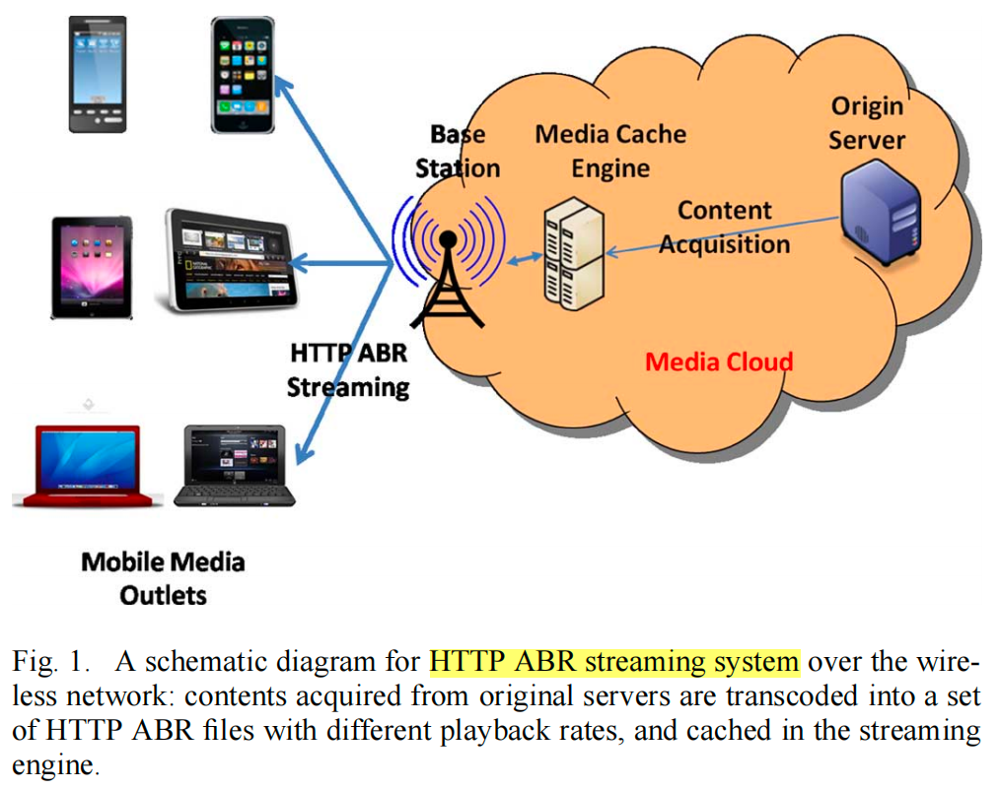
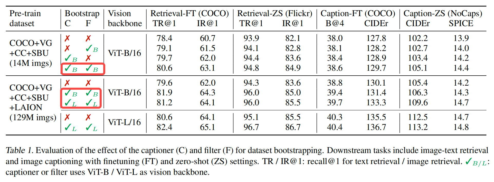

# anpapers-weekly

每周论文学习记录

# pending list

> paper1 = video 2

领域主线：

1. 大模型（NLP, CV, 多模态等)
2. GNN系列
3. Anomaly Detection 系列
4. 搜广推（+智能运营)
5. ABtest

具体文章：

- [ ] Opening the black box of Deep Neural Networks via Information
- [ ] Learning phrase representations using rnn encoder-decoder for statistical machine translation2014年，提出了GRU
- [ ] 使用Xenon-Generation Finetune LLama文档阅读
- [ ] 写综述：GNN 论文总结
- [ ] Deeper insights into graph convolutional networks for semi-supervised learning
- [ ] 搜广推：MMoE，DeepFM等
- [ ] 不同的位置编码方式，1D(Bert的), 2D etc
- [ ] 通用内容

  - [ ] GAP global average pooling
  - [ ] Grad-cam: Visual explanations from deep networks via gradient-based localization  视觉DNN的可解释性
  - [ ] DL三大特征抽取器（CNN,RNN,Transformer）总结TBD
  - [ ] viking, milvus等向量检索相关技术，检索和矢量搜索工具（如 LangChain、LlamaIndex 和 Pinecone）
  - [ ] 模型FT相关，LoRA，QLoRA，langchain等技术
- [ ] 大模型近年来的主要文章（目标：7月底写一篇综述）

  - [ ] Big Transfer (BiT): General Visual Representation Learning （CNN中做的比较大的)
  - [ ] StyleDrop: Text-to-Image Generation in Any Style 通过文字改变发型等
  - [ ] CLIP 得分，衡量文本、图像的对齐程度
  - [ ] Tokens-to-Token ViT: Training Vision Transformers from Scratch on ImageNet
  - [ ] image GPT 的工作
  - [ ] 多模态预训练工作（by李沐)
  - [ ] MAE loss，BiT MAE重建图像
  - [ ] DALLE/DALLE2 效果体验

# 2023.8

T5

ALIGN

Imagen

LLM 系列：

Zero-Shot Text-to-Image Generation

Florence

## 2023.8.13

《DeSVQ: Deep learning based streaming video qoe estimation》

2022.1 IIT 的工作，本文要点：

1. 针对 VQA QoE 的 continuous 评估是比较难的事情，综合了质量切换、压缩、卡顿等时序因素
2. 本文提出了一个DL framework，使用 CNN + LSTM，提取spatial-temporal，以及人工QoS特征信息，预测 z scores QoE 指标
3. 评估结果，对比之前的同类模型，在效果上有一定提升

模型结构：

z scores：

QoS metrics随frame变化：

QoS metrics与QoE关系：

dr：

    总体是一个基于 video 内容的内容 QoE 评估方法，并且模型学习目标是人工打标分数，不太 scalable

《QoE-Driven Cache Management for HTTP Adaptive Bit Rate Streaming Over Wireless Networks》

2013年的工作，本文要点：

1. 关于如何提供一个 subset of playback bitrates，提供最优的 QoE，同时节省 cloud storage（类似我们的如何提供更少的档位，更好的满足用户）
2. 通过抽象建模为一个凸优化的数学问题，通过拉格朗日乘子法进行求解

## 2023.8.12

《YouSlow: QoE Matters More Than QoS:Why People Stop Watching Cat Videos》

2016年的一篇文章，本文要点：

1. 量化 QoE 对于使用ABR的 video streaming 服务来说比较困难，本文推出 YouSlow 插件监控youtube的playback events，研究方法是定义QoE metric abandonment ratio，然后看各种QoS指标与它的相关性
2. rebufferings increase abandonment six times as much as the start-up latency caused (mostly) by pre-roll ads. 并且同样 RB rate 的情况下，频次越高影响越大
3. even increasing bitrate during playback can annoy viewers; when the bitrate changes, they abandon videos more than four times as much
4. a single rebuffering event can cause abandonment rate three times higher than a single bitrate change
5. 基于YouTube 搜集了一定量的真实用户数据，对于结论的现实意义提供了支撑

    几种QoS指标的影响强弱：rebuffering > bitrate change > start-up latency

ABR 原理：

RB 量级的影响：

RB 频次的影响

RB和码率影响拆分：

RB 量级和码率变化的叠加影响：

一些延伸：

    1，本文提出的量化分析方法是比较好的，不过基于全局 QoS-QoE 曲线，缺少了一些个性化。

    2，基于过程中的后验统计指标来做调整，相比于基于预测，可能效果上差一些？

## 2023.8.6

《ExQoE: **Rebuffering but not Suffering: Exploring Continuous-Time Quantitative ****QoE**** by User’s Exiting Behaviors**》

2023.2 的一篇文章，关于 Multimedia QoE 建模的，本文要点：

1. 对于用户观看短视频时的体验 QoE，缺少合适的量化指标同时满足三个条件（objective，quantitative，continuous-time），本文提出了 exiting behavior 这个指标
2. 基于 exiting ratio 进行QoE 建模时的难点：non-streaming factors的处理，predict exiting ratio，如何计算不同network情况下的QoE分数
3. 在模型方面，本文的思路是：
   1. 将 session playback 离散化为1s片段，构建 state 序列s
   2. 定义 SER/state exiting ratio，对于大量 state 序列样本，用线性回归法计算出马尔科夫过程的回归公式
   3. 基于SER的数值，可以用积分思路计算出 session duration 的期望
4. 在不同network参数下，计算马尔科夫状态转换概率，用于后续预估状态序列的出现概率，进而算E(dura)
5. 评估结果，这里有一些 insight 比较有参考价值，与机器学习的对比感觉仅供参考吧，写的很含糊

模型方案：

SER完整

SER近似

期望播放时长：

结合network的期望播放时长：

总体来说，playback 离散化这个思路比较有意思，但是基于马尔科夫过程来建模，忽略了内容/用户/网络等的个性化和动态变化，在优化上应该是不够彻底的。

# 2023.7

## 2023.7.31

《Modeling Task Relationships in Multi-task Learning with Multi-gate Mixture-of-Experts》

2018年Google的工作，大名鼎鼎的MMOE，复习一下。主要内容：

1. 本文提出一种 multi-task learning approach MMOE，受MoE model等启发
2. 该方法显式建模 task 之间的关系，以及学习 task-specific 能力
3. 该方法比基线要好，尤其在task之间相关性比较低的时候，Multi-gated 可以比较好的处理，通过决定不同task对应的gates之间的overlap程度
4. 通过一系列synthetic data和real data实验，验证了multi-task模型对于task相关性比较敏感，MMoE 比 OMoE效果要好，在线实验证实MMoE相比SB模型，取得了显著收益，并且在稀疏目标上收益更大

模型架构：

评估结果

模型的原理，通过数学公式表达出来，都是简单优雅的。

## 2023.7.30

《**Flamingo: a Visual Language Model for Few-Shot Learning**》

2022.4 Google 的一篇工作，一个V-L基座模型的尝试，本文要点：

1. 目标是提出一个通用的V-L基础模型，a visual language model that accepts text interleaved with images/videos as input and outputs free-form text（输入/输出的范式，决定了模型能解决的任务类型，VQA/captaining/dialog等)
2. 模型结构方面，基于一个冻结参数的预训练visual encoder，以及一个冻结参数的预训练Transformer decoder，加入视觉 perceiver resampler 和 文本 gated xattn dense 层
3. 训练数据，非常大规模的高质量数据集，主要是两类: image text interleaved data，以及高质量 image-text pair数据，达到了billion级别
4. 评估结果，因为有大规模数据做预训练，效果自然是非常好了，基于4个sample 的few shot已经可以取得很好的效果，同时有6个任务基于32样本few shot会超过其他FT的SOTA结果

模型架构：

Insight：我想本文核心的insight在于，V-L可以尝试train一个基座模型，主要包括v-l representation的对齐，同时数据集规模对于性能是非常关键的。

《DeepFM: A Factorization-Machine based Neural Network for CTR Prediction》

复习了一下DeepFM，2017年哈工大、华为合作的工作，本文要点：

1. 建模低阶交叉特征（FM）和高阶交叉特征（DNN），不像Wide&Deep，不需要任何特征工程
2. DeepFM 比 Wide&Deep 更高效，Wide&Deep 的input vector包含大量人工设计的pairwise交叉特征
3. DeepFM 不需要 FNN 那样的pre-train，直接端到端训练
4. 从评估结果来看，在Criteo数据集和Company数据集上对比SOTA都有明显的提升

模型架构

与FNN/PNN/Wide&Deep的对比：

近期会集中看一些CTR/推荐相关的文章

## 2023.7.23

《VECTOR-QUANTIZED IMAGE MODELING WITH IMPROVED VQGAN》

2021年Google Research的工作，本文要点：

1. 本问题提出了一种更好的通过预测光栅化 image tokens 的Transformer自回归预训练方法
2. 左侧ViT-VQGAN：在VQGAN 的基础上做了一些改进（Arch，Codebook learning等），Image Token 化的ViT-VQGAN，同时损失函数也做了改进，对多种损失做融合
3. 右侧VIM：Unsupervised Pretrain transformer，autoregressively Train On imagenet，采用类似GPT的pretrain方法
4. 效果评估，在图片重建、图片生成、图片分类等任务上都说明预训练效果比较好

模型架构：

本文的 visual tokenlizer 也是 BEiTv2 中用到的，不过好像在 BEiTV3中被放弃了？采用了更简单的linear patching

《**Practical Lessons from Predicting Clicks on ****Ads**** at Facebook**》

很久之前的一篇文章，今天翻到把其中重点结论记录下吧，都还是比较solid的

1. 主要介绍了FB广告系统中，GBDT+LR这种方法，并与单独的建模做对比说明增益
2. 模型结构方面，用GBDT将原始features input转换为 sparse feature，拼接后再作为LR的input
3. 性能评估结论，评估指标采用NE和Calibration，GBDT+LR 对比GBDT和LR都有明显的性能增益，同时LR相比GBDT有微小的性能增益
4. 特征重要性方面，historical 特征远高于contextual特征；contextual特征对于code start比较有用
5. 采样方法，均匀采样时10%左右采样率性能就不再提高，负样本下采样2.5效果最好，同时负采样会改变 predict 值的物理意义，需要映射回去
6. data fressness方面，相比及时更新训练数据，如果停止更新会造成性能下降，1周大概降了1%。实际使用中，如果训练量太大，也可以适当加大LR模型的更新频率

模型架构：

historical 特征 vs contextual 特征：

top-k中historical 特征占比：

Negative downsampling 的效果：

## 2023.7.22

《DETR: End-to-End Object Detection with Transformers》

2020ECCV的文章，DETR 即 detection transformer，是目标检测的里程碑工作，启发后续一系列xx-DETR，影响力巨大。

本文要点：

1. 当前目标检测方法基本都是two stage，出很多预测中间结果再接NMS后处理（过滤掉重复的框，需要复杂调参）本文标题端到端+Transformer，将其看作集合预测问题，不依赖很多先验知识，通过一个端到端网络取得很好的结果
2. 本质上Transformer 出来的特征够强，所以下游结果比较好，是Tfm的成功
3. 模型结构，CNN主干网络，接encoder-decoder各6层，ecd学习全局特征，dcd学习边缘特征更好的分割物体，在dcd这里输入一个learned object query 100*256，指引dcd输出我们想要数量的物体
4. 训练，当作集合预测问题，损失函数这里看作二分图匹配计算loss，构造cost matrix找最优匹配，匈牙利算法，本文场景下，100个框与ground truth计算分类loss+出框loss，填入matrix。训了500个epoch
5. 评估结果，在COCO数据集上能打平Fast R-CNN，不过对大物体表现比较好；全景分割的效果很好
6. 本文主要归功于Transformer比较好的提取了特征，可以看作是Tfm的成功。

模型架构：

自注意力可视化：

Insight：

很多工作都是在到达一个临界点之后，就会有一个更简单更优雅的里程碑式新框架，把技术演进带到一个新的方向，开启下一个阶段的进化。

例如CNN的AlexNet, ResNet，Transfomer/ViT/ViLT/DETR等都是这样的工作，事物是螺旋向上发展的，中间夹杂阶段跳跃。

## 2023.7.19

《VL-BEiT: Generative vision language pretraining》

2022.6 微软的工作，同属于 BEiT, VLMo 的后续，核心 idea：

1. 本文目标是要建立V-L基础模型 VL-BEiT，一个双向多模态预训练Transformer，A unified Masked data modeling objective
2. 模型结构上基本复用了 VLMo 的工作，一个 shared Self attention，加上多个 Modality experts。训练和推理时对input做不同的组织，如图二
3. 预训练，单模态数据 imagenet22k，wiki等text；多模态 CC/SBU/COCO/VG等数据集。训练阶段采用 masked text(Bert)，masked image(BEiT)，masked image-text(本文) 等不同的训练方式，多模态的mask train，可以起到对齐作用
4. 评估结果，在V-L任务如VQA,VR，以及V任务分类、检索上都表现不错，证明了多模态表征学习良好
5. 下一步计划，scale up model&data，想要探索NLP预训练的scale up是否在多模态work; 引入多语种预训练，对比学习目标等; zero-shot 跨模态迁移能力

图一：模型结构：

图二：不同模态训练方式

## 2023.7.18

《BEIT V2: Masked Image Modeling with Vector-Quantized Visual Tokenizers》

2022.8 ，BEiT这篇工作的后续，MIM 已经展现出了impressive效果，本文核心内容：

1. 现存的工作很多都聚焦低阶pixels，妨碍了挖掘图像中的高阶语义表示。本文提出语义丰富的visual tokenizer 作为Masked的重建目标，是一个单模态版本的视觉task
2. 使用 VQ-KD 技术训练这个 tokenizer，它将连续向量空间映射为 compact codes
3. 模型训练阶段，先训练VQ-KD网络，之后在预训练 ViT 的时候引入了 patch aggreation strategy，强化CLS尽可能表达全局信息
4. 效果评估，在分类、语义分割等任务上，对比前作BEiT都有较大幅度的提升
5. 结论：VQ-KD 将连续语义空间离散化，提供可供 MIM 学习的监督token，未来将尝试学习一个 universal tokenizer 映射 words 和 images 到同一个vocab

模型架构：

评估结果：

Codebook 中的语义概念：

## 2023.7.16

《BEiT：BERT pre-training of image transformers》

2021.6 微软的工作，可以称作计算机视觉领域的 BERT moment，核心内容：

1. 总体上就是 BERT 的思想，通过 Masked image learning 的方式，学习 image representation
2. 模型框架上，采用了 16*16 patch线性映射作为输入（类似ViT），visual tokenizer 作为离散 output（来自Zero-shot text-to-image generation），主干网络 Image Transformer
3. 预训练，基于imagenet 1k数据集，MIM 范式，patch-wise pred，mask 40% image patches，pixel level 的auto encode 会让模型关注图片中的小范围依赖和高频细节，计算量也会大很多。消融实验有效果对比。
4. 从评估结果看，在图像分类、语义分割等下游任务上的FT效果，要好于之前一系列工作；同时attention map可视化显示显式模型学到了物体信息，虽然本文没有采用任何物体标注数据，也证明了预训练的有效性。
5. 下一步工作，想要继续在数据和模型复杂度方面 scale up 模型，长期目标是统一的多模态预训练模型

模型架构：

分类评估结果：

语义分割评估结果：

Attention map 可视化：

## 2023.7.15

《Image as a Foreign Language: BEIT Pretraining for All Vision and Vision-Language Tasks》

2022.8 微软的工作BEiTv3，文章的标题很大，目的也很明确，核心内容：

1. 想要统一多模态基座模型（2022年开始出现各种），把图像也看作一种语言 Imglish，提出一个更灵活易复用的结构，引言部分写的非常好，关于多模态领域的系统性介绍
2. 模型大一统的几个核心要素：统一的模型结构 Transformer、通用的预训练目标 Masked data modeling、数据/模型 scale up，这些要素目前都基本完备了
3. 模型架构：就是一个 VLMo（取了个名字：Multiway Transformer），通过一组多模态epxerts，让模型捕捉更多模态特有信息，不同的输入会被路由到不同的experts；共享的MHA 学习不同模态之间的对齐，并且执行针对多模态任务deep fusion
4. 模型训练：一个训练任务，每个batch中包括多模态数据；15% tokens of texts, 50% tokens of texts from i-t pairs, 40% of image patches；本文只用 masked data modeling，简单方法容易scale，也容易应用
5. 评估，本是多模态工作，在单模态上也有非常好的效果，说明了不是目标函数越多越好，本文只用了mask language目标
6. 关于后续工作，作者的目标还是建立一个跨任务、语言、模态的大一统基座模型，让我们拭目以待

模型架构：

不同的downstream应用场景/方法：

模型训练：

评估结果：

## 2023.7.14

《CoCa: Contrastive Captioners are Image-Text Foundation Models》

2022.5 Google Research的工作，核心内容：

1. 标题顾名思义，对比学习和标题生成相结合，想要建立一个 I-T 基础模型，模型结构上看，本文属于 ALBEF 的后续工作，模型结构上几乎一致
2. 对比ALBEF，把右侧用于语言特征和多模态学习的部分换成了decoder，同时loss上做了简化 ITC+LM，提高学习效率，同时也能适应生成类任务
3. 本文用到了Google内部的超大数据集，训练数据达到了B级别，模型参数量也很大，最大有2.1B，学界比较难复现
4. CoCa模型的特征输出，可以用于多种下游任务：image classification，i-t 对比，image capationing 等，效果都非常的好，通过雷达图有比较直观的体现；尤为难能的是在单模态任务上也有非常好的效果

图1 模型架构：

图2 下游任务：

图3 实验结果：

本文用到了Google内部的JFT 3B数据集，可能是模型效果如此好的原因之一。增加了外界复现的难度。

## 2023.7.12

《BLIP: Bootstrapping Language-Image Pre-training for Unified Vision-Language Understanding and Generation》

2022.2 的一篇文章，salesforce

本文核心内容：

1. 之前的工作在模型层面有不同类型，ALBEF代表的Encoder类，VLMo的Mixed of experts类
2. 之前的工作在数据上，有很多noise data，比如Google的CC14M数据集，都是网上抓的，效果suboptimal
3. 本文在模型上融合了ALBEF和VLMo，如下图1，左侧三个塔就是ALBEF，右侧1个塔decoder结构用于生成模型，右侧三个塔共享了部分模型参数（参考VLMo），decoder塔的损失函数用的LM
4. 基于原始数据train了第一版BLIP之后，用人工标注的COCO数据集FT了Captioner和Filter2个模型，用于数据增强，再train一个最终的BLIP模型
5. 从评估结果来看，Captioner+Filter 的效果都很好。也启发了后续其他的工作，例如Stable Diffusion等

图1 模型架构：

图2 数据增强：

图3 消融实验：

多模态的文章真的很有趣，各种融合NLP和CV的工作，有意思。

## 2023.7.10

《**VLMO: Unified Vision-Language ****Pre-Training**** with Mixture-of-Modality-Experts**》

2021.11 微软的一篇多模态工作，mixture of experts 思想的应用，挺有意思

核心内容：

1. 模型结构改进，在Tfm encoder基础上，把 FFN 扩展成3个expert FFN，图像、文本、多模态的，底层share params
2. 训练方式改进，分阶段先应大量单模态数据分别train experts，最后用多模态数据train；ITC+ITM+MLM

模型框架：

MoMO transformer with shared parameters

* 针对不同模态，有不同FFN
* MHA 层share weights，对不同的模态都有用
* 要做多次Forward，64张A100的卡，train 3天

训练方式：

train过程中利用大量单模态数据，如上图：

1. Train vision 的时候，MHA和expert FFNs都不freeze
2. Train text 的时候，vision expert 和 MHA 被冻住，说明self attention 也能在text上work的很好，比较有意思
3. Train VL 的时候，都不冻住

评估结果：

    因为主要是模型结构改进，评了2个版本 VLMo-Base/VLMo-Large

    在VQA/NLVR2/Retrieval等数据集上评估效果非常好，相比ALBEF、ViLT等都有较大提升

## 2023.7.9

《ALBEF: Align before Fuse: Vision and Language Representation Learning with Momentum Distillation》

2021.7，Transformer用于多模态领域的一篇文章

核心内容：

1. 之前方法存在的问题：图像、文本特征抽取模型单独训练，不在一个空间内；目标检测很昂贵；数据集中噪声
2. 本文propose了一个新的 VL 表示学习框架，相比ViLT资源需求少，更容易复现。对比当前 VLP methods：LXMERT, UNITER, OSCAR 等，本文提出的方法具有更好的模型性能，以及更快的推理速度
3. 模型：三个 encoder, visual/text/multimodel，分别基于 ViT-B/16, Bert-base, Bert-base; 损失函数ITC对比学习，语言模型 MLM 和 图文匹配 ITM三者之和。引入了动量模型（滑动平均）的pseudo-labels对抗数据噪声
4. 训练数据：同ViLT/UNITER 采用4M数据集，COCO/VG/GCC/SBU，在A100 8卡机器上train 了30Epoch
5. 实验：从实验结果来看，在V-L多个任务上都取得很好的效果，如Retrieval/VQA/VE/NLVR/VG等

模型框架：

用于预训练的 Image-text pairs 通常有噪声，体现在：

* 正样本弱相关性：文本有可能包含了与图片不相关的词；图片包含了文本未描述的实体
* 对于ITC学习，图片的negative texts可能也包含了图片的内容
* 对于MLM来说，可能存在其它words也能描述图片，或者更好

Momentum Distillation / 动量蒸馏

引入momentum model生成的 pseudo-targets，动量模型是基于unimodal和multimodal的指数滑动平均。更新ITC loss，loss 计算把这部分伪标签样本也考虑进来。

准备复现一下论文结果，毕竟相比ViLT，资源需求少了很多

update：

    抓了下4M数据集，基本跑通FT的流程了，FT flickr数据集，4卡好像要不了很久

## 2023.7.7

图像生成领域的文章很多，发展时间比较久了，对于早期的文章简单串一下

图像生成系列一：

《AE: Autoencoders, minimum description length, and helmholtz free energy》

1994年文章，原理如下图：通过网络学习图片的分布，任意概率分布

《DAE: Extracting and composing robust features with denoising autoencoders》

2008年工作，去噪自编码机。

核心思想通过对输入数据在encoder之前加入噪声，来增强模型鲁棒性

《VAE: Auto-encoding variational bayes》

2013年工作，Kingma and Welling。

核心思想，在AE模型的基础上：

1. 中间学习出一个分布（正态分布），再采样得到特征，而不是直接学特征
2. VAE可以理解为通过网络学习出每个属性正态分布的mean和std编码，然后通过mean和std和N ( 0,1 )正态分布恢复每个属性的正态分布，最后随机采样得到每个属性的离散值。
3. 鲁棒性更好

《VQVAE: *Neural Discrete Representation Learning*》

2017年工作，核心思想：

1. 通过Encoder学习中间编码，然后通过最邻近搜索将中间编码映射为codebook中的K个向量之一，再通过Decoder解码
2. 跟VAE最大的不同是，中间编码连续->离散，因此编码范围更可控，能够生成更大更高清的图片
3. AE 的重构思想是用低维中间编码来表达高维数据分布，VAE和VQVAE的思想是设计中间编码的分布，控制图片生成过程。

《GAN: Generative Adversarial Nets》

2014年工作，Ian Goodfellow，领域奠基作

核心内容：

1. 训练2个模型，G和D，分别相当于造假者和警察，前者目标是要完美的造假，后者是要区分出造假
2. G的目标函数，是让D没办法区分出这是一个生成的图片还是真实图片
3. GAN的收敛很不稳定，相应原理解释比较复杂不赘述~后续有比较多改进工作

others get:

    把你的工作重新定义为一门你正在努力打磨的手艺，不要低质量勤奋/重复

## 2023.7.6

《Scaling Distributed Machine Learning with the Parameter Server》

李沐 2014年的博士论文，本文实现了一个分布式机器学习系统，包括参数服务器，核心内容：

1. 挑战包括可扩展性、一致性、容灾、易用性等等
2. worker 从servers取参数集合，同时拿到data，计算梯度更新参数后push回server
3. DAG 计算图，管理各种待计算的任务与其相互依赖关系
4. 针对一致性与计算性能之间的balance，有不同的并行度选择
5. consistent hash 比较有意思，server端用它来存储权重
6. 基于百度、google的最大ML任务做了测试，性能是很不错的

MXNet 作者之一的沐神，在ML计算框架上的积累还是非常深厚的，从其讲解视频中也能感受的到，源自于学生时代的扎实锻炼。

## 2023.7.2

《**Highly accurate protein structure prediction with AlphaFold**》

大名鼎鼎的 AlphaFold2，同时被科学和自然评为 2021年 AI 届在科学界最大的突破，为什么这是一个改变了整个生物学的跨时代工作？1972 年诺奖得主畅想过，未来应该根据氨基酸序列预测蛋白质3D结构。本文解决了一个50年的难题

问题定义：

1. 蛋白质的氨基酸序列结构 -> 预测蛋白质3D形状（蛋白质折叠问题），形状决定功能，并且结构和形状是一一对应的
2. 已知结构的只有10万，但现存有10亿种不同的氨基酸序列

模型架构：

总体分成3个部分：

1. 抽特征，分别抽取序列结构信息MSA，以及氨基酸互相之间的空间关系
2. encoder，输入前述2个3D张量，经过类Tfm的很复杂的运算，输出2类不同编码信息
3. decoder，将编码信息转换为3D空间结构，里面用到很多空间几何的运算。有点像LSTM的结构
4. 训练：主损失函数FAPE，128TPU v3，train 1周，因为整体参数量很大，内存比较吃紧，采用了一些优化技巧
5. 预测：256序列，单卡V100 跑 4.8分钟，2500序列，单卡V100 跑 18h~
6. 结果：从结果来看，相比同期的方法，取得了大幅度的提升，将误差降低到原子级别；消融实验证明了很多机制都有用

本文用了50页的补充材料来介绍算法细节，包含伪代码。模型是很复杂的，借鉴了很多前人的工作，像Tfm，MSA/空间信息的拆分等等。面对如此复杂的研究课题，我觉得要完成这样一个工作，需要极强的科研和工程能力，否则很容易迷失在其中。牛逼，致敬划时代的工作。

## 2023.6.30

《Hierarchical Text-Conditional Image Generation with CLIP Latents》

DALLE2，2022.4 OpenAI的工作，也是大热的一篇

一些有趣的应用场景：

1. 根据文本描述，生成原创性的图片，可以任意组合概念、属性、风格
2. **根据文本对图片进行编辑**，因为文本图片共享语义空间
3. 根据输入图片生成相似风格的图片，如图1
4. 2个图像内插，如图2
5. 图像文本内插，如图3

图1：

图2：

图3：

模型主要内容：

1. 本质上是 CLIP+GLIDE 的模型，
2. Text -> text emb -> image emb -> image，与CLIP的过程是相反的，所以又叫UNCLIP
3. 模型结构如图4，上半部分是CLIP（在本文一直锁住)，下半部分采用两阶段建模：prior + decoder
4. prior：text emb->img emb，尝试了AR和Diffusion 两种，Tfm decoder-only 用classifier free方式的效果好一些
5. decoder：采用GLIDE 的方案，基于UNET，CNN base的模型，最后逐层上采样，级联生成高清大图
6. 效果评估，COCO FID分数高于GAN，DALLE1等；生成的图片质量很高
7. 若干局限性：物体属性结合的不好；文字生成效果不好；有自己自己的鸟语~

图4：

总体而言，是非常吸引眼球的工作，复刻艺术风格、基于文字生成图片等，相比人工内容创作，拓展了很大的自由空间，具有想象力。不过看得出来训练和推理成本都是很高的，短期内应该难以落地实用，科研的路费钱又不能短时间内看到收益，比较考验投入定力。

## 2023.6.29

《Swin Transformer: Hierarchical Vision Transformer using Shifted Windows》

2021.3 上传arxiv，ICCV最佳论文

ViT 初步证明了Tfm在CV领域的巨大潜力，它能够让模型架构更加优雅，同时显著降低计算复杂度。但是相比叱咤CV领域多年的CNN骨干网络，还没有普遍性的证明它作为骨干网络的完备性。NLP Tfm -> CV Tfm，面临的困难：

1. 多尺度问题，同物体大小多变，CNN 则应对的很好，ViT 对多尺度特征的把握能力，会弱一些，而对于检测、分割这类任务，多尺度特征很重要
2. Resolution 困扰，通过patch 初步得到解决

本文的出发点，就是想要证明 Swin Tfm 可以作为通用骨干网络，既然有CNN这么一个CV领域成熟的模型架构做参照，本文作者设计了一个精巧的披着Tfm皮的类CNN架构。并基本把视觉领域所有任务刷了一遍，并且效果很炸裂，基本实现了目标。

模型结构

核心组件：

1. 局部自注意力，全局计算自注意力对于图像类任务来说，可能有点浪费了，图像的特性还是应该有局部性。本文主要贡献，提出局部自注意力，在7*7序列内计算，计算复杂度跟图片大小成正比，相比较而言ViT是平方
2. Patch merging，类似于卷积神经网络的卷积操作。基于窗口和移动窗口的注意力计算，算出多尺度特征输入给FPN，去做检测，也可以扔给 unet 去做分割
3. 掩码自注意力，在基于patch的移动窗口机制下，局部自注意力之上，进行跨窗口注意力计算不是很容易，作者进行了精巧的设计。

实验：

* 作者把NLP领域分类、目标检测、语义分割代表性数据集都刷了一遍，考虑到其初衷这也是需要做的。效果都相当不错
* 消融实验证明，shifted window 和 相对位置编码都比较有用。并且在 dense predict 场景（COCO, ADE20k) 的提升幅度大一些，分类提升稍小，结合模型改进点可以理解。

作者实现了其原始目标，Swin Tfm 由于其里程碑式的优秀表现，之后会成为视觉领域一个重要的baseline。本文也体现了作者对CNN，Transformer，MLP 几种架构的研究深度和醇熟运用，随意魔改~

个人看法，Shift window的自注意力计算机制有点太复杂了，太fancy不一定能长久，有生命力的还是简洁优雅的方案

## 2023.6.27

《Whisper: Robust Speech Recognition via Large-Scale Weak Supervision》

2022年，OpenAI的文章，语音识别领域一个比较有潜力的工作

核心内容：

1. 已有的方法，主要是无标数据预训练 + 有标数据FT，局限性：没有高质量解码器，需要搜集数据FT；FT的时候容易过拟合
2. 本文模型，一个标准的Transformer encoder-decoder架构，emb层加了2层卷积，降低输入长度；all in one 的模型
3. 训练，68h 网上抓下来的多语言数据，做了一定预处理后分成30s/区间，train 了2~3个Epoch
4. 效果，在英语等语种上都不错，中韩阿拉伯语效果差一些；泛化性也比较好；对比几个商业系统也不错，可能会造成冲击

## 2023.6.26

《MAE: **Masked Autoencoders Are Scalable ****Vision**** Learners**》

    2021.11的一篇文章，一作是 ResNet 的作者 Kaiming He

本文思路比较straightforward，相当于Bert在CV上面的实现，a masked CV model

"***Simple*** algorithms that ***scale well*** are the core of deep learning."

核心内容：

1. 只用图片本身做自监督学习，属于Bert 在计算机视觉上的拓展
2. 把Bert从NLP用到CV的时候，会有什么问题？
   1. 卷积上面不好做掩码
   2. NLP里面完形填空并不简单，CV的完形填空则相对简单一些~图像中的很多像素是冗余的
   3. 解码器方面，NLP任务简单FC就行，CV则不行
3. 模型：非对称性的encoder-decoder架构，encoder follow ViT，decoder 标准 Transformer，损失函数 MSE in pixel space
4. 实验：下游分类、目标检测、语义分割等数据集上，都有比较好的表现；展示出来的例子也比较震撼，75%遮盖下能够很好的还原

## 2023.6.25

《AN IMAGE IS WORTH 16X16 WORDS: TRANSFORMERS FOR IMAGE RECOGNITION AT SCALE》

2021 ICLR，大名鼎鼎的ViT，本文的重要意义：

1. 证明了在图像任务上CNN不是必须，可以用纯Transformer，在此之前ResNet 还是SOTA的方法
2. 同时注重可扩展性，基于Transformer尽量少做修改，架构简洁
3. 挑战了CNN在视觉领域的绝对统治地位，打破了CV和NLP的壁垒，打通CV、NLP的鸿沟，开启了CV新时代
4. 同时探索自监督预训练方式在CV的可行性，本文证明了也OK，但是相比有监督有不少差距

主要内容：

* 模型：尽量follow original Tfm，每个patch16X*16作为一个元素，完成token化（2020年类似的工作，2*X2patch)，MHA+Res+MLP。如图1
* 数据集：imagenet 1k，imagenet 21k，JFT 等
* 效果：对比ResNet 方法，ViT-H在多个数据集上都取得了最好的效果，性能强大。如图2
* 训练：在同等计算复杂度下，ViT的效果比CNN要好，不过从论文评估来看，CNN和ViT的效果随着计算复杂度都没有进入瓶颈，还有提升空间.如图3
* 其他分析：图4可以看出，在<14M数据集上，ResNet的效果还是更好一些，ViT 在更大的数据集上效果更好；自监督工作有潜力（关注MAE)；1D pos emb有学习到2D的信息

图1：

图2：

图3：

图4：

## 2023.6.22

《ViLT: Vision-and-Language Transformer Without Convolution or Region Supervision》

多模态领域里程碑著作，把目标检测任务去除了，计算性能有上千倍提升，同时效果整体并没有降低很多。（有时候工作follow的慢一些，可能反而会更容易上手了~)

先上一个牛逼的对比图：

多模态领域 VLP 现状：

* 传统方法计算太贵，在2021年之前，VLP基本都依赖目标检测，识别bounding box，region->word，目标检测作为多模态的一部分（Visual Genome 预训练的目标检测器)。也是因为下游任务很多都是多模目标检测，这样更相关。
* 并且当前预训练模型的数据集不太大，因此泛化性不一定好。
* 2020年 Pixel BERT 只用用 ResNet 抽特征图，grid feature，7*7特征图拉直为线性序列，也还是有点贵，并且效果下降了很多，十几个点
* 传统方法非常依赖视觉特征部分的提升

本文核心idea：

1. 文本图像多模态，需要将图像 pixel 变成具有语义信息的序列，传统方法基于CNN+Region Supervision，比较贵
2. 怎么设计更简单的图像特征抽取方法，本文受启发于ViT，打patch获取 patch embedding。本质上属于ViT 思想在多模态领域的手快应用。因为是Linear emb 层，计算性能提升了很多，但效果上还是目标检测更好，迄今最简单的 v+l 模型，减少复杂度保证不掉点
3. 模型结构：2路特征concat为Transformer Encoder的输入，目标函数：image text matching + masked language loss + word patch alignment
4. 训练过程中小技巧：图像侧做了巧妙的图像数据增强，randAugment 这个工作，并尽量保证文本图片是匹配的；文本侧把文本word整个mask掉，以增强文本图像之间的联系
5. 训练成本：64个V100的GPU，训练三天，成本太高。相比而言ALBEF单机8卡训3天，以及BLIP等更容易跟进一些。

另外本文对多模态领域工作做了综述，非常扎实，值得学习！

## 2023.6.21

家里人来坡旅游，今天没时间看文章+summarize了，先占个位吧，明天补~

《ViLT: Vision-and-Language Transformer Without Convolution or Region Supervision》

    TBD

## 2023.6.18

CLIP 系列文章整体串一下

《CLIPasso: Semantically-Aware Object Sketching》

本文核心要解决的问题：图像->简笔画

之前的研究：

    搜集 sketch 数据集，风格和类别受限，已有素描数据集比较有限。

    如何摆脱对有标签数据集的依赖，而CLIP对物体很敏感（不受风格印象），具有出色的zero shot能力，是否可以结合

本文核心内容：

1. 贝斯曲线，用了图形学已有的光栅化器；同时控制笔画多少，实现不同程度的抽象，兼顾几何和语义性
2. 进行更好的Saliency初始化（训练好的 VIT，最后一层多注意力看hot area，画贝斯曲线）
3. 设计合理的loss function：Ls语义接近 + Lg空间限制，其中Lg把模型前几层的特征拿出来算loss，有长宽概念，几何敏感
4. train阶段，进行了2000 iteration，1张V100 GPU，一天train
5. 效果优势：能达到任意程度抽象，控制贝斯曲线的点数；具备强大的Zero shot 能力
6. limitations，要求有背景的图，否则效果大打折扣；CLIPasso是同时生成，而不是序列生成，因此结果不够diverse；不同图片需要的抽象程度不一样，现在的模型需要显式指定

   本文综合利用了图形学知识，以及CLIP模型的强大多模态+zero shot能力。

《DepthCLIP: Can Language Understand Depth?》

    如何通过模型理解图片中的深度信息

《AudioCLIP: Extending CLIP to Image, Text and Audio》

把音频模态添加进来：

1. CLIP 框架完全适应，比较优雅简单
2. 在音频模态上，具备了zero shot 能力

《PointCLIP: Point Cloud understanding》

    将3D point cloud 投射到2D平面，变成2D深度图，再用经典的CLIP框架处理

《ActionCLIP: A New Paradigm for Video Action Recognition》

本文针对动作识别问题，一个图像领域更热的研究领域

本质是分类问题，传统方法：

    依赖大量标注数据集

    具有巨大局限性，动作非常难以标注，label 接近无穷

    类别太多，softmax不工作了

如何在动作识别里也做zero shot？

思路如上图：

    图像变成视频，如前文

    图像文本对，ground-truth 是一个矩阵

《CLIP4Clip: An Empirical Study of CLIP for End to End Video Clip Retrieval》

针对视频检索问题 Empirical 的 study

    CLIP 很适合做，图文相似性

关键点：

    视频的时序处理：视频->图片单帧->图像特征

    三种方式：mean pooling，（frame）transformer Encoder/LSTM，（text+frame）transformer Encoder

结果：

    怒刷了5个 Video retrieval 常用数据集，效果都很好

## 2023.6.14

Fine Tuning(by 李沐)
    用高质量预训练模型，初始化目标模型的权重，再在小数据集上微调
    微调技巧：
    1，更强的正则化：小学习率；用少量数据做FT
    2，如果pretrain数据集中有类似的数据，可以在FC层复用其权重

《NCI: A Neural Corpus Indexer for Document Retrieval》
    2022.10 NIPS 最佳论文之一
    核心idea：
    1，本文提出比较新颖的E2E做文本检索的方法，部分参考了同会DSI
    2，用transformer训练一个s2s的模型，输入query，输出docid
    3，train关键点：用层次化聚类的方式生成具有一定语义信息的docid，用docT2query为doc生成query；32w doc
    优势：
    a）区别于传统搜索基于倒排索引方案，本文E2E的检索很简洁
    b）模型记住了文档信息，对新query、长query的泛化能力比较好
    劣势：
    a）性能上还差的比较多，要消耗大量GPU
    b）数据集选择的特殊性，选择了比较复杂的QA数据集，短query存在隐患

    比较有意思的一篇文章，瑕不掩瑜

## 2023.6.13

《CLIP: Learning Transferable Visual Models From Natural Language Supervision》
    2021.2 的文章，核心idea：
    1，利用自然语言的监督信号，学习迁移性很好的视觉模型，在train时采用对比学习paradiam，推理时可以做zero shot 和 few shot
    3，模型架构，预训练阶段train2个编码器文本 + 图片，推理时构建文本prompt，用2个编码器编码，再计算cos相似度
    4，训练数据：作者构建的一个高质量数据集WIT/WebImageText，有4亿(image, text) pair，是CLIP如此强大的主要原因之一
    5，评估结果：在30个数据集上取得非常好的效果，zero shot 推理在Imagenet上超过ResNet50监督模型，同时表现出非常强的鲁棒性，很炸裂的结果；few shot 之后效果更好，说明模型学习到泛化性很好的特征
    6，模型在 MNIST数据集上效果不好，还是强依赖数据，DL的脆弱性所在；同时细分类任务、抽象任务、计数类任务等也表现不太好，原始数据中难以获得高质量信号
    7，整体方案比较scalable，不用针对特定任务去搜集监督数据集，同时打破了固定种类标签的范式，无限种类、不限使用场景

    总体上属于新意度、问题规模、有效性都非常高的一篇文章。
    后续继续看下CLIP衍生出来的一些工作

## 2023.6.10

GD, SGD, RMSProp, AdaGrad, Adam 之间关系及优化路径，还是比较搞混的，简单梳理下：
    GD是NN优化非常重要的部分，标准梯度下降需要计算全量样本，计算量太大，后续优化思路主要有2个（减少计算量、优化下降路径）
    SGD 通过随机选择样本减少计算量，可以解决这个问题，minibatch SGD可以加速收敛
    但是下降路径却不一定最优，学习率不应该是一个固定值，每一步应该随着梯度变化关系动态适应
    如何优化路径？
    牛顿法，通过对梯度公式进行泰勒展开保留到二阶导（梯度的梯度），可以优化这个问题，不过计算量也比较大
    动量法，把历史梯度数据考虑进来，对梯度更新的0次项做修正，指数滑动加权平均；Nestro方法则结合历史梯度和超前数据
    学习率应该逐渐变小，简单的办法随着迭代进行而逐渐减小，这种做法未必好。AdaGrad 提出学习率自适应的方法，在学习率下面除以一个数值
    这个数值跟历史梯度有关，修正在不同维度上的学习率。进一步优化也采用指数滑动加权平均，降低历史数据权重，即RMSprop

    动量法 + RMSprop = Adam(Adaptive moment estimation) optimizer，几个超参：
    α：初始学习率，0.001
        β1：0次项的加权系数，0.9
    β2：1次项的加权系数，0.999
    epsilon: 10^-8，这个一般不动
    通常固定β1,β2,epsilon，保持默认值，调参初始学习率

## 2023.5.22

《ResNet: Deep Residual Learning for Image Recognition》
    2016年文章，短短9页，16w引用，绝对是人狠话不多的典范
    核心idea：
    1，VGG 证明了深的网络更好，但是深的网络难以训练（收敛速度慢、梯度 vanish/explode等）
    2，本文提出的残差网络优化了这个问题，网络更深但是计算复杂度并没有提高很多
    3，对比VGG net，ResNet-152有8倍的深度，跟 VGG，GoogleNet 等网络的实验对比，效果非常的好，收敛速度也很快
    4，本文把网络做深过程中的几个核心部件：skip connection，bottleneck layer等

    Residual net 和 skip connection 都不是本文的首创，但是却很好的解决了图像分类等问题，非常赞
    不足之处是只讲了调参后工程上的做法，却没有很多理论解释（可能也比较难吧），无碍于神作

## 2023.5.20

《Very deep conversational networks for large-scale image recognition》
    2015 ICLR, 大名鼎鼎的VGG
    核心idea：
    1，2012年 AlexNet 已经展现了CNN处理图片分类的强大能力，之后不同工作有不同演进方向，例如感受野大小、网络深度等
    2，本文采用3*3 receptive fields，步长为1，堆叠8~16层卷积+3层FC，想要研究网络深度的影响

    部分研究结论：
    1，3个3*3卷积层叠加，感受野与1个7*7是一样的，参数量却小得多 3*9*C^2 vs 49*C^2
    2，网络深度的增加对于性能提升有显著作用，VGG19对比VGG16效果没有进一步提升，说明参数量饱和
    3，1*1卷积层的作用，是一种增加非线性的方式，实验结果显示能提升性能
    4，A-LRN 的效果并不比 A好，说明 LRN（AlexNet的创新）效果不大
    5，multi scale 技巧，无论用在train（数据增广）还是test（集成）都有效果，也容易理解

## 2023.5.15

《Semi-supervised classification with graph convolutional networks》
    2017 年的文章
    昨天 PPNP 的文章基于GCN做了一些创新，今天将GCN回顾一下，这是图卷积的开创性论文，非常经典，今天看来其思路或许比较平常，但是在17年的时候，其将CNN思想用于Graph是非常创新的
    核心idea：
    1，GCN 相对于GNN（下一篇会回顾）来说，是对信息聚合过程做了一定的简化和近似，之后就类似CNN的卷积了
    2，2层卷积网络 + CE loss，为什么只有两层卷积，卷积太浅，信息不能大范围传播，卷积太深，容易过平滑（PPNP解决的问题之一）
    3，GCN 要基于整个Graph的邻接矩阵去计算（参见5.14的公式），进行整体求解，因此其范式是 transductive 的，计算开销也大（GraphSAGE后续会改进）
    4，从评估结果来看，GCN是要显著优于DeepWalk, LP等传统方法的，从原理看也容易理解。不过遗憾的是没有与GNN做对比，我想其效果应该差于GNN？

## 2023.5.14

《Predict then propagate: Graph neural networks meet personalized pagerank》
    2019 ICLR 的一篇论文，核心思想：
    GCN 的公式：
    
    其原理直观理解，就是不断聚合邻居节点的信息，并学习聚合权重。原论文推荐使用2层GCN-layers
    那么就只能感知到两步以内的邻居节点信息，要进一步提高层深，会存在2个问题：
    1，过平滑问题，如果使用太多层节点表示会趋向一致
    2，增加要学习的参数量

    为了解决这2个问题，PPNP 提出了新的方案，思路：
    1，先用一个MLP基于提取特征做预测（特征变换），这里包含了所有要学习的参数
    2，传播策略，采用 personalized PR 的思想，将邻接矩阵替换为带有 self loop 的矩阵
    这样PPNP就包含两步，NN+传播，可以提高模型复杂度以及传播距离而不用担心GCN的2个问题

    PPNP 宏观的理解是：GNN=AXW 表达的是节点特征能够在图结构上进行传播，经过抽象解耦之后
    PPR 的引入能缓解过平滑问题，NN 结构也可以做深了

    由于 PPNP 信息传播过程中的矩阵求逆运算花销比较大，作者提出了一个近似的 APPNP 模型

## 2023.4.23

Anomaly Detection with Robust Deep Autoencoders
    2017年
    想法：
    1，提高autoencoder模型的抗噪声能力，启发于RPCA模型，降原始数据分成正常数据、噪声数据两部分，交替训练
    2，L1 正则，L21正则（对矩阵每一列求2范数再求和）
    3，先优化AE，再优化正则项

## 2023.4.22

Deep Visual-Semantic Alignments for Generating Image Descriptions
    2015年的文章，二作李飞飞

    本文的核心idea，训练模型来为图片生成文本描述，分为两步
    1，基于pretrained RCNN模型 和 BRNN 模型来学习 image 和 text 的emb，建立他们之间的对齐关系
    2，训练 generative model MRNN，接收RCNN的信息作为初始输入，并训练MRNN模型
    a) 初始化h0，输入START，得到第一个word
    b) 输入第一个word，得到输出的第二个word
    c) 以此类推，期待输入最后一个word之后输出END

    建立图文emb映射的思路比较有意思，不足之处
    1，输入图片分辨率是固定的
    2，RNN只通过bias来接收图像信息，可以做得更好
    3，不是end-to-end的

## 2023.4.13

RNN & LSTM basics
The Unreasonable Effectiveness of Recurrent Neural Networks
    link: http://karpathy.github.io/2015/05/21/rnn-effectiveness/
    核心思想：
    1，RNN 引入了时间和依赖信息，适用于序列建模场景，包含Recurrent网络，允许信息持久化。
    2，RNN 的优势: 能够处理长度不限的输入, 以及"理论上"可以利用整个输入序列的信息
    3，由于Gradient vanishing 和Gradient explosion的问题，RNN 实际上取得的成绩并不大
    4，LSTM 的出现，很好的解决了RNN存在的梯度消失和梯度爆炸问题，也因此成为DL领域引用率最高的论文之一

Long short-term memory
    1997年的文章
    核心思想：
    1，LSTM 通过三个门结构的引入解决RNN网络存在的梯度消失和梯度爆炸问题，极大提高RNN网络的能力
    2，遗忘门，决定ht-1的信息有多少能传递到ht
    3，更新门/输入门，决定记住多少xt和ht-1的信息
    4，输出门，决定ct的信息以多少比例输出到ht
    5，三个门结构比较好的解决了梯度消失问题，但是并不能够避免梯度爆炸。不过由于LSTM有众多门控结构，跟普通RNN相比，发生梯度爆炸概率低很多

    遗憾的是，LSTM 论文并没有solid的理论解释，也没有解释门控为什么这么设计。再次支撑了深度学习是炼丹的说法~ lol
    LSTM 相比RNN的改进是比较好理解的，后来基于各种门控又有一些新的变体，例如GRU（Gated Recurrent Unit）等

## 2023.4.12

Learning convolutional neural networks for graphs
    2016年的文章
    本文提出了 PATCHY-SAN model，核心idea：
    1，CNN 对于CV/NLP等Euclidean数据场景，取得了SOTA效果，但是对于social network等Non-Euclidean数据，还不能很好的处理
    2，因此本文提出了一种方法，将图数据巧妙的转换成CNN可以处理的 Euclidean 数据格式
    3，核心过程：确定w个中心节点，并为它们创建邻域；然后将图表示映射为向量表示，使得相似结构的节点处于向量中相似位置

    具体逻辑比较复杂，就不详述了。我个人的看法是：这篇文章设计了巧妙（且复杂）的方法，将图数据映射为CNN能够处理的欧式数据，以便可以使用CNN这一利器，好是好，不过以当今的视角来看，肯定是信息有损的了。后续关注一下其它方法与之的对比，尤其是GNN的对比。

## 2023.4.9

Imagenet classification with Deep CNN
    2017年的文章，用一个改进的CNN网络解决基于ImageNet的1k类分类问题
    核心idea：
    1，当时最大的一个CNN网络，基于2块GPU
    2，2D卷积的高性能GPU实现
    3，采用了一些技巧（Relu instead of tanh/multiple GPUs），提高模型性能和训练效率
    4，采用了一些方法避免过拟合：数据增强、dropout等

## 2023.4.8

Graph Convolutional Networks for Text Classification
    本文提出 TextGCN model，核心idea：
    1，利用 word-doc TF-IDF, word-word 共现来构建 heterogeneous graph
    2，在此graph之上用GCN模型，半监督方式train

    对比 LR/CNN/LSTM 等模型，表现出了更优的效果，即便CNN和LSTM使用了pre train emb，TextGCN只使用graph和部分标签信息。

    不足之处：因为用了GCN，整个方案是transductive的，不过要改为inductive应该也不困难，参考GraphSAGE即可
    (原文的代码基于TF1，现在跑不了了，git上 找了一个TF2的版本)
